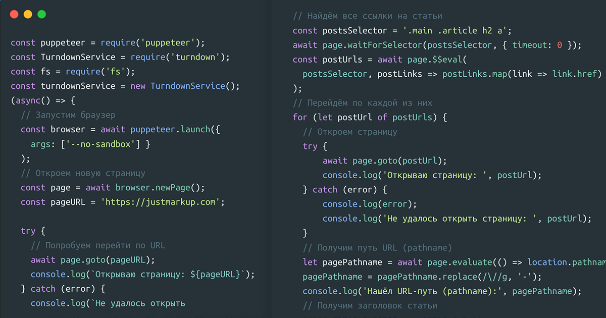

Одна из моих целей на 2019: закончить редизайн [моего сайта](https://justmarkup.com/), и, что гораздо важнее, превратить его из сайта на WordPress в обычный статический сайт. Чтобы это сделать, мне надо сохранить все мои посты в формате Markdown. Попытки найти для этой задачи подходящий плагин для WordPress не увенчались успехом. С другой стороны, я бы мог использовать WordPress REST API или даже RSS-фид, чтобы получить данные, но и это не показалось мне вполне правильным решением. Потом я прочёл [статью](https://24ways.org/2018/dynamic-social-sharing-images/), написанную [Дрю МакЛиланом](https://twitter.com/drewm), в которой он использует Puppeteer для динамического создания скриншотов страниц, которые потом использует в превью постов для социальных сетей. И тогда у меня созрел план.

В этой статье я опишу, как с помощью Puppeteer найти все статьи на странице, открыть их одну за другой, извлечь контент, сконвертировать в Markdown и сохранить в отдельных файлах.

## Запуск Puppeteer

[Puppeteer](https://github.com/GoogleChrome/puppeteer) — это «безголовый» Google Chrome на Node.js, который предоставляет понятный API для работы. Это означает, что вы можете запустить Chrome из командной строки, даже не открывая окна браузера. Вы можете открывать страницы, на которых будет рендериться CSS, выполняться JavaScript — всё то же, что делает десктопный Chrome, но без интерфейса для пользователя.

Для начала — у вас должен быть установлен [Node.js](https://nodejs.org/en/download/package-manager/). Для установки Puppeteer запустите в консоли:

```sh
npm i puppeteer
```

Эта команда установит API вместе с Chromium (около 200 МБ). На моей Linux-подсистеме на Windows возникли проблемы во время установки, так как некоторые зависимости не подтянулись. Поэтому мне пришлось установить несколько дополнительных библиотек, чтобы всё заработало. Если у вас возникнут трудности на этом этапе, почитайте [советы по решению проблем](https://github.com/GoogleChrome/puppeteer/blob/master/docs/troubleshooting.md).

## Получение данных

Сначала мы запустим новый браузер с Puppeteer и откроем новую страницу. Для этого, создадим новый файл index.js с таким содержимым

```js
const puppeteer = require('puppeteer');

(async() => {
    // Запустим браузер
    const browser = await puppeteer.launch({
        args: ['--no-sandbox'] }
    );

    // Откроем новую страницу
    const page = await browser.newPage();
    const pageURL = 'https://justmarkup.com';

    try {
        // Попробуем перейти по URL
        await page.goto(pageURL);
        console.log(`Открываю страницу: ${pageURL}`);
    } catch (error) {
        console.log(`Не удалось открыть страницу: ${pageURL} из-за ошибки: ${error}`);
    }

    // Всё сделано, закроем браузер
    await browser.close();

    process.exit()
})();
```

На первой строке мы подключаем библиотеку Puppeteer. Потом открываем браузер — `puppeteer.launch()`, создаём новую страницу — `browser.newPage()`, и переходим по нужному адресу — `page.goto(URL)`.

Если мы запустим наш файл — `node index.js`, и всё сработает без ошибок, то в консоли должно появится сообщение `Открываю страницу https://justmarkup.com`. Либо что-то может пойти не так: неправильный URL, ошибка SSL, превышено время ожидания, ресурс недоступен… Поэтому мы обернули переход по URL в блок `try/catch` для обработки возможных [ошибок](https://github.com/GoogleChrome/puppeteer/blob/v1.11.0/docs/api.md#pagegotourl-options).

Теперь, когда мы знаем как открыть браузер и перейти по URL, давайте посмотрим, как получить данные из DOM.

```js
const puppeteer = require('puppeteer');

(async() => {
    // Запустим браузер
    const browser = await puppeteer.launch({
        args: ['--no-sandbox'] }
    );

    // Откроем новую страницу
    const page = await browser.newPage();
    const pageURL = 'https://justmarkup.com';

    try {
        // Попробуем перейти по URL
        await page.goto(pageURL);
        console.log(`Открываю страницу: ${pageURL}`);
    } catch (error) {
        console.log(`Не удалось открыть
            страницу: ${pageURL} из-за ошибки: ${error}`);
    }

    // Найдём все ссылки на статьи
    const postsSelector = '.main .article h2 a';
    await page.waitForSelector(postsSelector, { timeout: 0 });
    const postUrls = await page.$$eval(
        postsSelector, postLinks => postLinks.map(link => link.href)
    );

    // Перейдём по каждой из них
    for (let postUrl of postUrls) {
        // Откроем страницу
        try {
            await page.goto(postUrl);
            console.log('Открываю страницу: ', postUrl);
        } catch (error) {
            console.log(error);
            console.log('Не удалось открыть страницу: ', postUrl);
        }

        // Получим pathname
        let pagePathname = await page.evaluate(() => location.pathname);
        pagePathname = pagePathname.replace(/\//g, '-');
        console.log('Нашёл pathname:', pagePathname);

        // Получим заголовок статьи
        const titleSelector = '.article h1';
        await page.waitForSelector(titleSelector);
        const pageTitle = await page.$eval(
            titleSelector, titleSelector => titleSelector.outerHTML
        );
        console.log('Нашёл заголовок статьи: ', pageTitle);

        // Получим контент статьи
        const contentSelector = '.article .entry-content';
        await page.waitForSelector(contentSelector, { timeout: 0 });
        const pageContent = await page.$eval(contentSelector,
        contentSelector => contentSelector.innerHTML);
        console.log('Нашёл контент: ', pageContent);
    }

    // Всё сделано, закроем браузер
    await browser.close();

    process.exit()
})();
```

Сначала мы получим все ссылки на наши посты, которые есть на начальной странице. В моём случае, их можно собрать по селектору `.main .article h2 a`.

```js
// Найдём все ссылки на посты
const postsSelector = '.main .article h2 a';
await page.waitForSelector(postsSelector, { timeout: 0 });
const postUrls = await page.$$eval(
    postsSelector, postLinks => postLinks.map(link => link.href)
);
```

Мы определяем селектор и используем `waitForSelector()` чтобы все DOM-узлы были доступны. После, мы используем [`page.$$eval(selector, pageFunction[,...args])`](https://github.com/GoogleChrome/puppeteer/blob/v1.11.0/docs/api.md#pageevalselector-pagefunction-args), который запускает `Array.from(document.querySelectorAll(selector))` для всей страницы и передаёт полученное первым аргументом в `pageFunction`. И наконец, мы используем метод `map()` для получения ссылок на страницы из атрибута `href`. Отлично, у нас есть массив со всеми нужными ссылками!

Теперь, самое время для того, чтобы открыть все ссылки, одну за другой, и получить данные (заголовок, контент, `pathname`), которые нам нужны.

```js
for (let postUrl of postUrls) {
    // Откроем страницу
    try {
            await page.goto(postUrl);
            console.log('Открываю страницу: ', postUrl);
    } catch (error) {
            console.log(error);
            console.log('Не удалось открыть страницу: ', postUrl);
    }

    // Получим pathname
    let pagePathname = await page.evaluate(() => location.pathname);
    pagePathname = pagePathname.replace(/\//g, '-');
    console.log('Нашёл pathname:', pagePathname);

    // Получим заголовок статьи
    const titleSelector = '.article h1';
    await page.waitForSelector(titleSelector);
    const pageTitle = await page.$eval(
        titleSelector, titleSelector => titleSelector.outerHTML
    );
    console.log('Нашёл заголовок статьи: ', pageTitle);

    // Получим контент статьи
    const contentSelector = '.article .entry-content';
    await page.waitForSelector(contentSelector, { timeout: 0 });
    const pageContent = await page.$eval(
        contentSelector, contentSelector => contentSelector.innerHTML
    );
    console.log('Нашёл контент: ', pageContent);
}
```

Мы перебираем массив ссылок `postUrls` и используем `page.goto()` для перехода по каждому URL. Чтобы получить `pathname` которое мы будем использовать позже, для того, чтобы сохранить файл, мы используем `page.evaluate()` чтобы получить `pathname` из `window.location`. Мы также заменяем слэши `/` на дефисы `-`, чтобы имена файлов были валидными.

Следующий этап — заголовок статьи. Определяем селектор (в моём случае, это — `.article h`), и, снова используя `page.waitForSelector()`, ждём, чтобы всё загрузилось и получаем `outerHTML` заголовка с помощью `page.$eval()`. Позже мы сможем преобразовать этот HTML в markdown, с помощью HTML-to-Markdown API.

Ну и наконец, мы можем получить основной контент статьи. Определяем ещё одни селектор (в моём случае, это — `.article .entry-content`), снова используем `page.waitForSelector()`, и получаем `innerHTML` контента статьи с помощью `page.$eval()`.

Отлично, теперь мы знаем, как найти ссылки, перейти по каждой из них и получить данные со страницы.

## Конвертация в Markdown

Что же, у нас есть все необходимые данные. На следующем шаге, мы будем использовать [Turndown](https://github.com/domchristie/turndown) для конвертации HTML в Markdown.

```js
const puppeteer = require('puppeteer');
const TurndownService = require('turndown');

const turndownService = new TurndownService();

(async() => {
    // Запустим браузер
    const browser = await puppeteer.launch({
        args: ['--no-sandbox'] }
    );

    // Откроем новую страницу
    const page = await browser.newPage();
    const pageURL = 'https://justmarkup.com';

    try {
        // Попробуем перейти по URL
        await page.goto(pageURL);
        console.log(`Открываю страницу: ${pageURL}`);
    } catch (error) {
        console.log(`Не удалось открыть
            страницу: ${pageURL} из-за ошибки: ${error}`);
    }

    // Найдём все ссылки на статьи
    const postsSelector = '.main .article h2 a';
    await page.waitForSelector(postsSelector, { timeout: 0 });
    const postUrls = await page.$$eval(
        postsSelector, postLinks => postLinks.map(link => link.href)
    );

    // Перейдём по каждой из них
    for (let postUrl of postUrls) {
        // Откроем страницу
        try {
                await page.goto(postUrl);
                console.log('Открываю страницу: ', postUrl);
        } catch (error) {
                console.log(error);
                console.log('Не удалось открыть страницу: ', postUrl);
        }

        // Получим pathname
        let pagePathname = await page.evaluate(() => location.pathname);
        pagePathname = pagePathname.replace(/\//g, '-');
        console.log('Нашёл pathname:', pagePathname);

        // Получим заголовок статьи
        const titleSelector = '.article h1';
        await page.waitForSelector(titleSelector);
        const pageTitle = await page.$eval(
            titleSelector, titleSelector => titleSelector.outerHTML
        );
        console.log('Нашёл заголовок статьи: ', pageTitle);

        // Получим контент статьи
        const contentSelector = '.article .entry-content';
        await page.waitForSelector(contentSelector, { timeout: 0 });
        const pageContent = await page.$eval(
            contentSelector, contentSelector => contentSelector.innerHTML
        );
        console.log('Нашёл контент: ', pageContent);

        // Преобразуем HTML в Markdown
        let pageContentMarkdown = turndownService.turndown(
            pageTitle + pageContent
        );
        console.log(
            'Да это заголовок статьи и её контент в Markdown',
            pageContentMarkdown
        );
    }

    // Всё сделано, закроем браузер
    await browser.close();

    process.exit()
})();
```

Сначала, нам нужно установить Turndow, запустив в консоли `npm install turndown`. Потом мы подключаем его в начале index.js и определяем как сервис `const turndownService = new TurndownService();`
Теперь, нам всего лишь надо добавить `let pageContentMarkdown = turndownService.turndown(pageTitle + pageContent);` после той части, где мы определили `pageTitle` и `pageContent`, и вуаля: у нас есть наш HTML преобразованный в Markdown

### Сохранение файлов Markdown

Итак, нам осталось сохранить сконвертированный Markdown в файлы — по одному для каждой статьи.

```js
const puppeteer = require('puppeteer');
const TurndownService = require('turndown');
const fs = require('fs');

const turndownService = new TurndownService();

(async() => {
    // Запустим браузер
    const browser = await puppeteer.launch({
        args: ['--no-sandbox'] }
    );

    // Откроем новую страницу
    const page = await browser.newPage();
    const pageURL = 'https://justmarkup.com';

    try {
        // Попробуем перейти по URL
        await page.goto(pageURL);
        console.log(`Открываю страницу: ${pageURL}`);
    } catch (error) {
        console.log(`Не удалось открыть страницу: ${pageURL} из-за ошибки: ${error}`);
    }

    // Найдём все ссылки на статьи
    const postsSelector = '.main .article h2 a';
    await page.waitForSelector(postsSelector, { timeout: 0 });
    const postUrls = await page.$$eval(
        postsSelector, postLinks => postLinks.map(link => link.href)
    );

    // Перейдём по каждой из них
    for (let postUrl of postUrls) {
        // Откроем страницу
        try {
            await page.goto(postUrl);
            console.log('Открываю страницу: ', postUrl);
        } catch (error) {
            console.log(error);
            console.log('Не удалось открыть страницу: ', postUrl);
        }

        // Получим pathname
        let pagePathname = await page.evaluate(() => location.pathname);
        pagePathname = pagePathname.replace(/\//g, '-');
        console.log('Нашёл pathname:', pagePathname);

        // Получим заголовок статьи
        const titleSelector = '.article h1';
        await page.waitForSelector(titleSelector);
        const pageTitle = await page.$eval(
            titleSelector, titleSelector => titleSelector.outerHTML
        );
        console.log('Нашёл заголовок статьи: ', pageTitle);

        // Получим контент статьи
        const contentSelector = '.article .entry-content';
        await page.waitForSelector(contentSelector, { timeout: 0 });
        const pageContent = await page.$eval(
            contentSelector, contentSelector => contentSelector.innerHTML
        );
        console.log('Нашёл контент: ', pageContent);

        // Преобразуем HTML в Markdown
        let pageContentMarkdown = turndownService.turndown(
            pageTitle + pageContent
        );

        // Проверим, существует ли папка, если нет — создадим её
        const postsDirectory = '/posts/';
        if (!fs.existsSync(postsDirectory)) {
            fs.mkdirSync(postsDirectory);
        }

        // Сохраним файл в формате ${pathname}.md
        fs.writeFile(
            postsDirectory + pagePathname + '.md',
            pageContentMarkdown, (err) => {
                if (err) {
                    console.log(err);
                }

                // Если ошибки нет - значит статья сохранена
                console.log('Сохранил статью!');
            }
        );
    }

    // Всё сделано, закроем браузер
    await browser.close();

    process.exit()
})();
```

Здесь мы используем [API файловой системы — модуль fs из Node.js](https://nodejs.org/api/fs.html), поэтому подключим этот модуль начале нашего index.js. Я хочу сохранить все статьи в папке с именем `posts`. Поэтому, сначала проверим, существует ли папка с таким названием и если нет — создадим её с помощью:

```js
// Проверим, существует ли папка, если нет — создадим её
const postsDirectory = '/posts/';
if (!fs.existsSync(postsDirectory)) {
    fs.mkdirSync(postsDirectory);
}
```

И в завершении, сохраним каждую статью в формате Markdown.

```js
// Сохраним файл в формате ${pathname}.md
fs.writeFile(postsDirectory + pagePathname + '.md', pageContentMarkdown, (err) => {
    if (err) {
        console.log(err);
    }

    // Если ошибки нет — значит статья сохранена
    console.log('Сохранил статью!');
});
```

Здесь мы используем `fs.writeFile()`. Мы хотим сохранить наши файлы в папке `/posts/`, используя `pathname` из переменной `pagePathname` как имена файлов, и `.md` как расширение. Это будет первым аргументом в функции `writeFile()`. Вторым аргументом мы передадим `pageContentMarkdown`, в котором лежит полученный Markdown в формате `String`. Если всё пройдёт без ошибок, мы получими статьи в формате Markdown, сохранённые одна за другой. Да, мы сделали это!

Я надеюсь, эта статья вас чему-то научила, и, возможно, вы в будущем тоже решите использовать Puppeteer для чего-нибудь интересного. Если вам любопытно, посмотрите финальный код на [Гитхабе](https://github.com/justmarkup/html-posts-to-markdown/blob/master/index.js).
