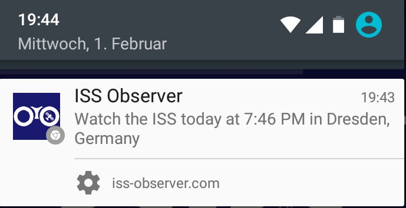

В предыдущей [статье](https://justmarkup.com/log/2017/02/introducing-iss-observer-com/) об [iss-observer.com](https://iss-observer.com/) я обещал рассказать о технической стороне реализации пуш-уведомлений. Изначально я планировал сконцентрироваться на проблемах, с которыми пришлось иметь дело в процессе работы над [iss-observer.com](https://iss-observer.com/). Теперь я думаю, будет полезнее посвятить материал базовым вопросам, и уточнять детали, где это необходимо. Обращаю ваше внимание, что фронтенд частично опирается на [этот урок](https://developers.google.com/web/fundamentals/getting-started/codelabs/push-notifications/?hl=en).

_Если вы хотите углубиться в исходный код, то смотрите в [GitHub-репозиторий](https://github.com/justmarkup/demos/tree/gh-pages/push-notifications) и на [пример](https://push-notifications-vwursywdxa.now.sh), демонстрирующий его работу._

## Фронтенд

Начнем с клиентской части. Первое, что нужно сделать — убедиться, что браузер поддерживает пуш-уведомления. Если да, загружаем наш JavaScript.

    if ('serviceWorker' in navigator && 'PushManager' in window) {
      var s = document.createElement('script');
      s.src = '/script/push.js';
      s.async = true;
      document.head.appendChild(s);
    }

Прежде чем писать код, выполним ряд требований. Нам потребуются Application Server Keys (VAPID Key). Получаем их [здесь](https://web-push-codelab.appspot.com), либо с помощью библиотеки web-push. Кстати, она нам еще потребуется для бэкенд-части. Устанавливаем библиотеку: npm install -g web-push, генерируем ключи: web-push generate-vapid-keys. В независимости от способа в результате у вас должны быть **закрытый ключ*** (private key) и **открытый ключ*** (public key). Сохраните их в надежном месте.

_До появления спецификации Application server key/VAPID первые браузеры (Chrome, Opera) реализовали функциональность пуш-уведомлений с помощью [Google Cloud Messaging](https://developers.google.com/cloud-messaging/). Все современные браузеры, за исключением [Samsung Internet](https://github.com/web-push-libs/web-push#browser-support), поддерживают VAPID. Поэтому в этой статье я не буду касаться GCM. Как добавить поддержку для Samsung Internet и старых версий Chrome и Opera — читайте [здесь](https://web-push-book.gauntface.com/chapter-06/01-non-standards-browsers/)._

Посмотрим на push.js. Здесь мы регистрируем сервис-воркер и подписываемся на уведомления:

    'use strict';

    const appServerKey = 'BHLCrsFGJQIVgg-XNp8F59C8UFF49GAVxvYMvyCURim3nMYI5TMdsOcrh-yJM7KbtZ3psi5FhfvaJbU_11jwtPY';

    const pushWrapper = document.querySelector('.push-wrapper');
    const pushButton = document.querySelector('.push-button');

    let hasSubscription = false;
    let serviceWorkerRegistration = null;
    let subscriptionData = false;

    function urlB64ToUint8Array(base64String) {
      const padding = '='.repeat((4 - base64String.length % 4) % 4);
      const base64 = (base64String + padding)
        .replace(/\-/g, '+')
        .replace(/_/g, '/');

      const rawData = window.atob(base64);
      const outputArray = new Uint8Array(rawData.length);

      for (let i = 0; i < rawData.length; ++i) {
        outputArray[i] = rawData.charCodeAt(i);
      }
      return outputArray;
    }

    function updatePushButton() {
      pushWrapper.classList.remove('hidden');

      if (hasSubscription) {
        pushButton.textContent = `Disable Push Notifications`;
      } else {
        pushButton.textContent = `Enable Push Notifications`;
      }
    }

    function subscribeUser() {
      serviceWorkerRegistration.pushManager.subscribe({
        userVisibleOnly: true,
        applicationServerKey: urlB64ToUint8Array(appServerKey)
      })
      .then(function(subscription) {

        fetch('/push/subscribe',{
          method: 'POST',
          headers: {
              'Content-Type': 'application/json'
          },
          body: JSON.stringify(subscription)
        })
        .then(function(response) {
          return response;
        })
        .then(function(text) {
          console.log('User is subscribed.');
          hasSubscription = true;

          updatePushButton();
        })
        .catch(function(error) {
          hasSubscription = false;
          console.error('error fetching subscribe', error);
        });

      })
      .catch(function(err) {
        console.log('Failed to subscribe the user: ', err);
      });
    }

    function unsubscribeUser() {
      serviceWorkerRegistration.pushManager.getSubscription()
      .then(function(subscription) {
        if (subscription) {
          subscriptionData = {
            endpoint: subscription.endpoint
          };

          fetch('/push/unsubscribe',{
            method: 'POST',
            headers: {
                'Content-Type': 'application/json'
            },
            body: JSON.stringify(subscriptionData)
          })
          .then(function(response) {
            return response;
          })
          .then(function(text) {
            hasSubscription = false;

            updatePushButton();
          })
          .catch(function(error) {
            hasSubscription = true;
            console.error('error fetching subscribe', error);
          });

          hasSubscription = false;

          updatePushButton();
          return subscription.unsubscribe();
        }
      });
    }

    function initPush() {

      pushButton.addEventListener('click', function() {
        if (hasSubscription) {
          unsubscribeUser();
        } else {
          subscribeUser();
        }
      });

      // Set the initial subscription value
      serviceWorkerRegistration.pushManager.getSubscription()
      .then(function(subscription) {
        hasSubscription = !(subscription === null);

        updatePushButton();
      });
    }

    navigator.serviceWorker.register('sw.js')
    .then(function(sw) {
      serviceWorkerRegistration = sw;
      initPush();
    })
    .catch(function(error) {
      console.error('Service Worker Error', error);
    });

В первую очередь создаем константу addServiceKey: ей присваиваем значение с открытым ключ VAPID (о нем мы говорили выше). Также создаем несколько элементов и переменных. Записываем функцию urlB64ToUint8Array(): она понадобится для конвертации ключа из base64 в [Uint8Array](https://developer.mozilla.org/en-US/docs/Web/JavaScript/Reference/Global_Objects/Uint8Array).

Затем декларируем функцию updatePushButton(). Мы будем вызывать её каждый раз при изменении статуса уведомлений, чтобы обновить отвечающие за него элементы интерфейса.

Далее видим функцию регистрации подписки subscribeUser(). Как вы наверно заметили, в начале скрипта была объявлена переменная let serviceWorkerRegistration. Она содержит результат [регистрации сервис-воркера](https://developer.mozilla.org/en-US/docs/Web/API/ServiceWorkerRegistration): посмотрите в конец файла, мы записываем его в переменную в момент регистрации.

    serviceWorkerRegistration.pushManager.subscribe({
      userVisibleOnly: true,
      applicationServerKey: urlB64ToUint8Array(appServerKey)
    })

Метод subscribe() возвращает промис, а в качестве аргумента принимает объект с двумя свойствами:

- `userVisibilityOnly`: булево значение. Параметр сообщает, что подписка будет использоваться только для сообщений, эффект которых виден для пользователя. Устанавливаем значение true.
- `applicationServiceKey`: номер открытого ключа, он используется сервером для отправки уведомлений. Так как ключ должен быть в формате `UInt8Attay`, используем уже знакомую нам функцию.

    .then(function(subscription) {
      fetch('/push/subscribe',{
        method: "POST",
        headers: {
          'Content-Type': 'application/json'
        },
        body: JSON.stringify(subscription)
      })

Теперь отправляем данные подписки на сервер. Смело используем Fetch API, так как все браузеры, которые поддерживают пуш-уведомления, поддерживают и Fetch. После получения ответа выводим результат — завершена ли подписка успешно.

Этот этап прекрасно подходит для уточнения нужных параметров у пользователя. Например, на [iss-observer.com](https://iss-observer.com) он может выбрать время получения уведомлений (утро и/или вечер). Я также отправляю на сервер данные о стране, регионе и городе, по которому пользователь хочет получать уведомления; данные сохраняются и могут потребоваться при отправке уведомлений.

После этого, создаем функцию отписки unsubscribeUser(). Используем метод getSubscription() объекта PushManager, с его помощью получаем детали подписки, которые отправляем на сервер (снова Fetch API). На этот раз, чтобы удалить её базы.

Записываем функцию initPush(). В ней — событие для кнопки `pushButton`, которое вызывает функцию подписки или отписки в зависимости от текущего состояния. После, не забываем обновить это состояние. Использованный в примере код можно найти на [GitHub](https://github.com/justmarkup/demos/blob/gh-pages/push-notifications/public/script/push.js).

Последний шаг — регистрация сервис-воркера.

## Сервис-воркер

В этой части мы разберем два необходимых для реализации пуш-уведомлений события: push и notificationonclick.

    self.addEventListener('push', function(event) {
      let notificationData = {};

      try {
        notificationData = event.data.json();
      } catch (e) {
        notificationData = {
          title: 'Default title',
          body: 'Default message',
          icon: '/default-icon.png'
        };
      }

      event.waitUntil(
        self.registration.showNotification(notificationData.title, {
          body: notificationData.body,
          icon: notificationData.icon
        })
      );
    });

Начнем с push. Проверяем содержимое объекта notificationData (свойства title, body и icon), и, если не находим их, присваиваем дефолтные значения. После вызываем метод showNotification, он покажет уведомление пользователю.

_В дополнение к трём перечисленным свойствам могут использоваться и другие, например, `badge`, `tag`, `vibrate`. На момент написания этой статьи (февраль 2017) многие из них поддерживались только некоторыми браузерами. `title`, `body` и `icon`, доступных во всех браузерах, поэтому ограничимся ими._

    self.addEventListener('notificationclick', function(event) {

    // close the notification
      event.notification.close();

    // see if the current is open and if it is focus it
      // otherwise open new tab
      event.waitUntil(
        self.clients.matchAll().then(function(clientList) {

          if (clientList.length > 0) {
            return clientList[0].focus();
          }

          return self.clients.openWindow('/');
        })
      );
    });

Событие notificationOnClick срабатывает в момент клика по уведомлению. Сначала закрываем уведомление. Затем проверяем, открыт ли наш сайт в текущей вкладке браузера, если нет, то открываем его с помощью openWindow().

## Бэкенд

Переходим к серверной части, в которой мы используем библиотеку [web-push](https://github.com/web-push-libs/web-push). В нашем случае это реализация библиотеки для Node.js, но версии для PHP, Java и C# также доступны.

_Я предполагаю, что у вас есть базовые знания Node.js и опыт использования Express. В ином случае, я рекомендую вам ознакомиться с ними прежде чем продолжить._

Итак, в первую очередь:

- устанавливаем библиотеку командой `npm install web-push --save`,
- получаем доступ к ней с помощью `require`: `const webPush = require('web-push')`

    webPush.setVapidDetails(
      'mailto:hallo@justmarkup.com',
      'YOUR_PUBLIC_VAPID_KEY', // process.env.VAPID_PUBLIC_KEY,
      'YOUR_PRIVATE_VAPID_KEY', // process.env.VAPID_PRIVATE_KEY
    );

Теперь передаем данные VAPID. Помимо сгенерированной в начале пары ключей, нужно указать адрес электронной почты (с префиксом mailto:) либо URL сайта. Контактные данные могут потребоваться сервису для связи с вами. Обратите внимание на комментарии: я предпочел сохранить ключи в переменную окружения. Вы можете поступить так же или выбрать свой метод, но главное помните, **закрытый ключ **должен быть всегда защищен от обращений извне. Собственно поэтому он так и назван.

Переходим к функции подписки:

    app.post('/push/subscribe', function (req, res) {

    const subscription = {
        endpoint: req.body.endpoint,
        keys: {
          p256dh: req.body.keys.p256dh,
          auth: req.body.keys.auth
        }
      };

      const payload = JSON.stringify({
        title: 'Welcome',
        body: 'Thank you for enabling push notifications',
        icon: '/android-chrome-192x192.png'
      });

    const options = {
        TTL: 3600 // 1sec * 60 * 60 = 1h
      };

    webPush.sendNotification(
        subscription,
        payload,
        options
        ).then(function() {
          console.log('Send welcome push notification');
          res.status(200).send('subscribe');
          return;
        }).catch(err => {
          console.error('Unable to send welcome push notification', err );
          res.status(500).send('subscription not possible');
          return;
      });

    })

В функции отправки подписки на сервер, получаем доступ к объекту subscription. В нем — значение endpoint и ключи доступа. Здесь я не буду останавливаться на вопросах работы с базой данных. Для примера укажу только, что для демо использована [Mongo DB](https://github.com/justmarkup/demos/blob/gh-pages/push-notifications/controllers/push.js#L19).

_Прим. переводчика: `endpoint` — это уникальный URI, создаваемый для каждого пользователя индивидуально в соответствии [с паттерном](https://random-push-service.com/some-kind-ofunique-id-1234/v2/): p256dh — открытый ключ, auth — закрытый ключ._

Затем получаем наше первое уведомление — то, которое приветствует подписавшегося пользователя. Метод sendNotification() принимает три аргумента:

- данные подписки, получаемые от браузера;
- информацию для пользователя (заголовок, сообщение, иконка — свойства `title`, `body`, `icon` соответственно);
- объект `options`, [см. подробнее](https://github.com/web-push-libs/web-push#sendnotificationpushsubscription-payload-options).

_TTL (Time To Live) — срок жизни уведомления —по умолчанию четыре недели. Это значит, что оно будет ожидать появления пользователя онлайн в течение этого срока. Например, если вы отправили уведомление пользователю в оффлайне, и он подключится к сети только через две недели, сообщение все равно будет доставлено. В моем случае разумно изменить TTL на более короткий срок._

    app.post('/push/unsubscribe', function (req, res) {
      // remove from database
      Push.findOneAndRemove({endpoint: endpoint}, function (err,data) {
        if (err) {
          console.error('error with unsubscribe', error);
          res.status(500).send('unsubscription not possible');
        }
        console.log('unsubscribed');
        res.status(200).send('unsubscribe');
      });
    })

Если пользователь отменяет подписку, удаляем информацию о ней из базы.

## Дополнительно

Вероятно, каждый из вас столкнется со своим случаем применения пуш-уведомлений, и просто скопировать код не получится. Однако я надеюсь, что этот урок поможет вам реализовать искомую функциональность как на стороне клиента, так и на стороне сервера.

[Демо проекта](https://push-notifications-vwursywdxa.now.sh), исходный код опубликован на [GitHub](https://github.com/justmarkup/demos/tree/gh-pages/push-notifications).

Для более глубокого погружения в тему рекомендую бесплатную книгу [Web Push Book](https://web-push-book.gauntface.com) и примеры на [servicewore.rs](https://serviceworke.rs/).

Если вам есть что спросить, или есть что добавить, пишите в [Twitter](https://twitter.com/justmarkup) или по [электронной почте](mailto:hallo@justmarkup.com).
