Адаптивная сетка — один из лучших инструментов для создания уникального дизайна. Вы можете настроить всё, что нужно — количество и ширину колонок, отступы и даже контрольные точки, при достижении которых перестраивается раскладка страницы.

К сожалению, большинство людей даже не пытаются создавать свои сетки из-за того, что им не хватает знаний и уверенности в своих силах.

В этой статье я хочу помочь вам обрести веру в себя и знания, нужные для создания собственной сетки. Надеюсь, после прочтения статьи вы отложите фреймворки и попробуете создать собственную сетку для следующего проекта.

## Что входит в сетку?

Прежде чем браться за создание сетки, вам нужно сделать три вещи.

### 1. Спроектировать сетку

Сколько будет колонок? Они будут одинаковой или разной ширины? Какие у них будут ширина и отступы? Вы сможете правильно просчитать параметры сетки только после того, как ответите на эти вопросы. Чтобы помочь вам, я написал статью о [проектировании сеток](https://zellwk.com/blog/designing-grids). Прочтите её, что бы научиться грамотно проектировать сетки.

### 2. Понять поведение сетки на разных вьюпортах

Будете ли вы менять размеры колонок и отступов пропорционально ширине вьюпорта? Или вы будете менять только ширину колонок, оставляя отступы фиксированными? Может вы будете менять количество колонок в определённых контрольных точках?

На эти вопросы тоже нужно ответить. Это поможет рассчитать ширину колонок и отступов. Я писал об этом в той же [статье о проектировании сеток](https://zellwk.com/blog/designing-grids/), так что обратитесь к ней в случае сомнений.

### 3. Понять, нравится ли вам писать классы в разметке

Когда речь заходит о сетках, мир фронтенда делится на два лагеря. Один пишет сеточные классы в разметке (например, такой подход используют Bootstrap и Foundation). Я называю это _HTML-сетками_. Разметка выглядит так:

```html
<div class="container">
    <div class="row">
        <div class="col-md-9">Content</div>
        <div class="col-md-3">Sidebar</div>
    </div>
</div>
```

Другие создают сетки на CSS. Я называю это _CSS-сетками_.

С CSS-сетками разметка получается проще, чем с HTML-сетками. Вам не приходится повторять одни и те же классы, размечая визуально похожие части документа. Также вам не нужно помнить, как называются классы сетки:

```html
<div class="content-sidebar">
    <div class="content"></div>
    <div class="sidebar"></div>
</div>
```

С другой стороны, стили в случае с CSS-сетками получаются сложнее. Придётся думать, чтобы добиться простого решения задачи — если только вы ещё не решали её до сих пор.

### А что выбрал бы я?

Как и многие эксперты фронтенда, я выбираю CSS-сетки, хотя и не смею называть себя экспертом. Если вам интересно, я [написал статью](https://zellwk.com/blog/migrating-from-bootstrap-to-susy/) о том, почему выбрал CSS-сетки вместо HTML-сеток. Также я [написал статью](https://zellwk.com/blog/from-html-grids-to-css-grids/), которая поможет вам перейти с HTML-сеток на CSS-сетки.

Так много статей читать... 😢

В любом случае, вам нужно определиться с тремя вещами, прежде чем создавать свою сетку. Вот они, если кратко:

1. Дизайн сетки;
2. Как сетка ведёт себя на разных вьюпортах;
3. Используется CSS- или HTML-сетка.

Мы можем двигаться дальше, только определившись с этими вещами. В этой статье условия такие:

1. Сетка имеет максимальную ширину 1140 пикселей, 12 колонок по 75 пикселей и отступы в 20 пикселей. За подсказкой, откуда брать эти числа, обратитесь [к этой статье](https://zellwk.com/blog/designing-grids/).
2. Колонки меняют свой размер пропорционально вьюпорту, а отступы остаются фиксированными. Почему я выбрал такой поведение, объясняется [в этой статье](https://zellwk.com/blog/designing-grids/).
3. Я собираюсь создавать CSS-сетку. Почему я их рекомендую [в ещё одной статье](https://zellwk.com/blog/migrating-from-bootstrap-to-susy/).

Итак, давайте начнём!

## Создаём сетку

Процесс создания сетки состоит из восьми шагов:

1. Выбор технологии реализации
2. Установка `box-sizing: border-box`;
3. Создание контейнера сетки;
4. Расчёт ширины колонок;
5. Определение положения отступов;
6. Создание отладочной сетки;
7. Создание вариаций раскладки;
8. Адаптация раскладки.

Большинство из этих шагов становятся достаточно простыми, как только вы проходите их хотя бы раз. Я объясню всё, что нужно знать для прохождения каждого из них.

## Шаг 1: выбор технологии

Что вы будете использовать для создания сетки — CSS-гриды, флексы или старые добрые флоаты? Решения и детали реализации зависят от выбранной технологии.

CSS-гриды, безусловно, лучше всего подходят для создания сетки (потому, что гриды 😎). К сожалению, сегодня поддержка гридов оставляет желать лучшего. В каждом браузере они скрыты за флагом, поэтому мы не будем рассматривать гриды в этой статье. Я настоятельно рекомендую ознакомиться [с работой Рейчел Эндрю](http://gridbyexample.com/), если вы хотите узнать о гридах больше.

_На момент публикации перевода гриды уже поддерживаются без флагов в Chrome, Firefox и Safari — прим. редактора._

Перейдём к флексам и флоатам. Соображения по их применению схожи, так что можете выбрать то, что вам по душе и двигаться далее. Я буду использовать флоаты, потому что они проще и понятнее новичкам.

Если вы выбрали флексы, помните об отличиях от флоатов, которые нужно учесть.

## Шаг 2: установка `box-sizing`

Свойство `box-sizing` задаёт блочную модель, которую браузеры используют для расчёта свойств `width` и `height`. Выставляя свойству `box-sizing` значение `border-box`, мы сильно упрощаем расчёт размеров колонок и отступов, позже вы поймёте, почему.

Вот наглядный пример того, как вычисляется `width` в зависимости от значения свойства `box-sizing`:

<figure>
    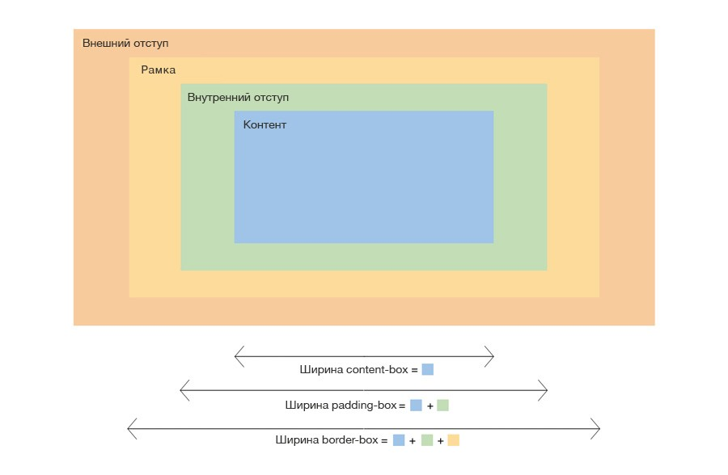
    <figcaption>Свойство <code>box-sizing</code> и его влияние на расчёт ширины.</figcaption>
</figure>

Обычно я устанавливаю значение `border-box` для всех элементов на сайте, благодаря чему расчёт ширины и высоты элементов работает последовательно и интуитивно понятно. Вот как я это делаю:

```css
html {
    box-sizing: border-box;
}

*,
*:before,
*:after {
    box-sizing: inherit;
}
```

Примечание: если вам нужно более детальное объяснение работы свойства `box-sizing`, я рекомендую вам [прочесть эту статью](https://zellwk.com/blog/understanding-css-box-sizing/).

## Шаг 3: создание контейнера сетки

У каждой сетки есть контейнер, определяющий её максимальную ширину. Как правило, я называю его `.l-wrap`. Префикс `.l-` означает layout (раскладка). Я использую такое именование с тех пор, как изучил [SMACSS](https://smacss.com/), методологию [Джонатана Снука](https://twitter.com/snookca).

```css
.l-wrap {
    max-width: 1140px;
    margin-right: auto;
    margin-left: auto;
}
```

Примечание: для лучшей доступности и адаптивности я настоятельно рекомендую использовать вместо пикселей относительные единицы измерения вроде `em` или `rem`. В примерах я использую пиксели, потому что они проще для понимания.

## Шаг 4: расчёт ширины колонок

Помните, что мы используем флоаты для вёрстки колонок и отступов? С флоатами мы можем использовать только пять CSS-свойств для создания колонок и отступов, в случае с флексами, их немного больше.

1. `width`
2. `margin-right`
3. `margin-left`
4. `padding-right`
5. `padding-left`

Если вы помните, при использовании CSS-сеток разметка выглядит примерно так:

```html
<div class="l-wrap">
    <div class="three-col-grid">
        <div class="grid-item">Элемент сетки</div>
        <div class="grid-item">Элемент сетки</div>
        <div class="grid-item">Элемент сетки</div>
    </div>
</div>
```

Из этой разметки понятно, что сетка имеет всего три колонки. Также видно, что для создания отступов нет дополнительных `<div>`. Это означает, что:

1. Мы создаём колонки с помощью свойства `width`;
2. Мы создаём отступы с помощью свойств `margin` или `padding`.

Думать о колонках и отступах одновременно сложно, поэтому давайте для начала представим, что делаем сетку без отступов.

Эта сетка будет выглядеть примерно так:

<figure>
    
    <figcaption>Трёхколоночная сетка без отступов.</figcaption>
</figure>

А теперь нужно произвести несколько математических вычислений. Мы знаем, что сетка имеет максимальную ширину в 1140 пикселей, значит ширина каждой колонка — 380 пикселей (1140 ÷ 3).

```css
.three-col-grid .grid-item {
    width: 380px;
    float: left;
}
```

Пока всё хорошо. Мы сделали сетку, которая отлично работает на вьюпортах больше 1140 пикселей. К сожалению, всё ломается, когда вьюпорт становится меньше.

<figure>
    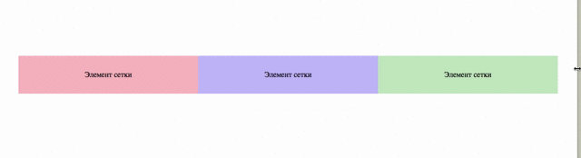
    <figcaption>Сетка ломается, когда вьюпорт меньше 1140 пикселей.</figcaption>
</figure>

Из-за этого мы не можем использовать пиксели. Нам нужна единица измерения, которая зависит от ширины контейнера: это проценты. Давайте зададим ширину колонок в процентах:

```css
.three-col-grid .grid-item  {
    width: 33.33333%;
    float: left;
}
```

Код выше задаёт простую резиновую трёхколоночную сетку без отступов. Колонки меняют свою ширину пропорционально ширине окна браузера.

<figure>
    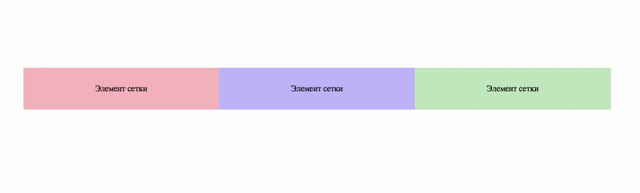
    <figcaption>Три колонки без отступов.</figcaption>
</figure>

Прежде чем двигаться дальше, нужно уточнить одну вещь. Когда все дочерние элементы контейнера плавающие (им задано свойство `float`), высота контейнера обнуляется. Это явление называется [схлопыванием флоатов](https://css-tricks.com/all-about-floats/). Контейнер ведёт себя так, будто в нём нет дочерних элементов:

<figure>
    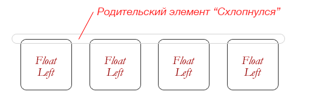
    <figcaption>Схлопывание флоата. Изображение с CSS Tricks.</figcaption>
</figure>

Чтобы это исправить, нам нужен клиар-фикс. Он выглядит так:

```css
.three-col-grid::after {
    display: table;
    clear: both;
    content: '';
}
```

Если вы используете препроцессор вроде Sass, вы можете сделать примесь, чтобы использовать этот код удобно в разных местах:

```scss
// Клиар-фикс
@mixin clearfix {
    &::after {
        display: table;
        clear: both;
        content: '';
    }
}

// Использование
.three-col-grid {
    @include clearfix;
}
```

Мы разобрались с колонками. Следующий шаг — отступы.

## Шаг 5: определение положения отступов

Пока мы только знаем, что их можно реализовать с помощью свойств `margin` и `padding`. Но какое из них следует выбрать?

Сделав несколько попыток, вы быстро поймёте, что есть четыре возможных способа как сделать эти отступы: внешние, `margin` и внутренние, `padding`. Отступы могут быть расположены:

1. С одной стороны, внешние;
2. С одной стороны, внутренние;
3. Равномерно с обеих сторон, внешние;
4. Равномерно с обеих сторон, внутренние.

<figure>
    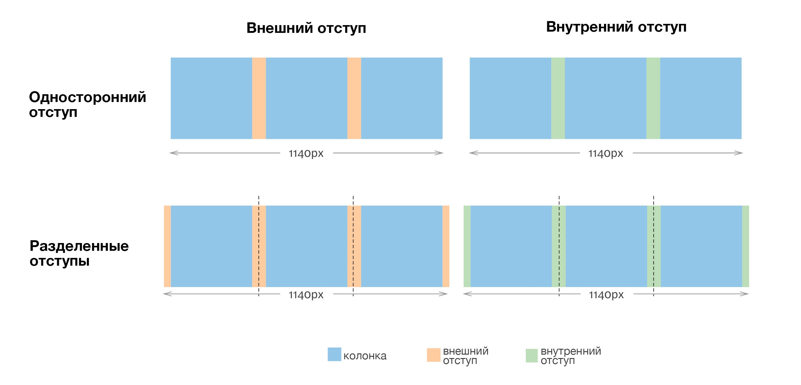
    <figcaption>Четыре возможных способа создать колонки и отступы.</figcaption>
</figure>

Здесь начинаются сложности. Вам нужно по-разному рассчитать ширину колонок в зависимости от используемого метода. Рассмотрим эти методы один за другим и посмотрим на разницу. Не торопитесь, пока читаете.

Поехали:

### Метод 1: внешние односторонние отступы

Используя этот метод, вы создаете отступы с помощь `margin`. Этот отступ будет расположен слева или справа от колонки. Вам решать, какую сторону выбрать.

В рамках этой статьи, давайте предположим, что вы задаете отступы справа. Вот что вы будете делать:

```css
.grid-item {
    margin-right: 20px;
    float: left;
}
```

Затем пересчитываете ширину колонки как на картинке:

<figure>
    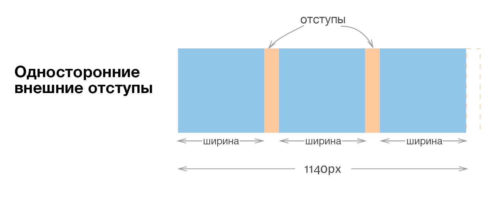
    <figcaption>Внешние односторонние отступы.</figcaption>
</figure>

Как вы видите на картинке выше, 1440 пикселей — это три колонки и два отступа.

И тут появляется проблема… Нам нужно, чтобы колонки были описаны в процентах, но в то же время отступы зафиксированы на ширине 20 пикселей. Мы не можем делать вычисления с двумя разными единицами измерения одновременно!

Это было невозможно раньше, но возможно сейчас.

Вы можете использовать CSS-функцию `calc` для сочетания процентов с другими единицами измерения. Она на лету извлекает значение процентов для выполнения вычислений.

Это значит, что вы можете задать ширину в виде функции, и браузер автоматически рассчитает ее значение:

```css
.grid-item {
    width: calc((100% - 20px * 2) / 3);
}
```

Это круто.

После получения ширины колонки, вам нужно удалить последний отступ у крайнего правого элемента сетки. Вот как это можно сделать:

```css
.grid-item:last-child {
    margin-right: 0;
}
```

Чаще всего, когда вы удаляете последний отступ у крайнего правого элемента, вы также хотите задать ему обтекание по правой стороне для предотвращения ошибок субпикселного округления, из-за которых ваша сетка переносит последний элемент на новую строку. Это происходит только в браузерах, которые округляют пиксели.

<figure>
    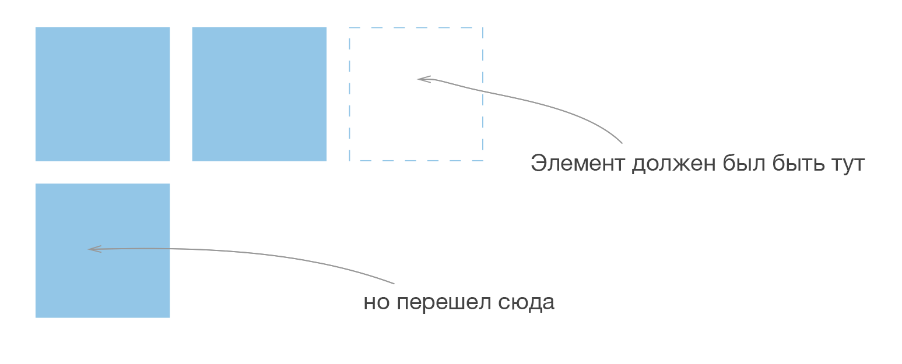
    <figcaption>Ошибка субпикселного округления может сломать сетку, вытолкнув последний элемент на следующую строку.</figcaption>
</figure>

```css
​.grid-item:last-child {
    margin-right: 0;
    float: right;
}
```

Фух. Почти готово. И ещё одна вещь.

Наш код хорош только в том случае, если сетка содержит лишь одну строку. Но он не справляется, если строк с элементами больше, чем одна 😢

<figure>
    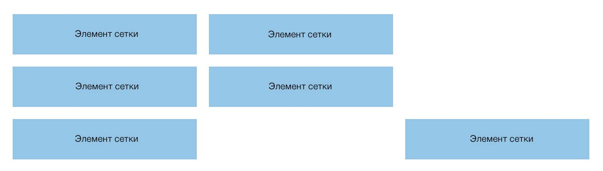
    <figcaption>Код не справляется, если строк больше, чем одна.</figcaption>
</figure>

Нам нужно удалить правый внешний отступ у каждого крайнего правого элемента в каждой строке. Лучший способ это сделать — использовать `nth-child`:

```css
/* Для 3-колоночной сетки */
.grid-item:nth-child(3n+3) {
    margin-right: 0;
    float: right;
}
```

Это всё, что нужно для создания односторонних внешних отступов. Вот CodePen, чтобы вы сами поиграли:

<figure>
    <iframe height="265" src="https://codepen.io/Lesnevskiy/embed/RoZpva/?height=265&theme-id=0&default-tab=css,result&embed-version=2" title="Односторонняя сетка с использованием внешних отступов" allowfullscreen></iframe>
    <figcaption>Односторонняя сетка с использованием внешних отступов.</figcaption>
</figure>

**Примечание:** свойство `сalc` не работает в IE8 и Opera Mini. Смотрите другие подходы, если вам нужно поддерживать эти браузеры.

### Метод 2: внутренние односторонние отступы

Как и с внешними односторонними отступами, в этом методе требуется разместить отступы на одной из сторон колонки. Предположим, что вы снова выбрали правую сторону.

```css
.grid-item {
    padding-right: 20px;
    float: left;
}
```

Затем, вы можете пересчитать ширину колонки как на картинке:

<figure>
    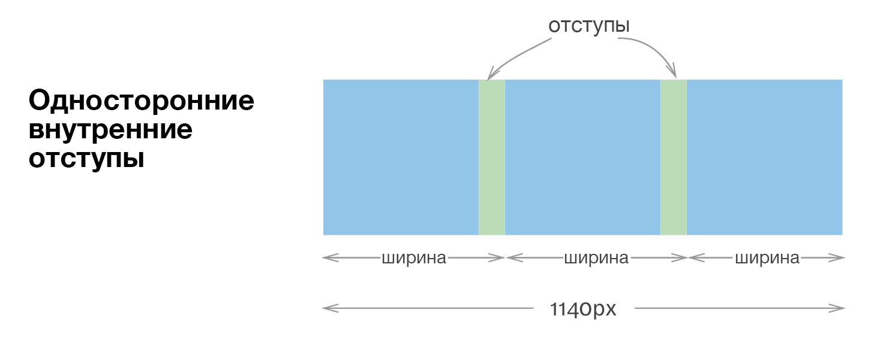
    <figcaption>Односторонние отступы с использованием внутренних отступов.</figcaption>
</figure>

Обратили внимание, что ширина отличается от предыдущего метода? Мы переключили свойство `box-sizing` в `border-box`. Теперь `width` рассчитывается, включая в себя `padding`.

В этом случае, две из трёх колонок имеют бо́льшую ширину, чем последняя, что в конечном итоге приводит к причудливым расчётам и делает CSS трудным для понимания.

Я предлагаю даже не продолжать с этим методом. Всё обернётся действительно страшно. Пробуйте на свой страх и риск.

### Метод 3: внешние разделённые отступы

В этом методе мы разделяем отступы на две части и размещаем по половине с каждой стороны колонки. Код выглядит примерно так:

```css
.grid-item {
    margin-right: 10px;
    margin-left: 10px;
    float: left;
}
```

Затем пересчитываем ширину колонки как на картинке:

<figure>
    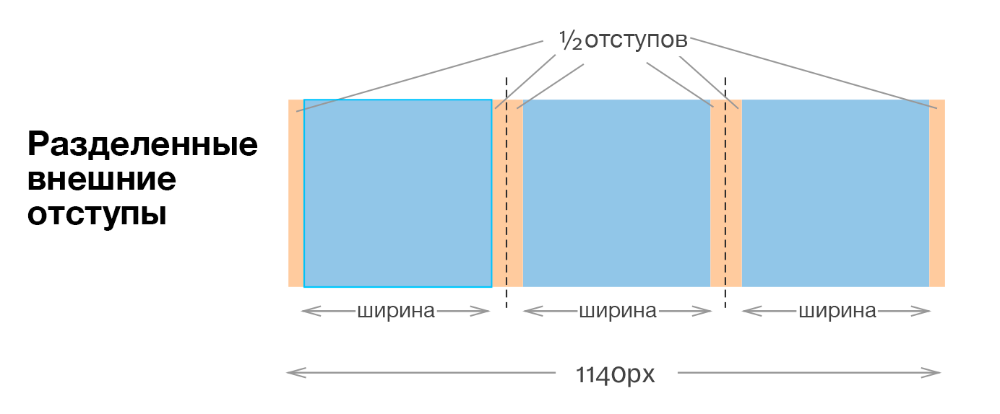
    <figcaption>Разделение внешних отступов.</figcaption>
</figure>

Как мы узнали ранее, рассчитать ширину колонки можно с помощью функции `calc`. В этой ситуации мы отнимаем три отступа от 100%, прежде чем делить ответ на три для получения ширины колонки. Другими словами, ширина колонки будет `calc((100% - 20px * 3) / 3)`.

```
.grid-item {
    width: calc((100% - 20px * 3) / 3);
    margin-right: 10px;
    margin-left: 10px;
    float: left;
}
```

Это всё! Вам не нужно ничего дополнительно делать для сеток с несколькими строками 😉 Вот CodePen, чтобы вы могли поиграть:

<figure>
    <iframe height="265" src="https://codepen.io/Lesnevskiy/embed/KNvWYR/?height=265&theme-id=0&default-tab=css,result&embed-version=2" title="Сетка с внешними разделенными отступами." allowfullscreen></iframe>
    <figcaption>Сетка с внешними разделенными отступами.</figcaption>
</figure>

### Метод 4: внутренние разделённые отступы

Этот метод аналогичен предыдущему. Мы делили отступы и размещали их с каждой стороны колонки. На этот раз мы используем `padding`:

```css
.grid-item {
    padding-right: 10px;
    padding-left: 10px;
    float: left;
}
```

Затем вы рассчитываете ширину колонки так:

<figure>
    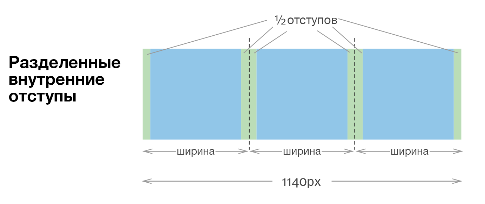
    <figcaption>Внутренние разделённые отступы.</figcaption>
</figure>

Обратили внимание, что в этом случае гораздо легче делать расчеты? Всё верно: это треть ширины сетки в каждой контрольной точке.

```css
.grid-item {
    width: 33.3333%;
    padding-right: 10px;
    padding-left: 10px;
    float: left;
}
```

Вот CodePen, чтобы вы могли поиграть:

<figure>
    <iframe height="265" src="https://codepen.io/Lesnevskiy/embed/qqXrzB/?height=265&theme-id=0&default-tab=css,result&embed-version=2" title="Сетка с внутренними разделенными отступами." allowfullscreen></iframe>
    <figcaption>Сетка с внутренними разделенными отступами.</figcaption>
</figure>

Прежде чем мы двинемся дальше, я хочу вас предостеречь, если вы используете разделенный `padding`. Если вы взглянете на разметку в CodePen, то увидите, что я добавил дополнительный `<div>` внутри `.grid-item`. Этот дополнительный `<div>` важен, если компонент содержит фон или рамки.

Всё потому, что фон отображается в границах `padding`. Надеюсь, эта картинка поможет вам разобраться, показав связь между `background` и другими свойствами.

<figure>
    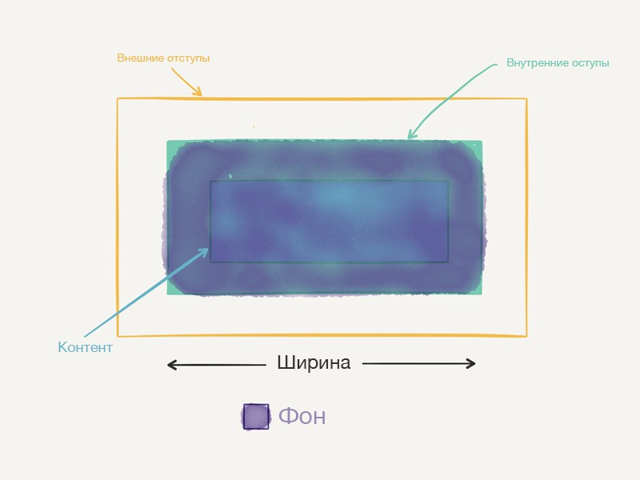
    <figcaption>Фон отображается на `padding`.</figcaption>
</figure>

## Что бы использовал я?

Когда я начинал делать сетки два года назад, я в основном делал сетки, которые были спроектированы по [нисходящему подходу](https://zellwk.com/blog/designing-grids/#how-big-should-columns-and-gutters-be-) и построены на [гибридной системе](https://zellwk.com/blog/designing-grids/#how-the-grid-responds-to-different-viewports). При таком подходе, я использовал процентные значения и для ширины, и для отступов.

В то время, я любил простоту настроек отступов с одной стороны колонки. Это было проще потому, что я не так хорош в математике. От дополнительных расчётов `отступы ÷ 2` я быстро вырубался.

Я рад, что я пошёл этим путем. Хоть CSS и выглядит более сложным, чем для разделенных отступов, я был вынужден [изучить](https://css-tricks.com/examples/nth-child-tester/) селектор `nth-child`. Я также понял важность написания [CSS сначала для мобильных](https://zellwk.com/blog/how-to-write-mobile-first-css/). Насколько я могу судить, это до сих пор является главным препятствием и для молодых, и для опытных разработчиков.

Так или иначе, если вы попросите меня выбрать сейчас, я выберу разделенные отступы вместо односторонних, потому что CSS для них более простой. Также, я рекомендую использовать `margin` вместо `padding`, потому что разметка получается чище. Но `padding` легче рассчитать, поэтому я продолжу статью с ним.

## Шаг 6: создание отладочной сетки

Когда вы только начинаете, особенно полезно иметь под рукой контрольную сетку, которая поможет отладить вашу разметку. Это помогает быть уверенным, что вы всё делаете правильно.

На сегодня, мне известен лишь кривой способ создания отладочной сетки. Нужно создать HTML-разметку и добавить к ней немного CSS. Вот так примерно выглядит HTML:

```html
<div class="fixed-gutter-grid">
    <div class="column"></div>
    <div class="column"></div>
    <div class="column"></div>
    <div class="column"></div>
    <div class="column"></div>
    <div class="column"></div>
    <div class="column"></div>
    <div class="column"></div>
    <div class="column"></div>
    <div class="column"></div>
    <div class="column"></div>
    <div class="column"></div>
</div>
```

CSS для отладочной сетки выглядит следующим образом. Я использую разделенные внешние отступы для упрощения разметки отладочной сетки:

```css
.column {
    width: calc((100% - 20px * 12) / 12);
    height: 80px;
    margin-right: 10px;
    margin-left: 10px;
    background: rgba(0, 0, 255, 0.25);
    float: left;
}
```

<figure>
    <iframe height="265" src="https://codepen.io/Lesnevskiy/embed/RoZVbG/?height=265&theme-id=0&default-tab=css,result&embed-version=2" title="Отладочная сетка с фиксированными отступами." allowfullscreen></iframe>
    <figcaption>Отладочная сетка с фиксированными отступами.</figcaption>
</figure>

**Ремарка:** Сьюзан Мириам и Собрал Робсон работают над [фоновым SVG изображением отладочной сетки для Susy v3](https://github.com/oddbird/susy/issues/609). Это очень захватывающе, так как вы можете использовать простую функцию для создания вашей отладочной сетки!

## Шаг 7: внесите изменения в раскладку

Следующий шаг заключается во внесении изменений в раскладку на основе вашего контента. Именно здесь CSS-сетка засияет во всей красе. Вместо того, чтобы создавать разметку с написанием множества сеточных классов, вы можете создать для нее подходящее имя.

Для примера допустим, что у вас есть сетка для раскладки, которая используется только для гостевых статей. На десктопе раскладка выглядит примерно так:

<figure>
    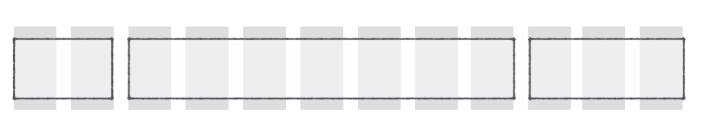
    <figcaption>Пример сетки для раскладки, которая используется только для гостевых статей.</figcaption>
</figure>

Разметка для раскладки этой гостевой статьи может быть такой:

```html
<div class="l-guest-article">
    <div class="l-guest">
        <!-- Профиль гостя -->
    </div>
    <div class="l-main">
        <!-- Главная статья -->
    </div>
    <div class="l-sidebar">
        <!-- Боковые виджеты -->
    </div>
</div>
```

Итак, сейчас у нас есть 12 колонок. Ширина одной колонки 8,333% (100 ÷ 12).

Ширина `.l-guest` равна двум колонкам. Поэтому вам нужно умножить 8,333% на два. Достаточно просто. Проделайте тоже самое для остальных элементов.

Здесь я предлагаю использовать препроцессор типа Sass, который позволит вам рассчитывать ширину колонок легче, используя функцию `percentage`, вместо расчетов вручную:

```scss
.l-guest-article {
    @include clearfix;
    .l-guest {
        // Хм, читается лучше, чем 16.666% :)
        width: percentage(2/12);
        padding-left: 10px;
        padding-right: 10px;
        float: left;
    }

    .l-main {
        width: percentage(7/12);
        padding-right: 10px;
        padding-left: 10px;
        float: left;
    }

    .l-sidebar {
        width: percentage(3/12);
        padding-right: 10px;
        padding-left: 10px;
        float: left;
    }
}
```

<figure>
    <iframe height="265" src="https://codepen.io/Lesnevskiy/embed/QGMvLm/?height=265&theme-id=0&default-tab=css,result&embed-version=2" title="Сетка с фиксированными отступами для раскладки гостевой статьи." allowfullscreen></iframe>
    <figcaption>Сетка с фиксированными отступами для раскладки гостевой статьи.</figcaption>
</figure>

Должно быть вы заметили, что сейчас часть кода повторяется. Мы можем это исправить, вынеся общие части кода в отдельный селектор `.grid-item`.

```scss
.grid-item {
    padding-left: 10px;
    padding-right: 10px;
    float: left;
}

.l-guest-article {
    .l-guest {
        width: percentage(2/12);
    }
    .l-main {
        width: percentage(7/12);
    }
    .l-sidebar {
        width: percentage(3/12);
    }
}
```

Ну вот, теперь гораздо лучше 🙂

## Шаг 8: создание вариаций раскладки

Последний шаг — сделать вашу раскладку адаптивной. Давайте предположим, что раскладка нашей гостевой статьи ведет себя следующим образом:

<figure>
    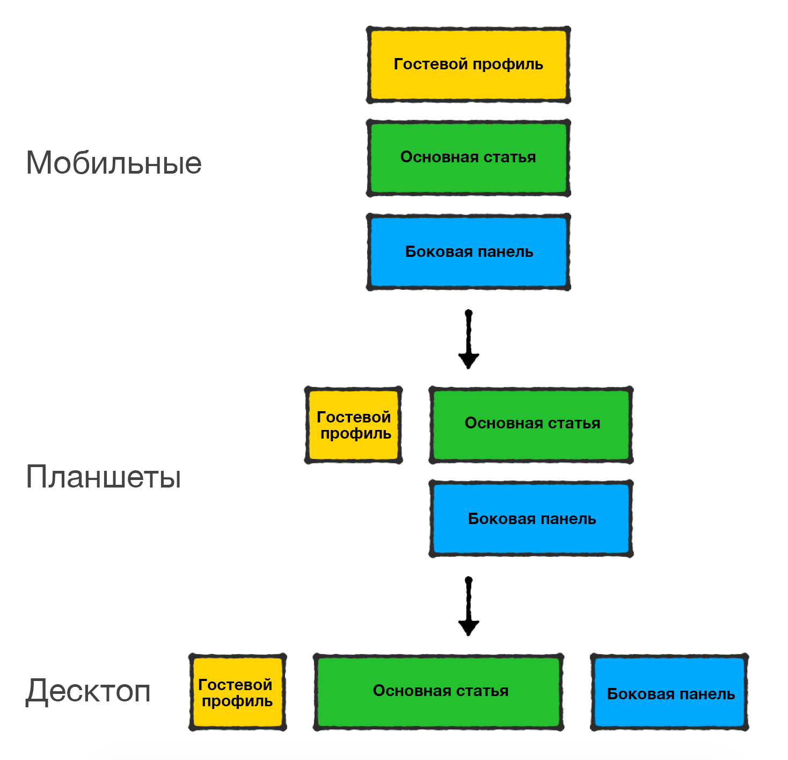
</figure>

Разметка нашей гостевой статьи не должна меняться. То, что у нас есть — это самая доступная раскладка из возможных. Так что, изменения должны быть полностью в CSS.

При написании CSS для нашей адаптивной гостевой раскладки, я настоятельно рекомендую вам писать [CSS сначала для мобильных](https://zellwk.com/blog/mobile-first-css/), потому что это делает ваш код проще и аккуратнее. В первую очередь, мы можем начать писать CSS для мобильной раскладки.

Вот код:

```scss
.l-guest-article {
    .l-guest {
        /* Здесь пусто */
    }
    .l-main {
        margin-top: 20px;
    }
    .l-sidebar {
        margin-top: 20px;
    }
}
```

Нам здесь нечего делать, каждый компонент занимает всю доступную ширину по умолчанию. Однако мы можем добавить верхний отступ к последним двум элементам, чтобы отделить их друг от друга.

Далее двигаемся к планшетной раскладке.

Давайте предположим, что для этой раскладки мы установим контрольную точку в 700 пикселей. `.l-guest` должен занимать 4 из 12 колонок, а `.l-main` и `.l-sidebar` по 8 колонок каждый.

Здесь нам надо удалить свойство `margin-top` у `.l-main`, потому что он должен быть на одной линии с `.l-guest`.

Также, если мы установим `.l-sidebar` ширину 8 колонок, он автоматически перейдет во второй ряд — в первом ряду не хватит места. Поскольку он находится во втором ряду, нам тоже нужно добавить внешний отступ слева у `.l-sidebar`, чтобы протолкнуть его на позицию. В качестве альтернативы, мы можем сделать его обтекаемым справа — я так и сделаю, это не требует лишних расчётов.

И поскольку мы сделали наши грид-элементы обтекаемыми, грид-контейнер должен включать клиар-фикс, чтобы очистить обтекание у дочерних элементов:

```scss
.l-guest-article {
    @include clearfix;
    .l-guest {
        @media (min-width: 700px) {
            width: percentage(4/12);
            float: left;
        }
    }
    .l-main {
        margin-top: 20px;
        @media (min-width: 700px) {
            width: percentage(8/12);
            margin-top: 0;
            float: left;
        }
    }
    .l-sidebar {
        margin-top: 20px;
        @media (min-width: 700px) {
            width: percentage(8/12);
            float: right;
        }
    }
}
```

Наконец, давайте перейдем к десктопной раскладке.

Допустим, для этой раскладки мы установим контрольную точку в 1200 пикселей. `.l-guest` будет занимать 2 из 12 колонок, `.l-main` — 7 из 12 и `.l-sidebar` — 3 из 12.

Для этого мы создаем новое медиавыражение в рамках каждого элемента сетки и изменяем ширину по необходимости. Обратите внимание, что мы также должны удалить верхний отступ у `.l-sidebar`.

```scss
.l-guest-article {
    @include clearfix;
    .l-guest {
        @media (min-width: 700px) {
            width: percentage(4/12);
            float: left;
        }

        @media (min-width: 1200px) {
            width: percentage(2/12);
        }
    }
    .l-main {
        margin-top: 20px;
        @media (min-width: 700px) {
            width: percentage(8/12);
            margin-top: 0;
            float: left;
        }
        @media (min-width: 1200px) {
            width: percentage(7/12);
        }
    }
    .l-sidebar {
        margin-top: 20px;
        @media (min-width: 700px) {
            width: percentage(8/12);
            float: right;
        }
        @media (min-width: 1200px) {
            width: percentage(3/12);
            margin-top: 0;
        }
    }
}
```

Вот CodePen с финальной раскладкой, которую мы создали:

<figure>
    <iframe height="265" src="https://codepen.io/Lesnevskiy/embed/zodwOQ/?height=265&theme-id=0&default-tab=css,result&embed-version=2" title="Сетка с фиксированными отступами для раскладки гостевой статьи, финальная версия." allowfullscreen></iframe>
    <figcaption>Сетка с фиксированными отступами для раскладки гостевой статьи, финальная версия.</figcaption>
</figure>

О, кстати, вы можете добиться таких же результатов со Susy. Только [не забудьте](https://zellwk.com/blog/susy-gutter-positions/) выставить `gutter-position` в `inside-static`.

## Подводя итог

Ого. Длинная получилась статья. Я думал, трижды помру, пока писал её. Спасибо, что дочитали до конца. Надеюсь, вы не померли трижды, пока читали! 😛

Как вы могли заметить, в этой статье шаги для создания адаптивной сетки относительно простые. Большинство путается на шагах 5 (определение положения отступов) и 8 (адаптация раскладки).

5-й шаг прост, когда вы учитываете все возможные способы, и мы разобрали их вместе. 8-й шаг проходится легче, если у вас достаточно опыта в написании [CSS сначала для мобильных](https://zellwk.com/blog/mobile-first-css/).

Надеюсь, эта статья дала вам знания для построения вашей собственной адаптивной сетки, и я надеюсь увидеть как вы строите специально созданную сетку для вашего следующего проекта.

До скорого!
