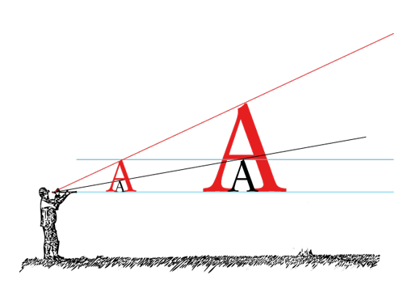
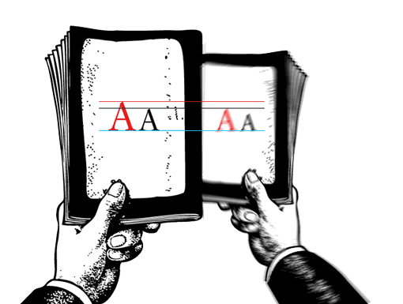
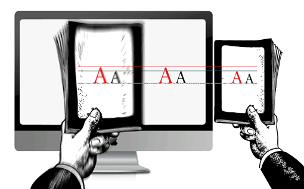
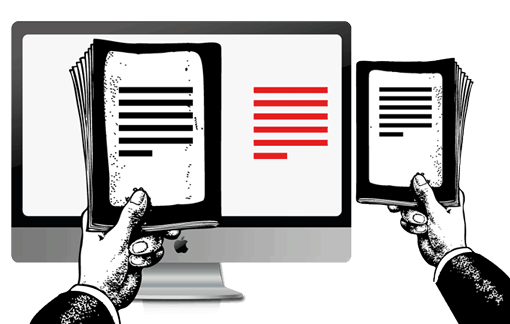
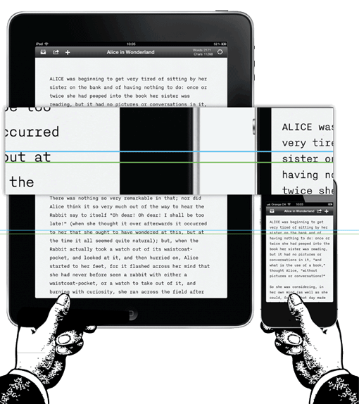
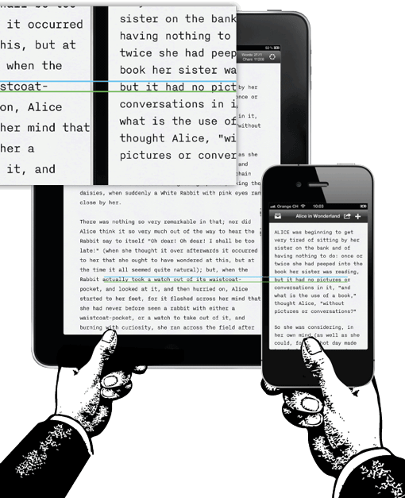
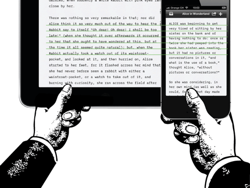
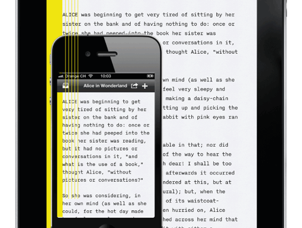
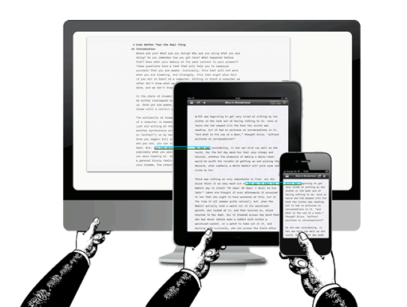
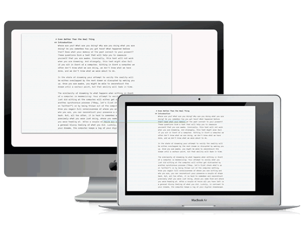

Когда мы создаём сайты, мы обычно начинаем с определения основных параметров текста. Он диктует нам ширину главной колонки, а остальное выстраивается почти само собой. Так было раньше. До недавнего времени разрешение экрана было более или менее однородным, сегодня же мы имеем дело с разнообразными размерами и разрешениями, и это многое усложняет.

В пылу перезапуска (сайта компании — _прим. переводчика_) я написал небольшой пост в блог об адаптивной типографике, фокусируясь исключительно на главном аспекте нашего последнего эксперимента: адаптивных шрифтах. Без знания [истории iA](http://informationarchitects.net/) вы упустите некоторые ключевые особенности адаптивной типографики и дизайна нашего нового сайта. Вместо того, чтобы смешивать все наши статьи по этому вопросу, я решил начать с нуля и объяснить, что такое адаптивная типографика шаг за шагом. Это первый шаг.

Чтобы избежать создания различных макетов для каждого из возможных размеров экрана, множество веб-дизайнеров взяли на вооружение концепцию адаптивного веб-дизайна. Если в двух словах, то это идея раскладки, которая автоматически подстраивается к параметрам экрана. Для этого есть [разные способы](http://viljamis.com/blog/2012/adaptive-vs-responsive-whats-the-difference.php). Я предпочитаю использовать эти:

1. Адаптивная раскладка: последовательное определение нескольких раскладок разной конечной ширины.
2. Резиновая раскладка: непрерывная подстройка раскладки к любой возможной ширине.

Несмотря на то, что оба подхода имеют преимущества и недостатки, нам кажется, что адаптивность с наименьшим числом контрольных точек — это верный путь, так как читаемость гораздо важнее, чем всегда занимающая всю ширину экрана раскладка. Это сложный вопрос со спорными мнениями, но для оптимальной читаемости нужен определённый контроль над текстом, а в этом случае резиновая раскладка создаёт больше проблем, чем решает. Подробнее об этом в следующий раз.

_Примечание:_ Адаптивный дизайн уже включает в себя множество макропараметров типографики (кегль, интерлиньяж, ширина колонки). Таким образом, в большинстве случаев адаптивный дизайн уже содержит адаптивную типографику. То, о чём мы говорили в первом посте об адаптивной типографике на нашем сайте, в основном касалось использования градации шрифтов. Об этом мне бы хотелось поговорить в следующей раз, а сейчас давайте погрузимся в основы адаптивной макротипографики на экране.

## Выбор гарнитуры

### Хороший тон

Рано или поздно вам придётся выбрать, какую гарнитуру использовать. Выбор шрифта — это в основном вопрос вкуса, но, так как каждый шрифт имеет свои качества и требования (или ограничения), выбор шрифта приводит ко множеству визуальных и технологических последствий. Веб-шрифты сейчас представлены большим спектром гарнитур, так что поиски подходящей становятся очередной проблемой.

Чтобы поэкспериментировать с типами шрифтов, для нашего сайта мы разработали свой шрифт. Мы выбрали шрифт с засечками, потому что он подходит нашей манере говорить и подчёркивает нюансы содержимого (или, по крайней мере, нам так кажется). Для [iA Writer](http://www.iawriter.com/) мы выбрали моноширинный шрифт. Поскольку главная цель нашей программы — помочь с написанием черновика, мы специально выбрали Nitti — гарнитуру, одновременно строгую и аккуратную. Решение использовать моноширинный шрифт пришло потому, что операционная система первого iPad не применяла кернинг к пропорциональным шрифтам. Вместо использования пропорциональных шрифтов, которые бы плохо отображались на экране, мы решили сразу начать с моноширинного.

### Шрифт с засечками или без?

Обычно выбор стоит между шрифтами с засечками и без. Это сложный вопрос сам по себе, но есть простое правило, которое может помочь: «[Шрифт с засечками — священник, без засечек — хакер](http://typotalks.com/berlin/de/blog/2011/05/19/oliver-reichenstein-we-are-the-medium/)». Один не лучше другого, но, по разным причинам, шрифт с засечками имеет более авторитарный оттенок, в то время как шрифт без засечек кажется более демократичным. Заметьте, что это пять тысяч лет истории типографики, пересказанные в двух небрежных строках, так что не воспринимайте их слишком серьёзно.

Множество людей до сих пор думают, что для экранной типографики задавать вопрос «с засечками или без» бессмысленно. На самом деле, всё не так просто. Вопреки всеобщим убеждениям, оба этих начертания будут хорошо смотреться, _если_ выбрать размер основного текста больше 12 пикселей. Антиква меньше 12 пикселей отрисовываются недостаточно чётко, к тому же на современных мониторах 12 пикселей определённо мало (и это отсылает нас ко второму пункту).

## Какой размер?

Кегль основного текста не зависит от личных предпочтений. Он зависит от дистанции чтения. Так как чаще всего компьютеры расположены дальше, чем книги, метрический размер шрифта на рабочем столе должен быть больше, чем размер шрифта, используемый в печатном аналоге.

Иллюстрация ниже показывает, что чем дальше ваш текст, тем больше он должен быть. Две чёрные и две красные А имеют одинаковые _физические размеры_. Но, так как правая пара расположена дальше, _воспринимаемый размер_ меньше. Красная «A» на правой картинке имеет тот же воспринимаемый размер, что и чёрная «A» на левой:

Чем дальше вы держите текст, тем меньшим он кажется визуально. Чем дальше вы держите текст, тем больше нужно сделать шрифт, чтобы компенсировать большую дистанцию чтения. Насколько больше — это отдельная наука. Если у вас нет опыта, полезным упражнением будет держать книгу с хорошо напечатанным текстом на комфортной для чтения дистанции и сравнивать её с вашим сайтом.

Графические дизайнеры без опыта веб-дизайна удивляются, насколько огромен хороший основной текст в вебе по сравнению с печатным аналогом. Напоминаю, он большой, если их сравнивать рядом, а не в перспективе.

Если после увеличения кегля основного текста до соответствия, новый размер поначалу раздражает, не волнуйтесь, это нормально. Однако, привыкнув к нему, вы не захотите возвращаться к «стандартным» малым размерам.

Мы [продвигаем эти «перспективно пропорциональные» размеры шрифтов](http://informationarchitects.net/blog/responsive-typography-the-basics/100E2R) с 2006 года. Первоначально наше утверждение, что Georgia 16px — хороший эталон для основного текста, вызвало много гнева и даже смех, но сейчас это более или менее общий стандарт. С более высокими разрешениями этот стандарт постепенно устаревает. Но об этом чуть позже.

## Межстрочный интервал и контраст

В то время как кегль может быть определён с помощью трюка с перспективой, интерлиньяж требует некоторых корректировок. С увеличением дистанции чтения и появлением размытости пикселей (как мы это называем), будет мудро делать межстрочный интервал экранного текста немного большим, чем у печатного. 140% — это хороший стандарт, но, конечно, это зависит от используемого шрифта.

На сегодняшний день подразумевается, что вы не будете делать контраст слишком слабым (например, серый текст на светло-сером фоне) или слишком резким (как розовое на жёлтом). Так как экранные шрифты были разработаны для отображения чёрного на белом, тёмный фон использовать сложнее, но это возможно, если всё сделать верно. С современными высококонтрастными экранами также лучше выбрать либо тёмно-серый для текста, либо светло-серый для фона вместо жёсткого чёрного на белом. Но это, опять же, не самый главный вопрос.

### iPhone против iPad

Многое из того, что мы узнали об адаптивной типографике, пришло из поиска совершенной типографики для нашего приложения. Проектируя iA Writer для iPad, мы потратили несколько недель на то, чтобы определиться с типографикой. Тогда высокое разрешение iPad было совершенно новым испытанием, и прошло какое-то время, прежде чем мы разобрались как это работает. Когда Apple анонсировала Retina-дисплей для iPhone, а позже и для iPad, всё снова изменилось. Можно написать целую книгу, чтобы объяснить, как мы дошли до канонического вида шрифта iA Writer, но хочется ещё рассказать об общих вопросах, так что перейду к делу.

Если сравнить текущую версию Writer для iPhone с версией для iPad, можно заметить, что размер шрифта не совпадает.

Почему для iPhone и iPad используется разный кегль? Если вы внимательно прочли объяснение выше, вы уже могли догадаться.

1.  Поскольку расстояние не всегда одинаковое, обычно вы держите iPad немного дальше. Используете ли вы iPad за столом, кладёте на колени, или держите перед лицом, лёжа в кровати — в каждом случае комфортное для чтения расстояние будет своим. Это оказалось совершенно новой проблемой, так как расстояния до монитора компьютера и до экрана ноутбука не особо различались. Определяя размер шрифта, оптимальный во всех случаях, мы выбрали максимально дальнее положение для комфортного чтения. Следствием будет непривычно большой, но всё ещё комфортный, размер шрифта для чтения в постели, ну и обычно вы не будете печатать текст в приложении, лёжа в кровати на животе.
2.  Экрану iPhone доступна гораздо меньшая площадь, из-за чего приходится вносить правки.

К счастью, iPhone держат ближе к лицу, и вынужденное использование меньшего кегля отлично срабатывает. На среднем расстоянии и iPhone, и iPad имеют схожие по восприятию размеры текста.

Так как iPhone держат ближе, то и высоту строки можно делать меньше, что также является предпочтительным для меньшего экрана:

При проектировании для экрана не всё будет работать в вашу пользу. _Дизайн взаимодействия — это прикладная наука: не поиск безупречного вида, а поиск лучшего компромисса._ В нашем случае нам пришлось уменьшить межстрочный интервал, а также поля и межсимвольный интервал:

Поправки были так тонки, что, не зная о них, трудно заметить маленький размер полей. Почему мы и вовсе от них не избавились? Поля — не просто вопрос эстетики, они позволяют тексту дышать и помогают переводить взгляд со строки на строку. Если вам кажется, что всё это смахивает на эзотерику — нет, ведь пока что мы рассказали только про самые основы.

## Как насчёт настольных компьютеров?

Некоторые люди жалуются на большой шрифт в iA Writer для Mac. Аналогично тому, как мы выбрали наибольший минимальный размер шрифта для iPad (который держат на разном расстоянии при чтении), нам пришлось использовать тот же приём для Mac. В то время ориентиром был <nobr>24-дюймовый</nobr> iMac с высоким разрешением, с воспринимаемым размером примерно таким же, как и у других устройств.

Так как разнообразие компьютеров Mac, на которых работает iA Writer, конечно, мы смогли установить все возможные разрешения. Мы изучили каждую конфигурацию, чтобы быть уверенными, что выбранный размер шрифта — лучший компромисс для большинства машин.

Может возникнуть вопрос: «Почему бы просто не позволить пользователю настраивать размер шрифта?» Ну, подбор размера шрифта — не дело вкуса, а вопрос комфортного расстояния для чтения. Так как у большинства сайтов и приложений размер шрифта слишком мал, новые пользователи изначально выберут наиболее привычный размер шрифта, а именно — слишком маленький размер, и никогда не испытают полное удовольствие от использования нашего приложения. Смысл не в том, чтобы насадить всем пользователям определённое видение, а в том, что мы хотим, чтобы iA Writer работал без настроек, и всё что вы будете в нём делать — писать. Это стало открытым секретом его успеха, и отказ от него стал бы отказом от самой сути приложения. (Что нам нужно улучшить, так это доступность использования для людей со слабым зрением).

Хорошо, почему бы тогда не подстраиваться автоматически под разрешение экрана? Не будет ли это настоящей адаптивной типографикой? Это так, и мы работаем над чем-то похожим. Но сейчас при подстройке к разрешению, нужно правильно выбрать оптический вес, дабы быть уверенным, что шрифт на самом деле работает, как предполагалось с каждым размером и разрешением. С размером шрифта и разрешением оптика шрифта также изменяется. Вот почему у шрифта в iA Writer для Mac, iPad 1/2 и iPad 3 различные градации. Чтобы объяснить всю логику изменений размеров цифровых шрифтов и рассказать, о чём мы думали, создавая новый сайт, требуется чуть больше пространства и времени. Так что ожидайте второй части!

## Отзывы

Несмотря на [отсутствие социальных кнопок](http://informationarchitects.net/blog/sweep-the-sleaze/), у этой статьи множество ретвитов и очень мало критических замечаний, они касаются в основном противостояния резиновой и адаптивной раскладок, об этом я бы хотел поговорить позднее. Я был удивлён, когда Джошуа Портер спросил:

> [@iA](https://twitter.com/iA) Вы увлекли меня вплоть до строчки «дизайн взаимодействия — это прикладная наука». Что вы имели ввиду? [@bokardo](https://twitter.com/bokardo/status/208882881223856129)

На случай, если и другие люди задались этим вопросом… Полная цитата: «При проектировании для экрана не всё будет работать в вашу пользу. Дизайн взаимодействия — это прикладная наука: не поиск безупречного дизайна, а поиск лучшего компромисса». Обычно я говорю «Веб-дизайн — это прикладная наука: не поиск совершенства, а поиск лучшего компромисса». С термином «веб-дизайн» предложение становится немного яснее, из-за более очевидного технического подтекста. Я использовал «дизайн взаимодействия», потому что я использовал приложение в примерах.

Это означает, что в то время как графический дизайн даёт вам большую степень графического контроля, веб-дизайн с самого начала заставляет думать о компромиссе между визуальным дизайном и технологией. Для получения оптимального результата потребуется изучить множество различных решений, каждое со своими за и против, и попытаться найти лучший компромисс между всеми неоптимальными решениями.

На этом этапе в разговор часто вступают графические дизайнеры и пытаются доказать, что и им приходится иметь дело с большим количеством технологий. Конечно, вам приходится. Дизайн в принципе требует технологических знаний. В этом и заключается разница между производством двигателей автомобилей и сайтов, разница между дизайном сайтов и журналов. И дело в степени вовлечённости в разработку.

Резюмируя — это означает, что в процессе дизайна сайтов и приложений немалая часть нашей работы — это поиск компромиссов и решений с наименьшим количеством недостатков. Это то, что отпугивает многих графических дизайнеров, потому что они привыкли контролировать процесс. Подробнее об этом в великолепной презентации Хой Вин [о разнице между экранным и графическим дизайном](http://www.slideshare.net/khoiv/control-annotated) (2007).
