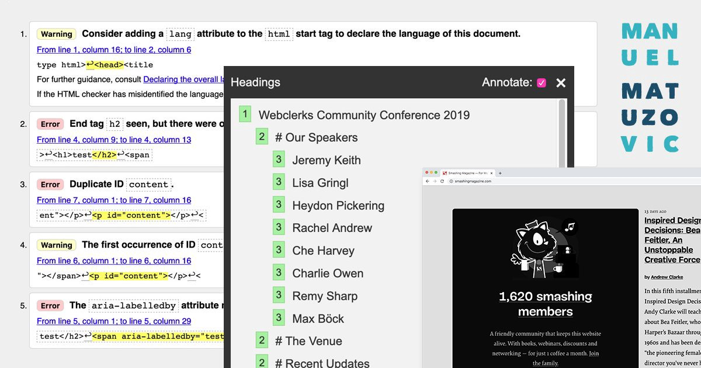
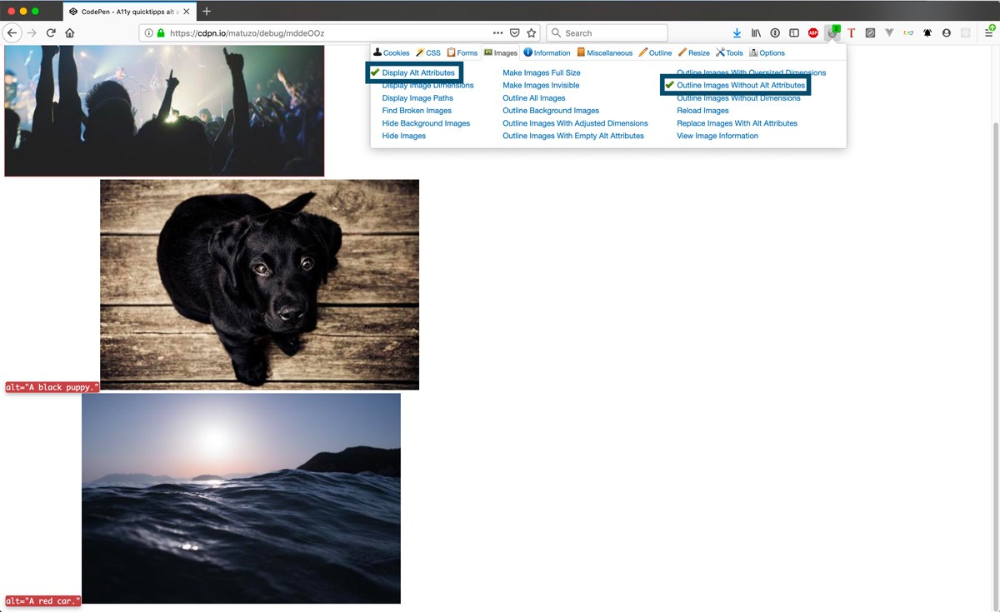
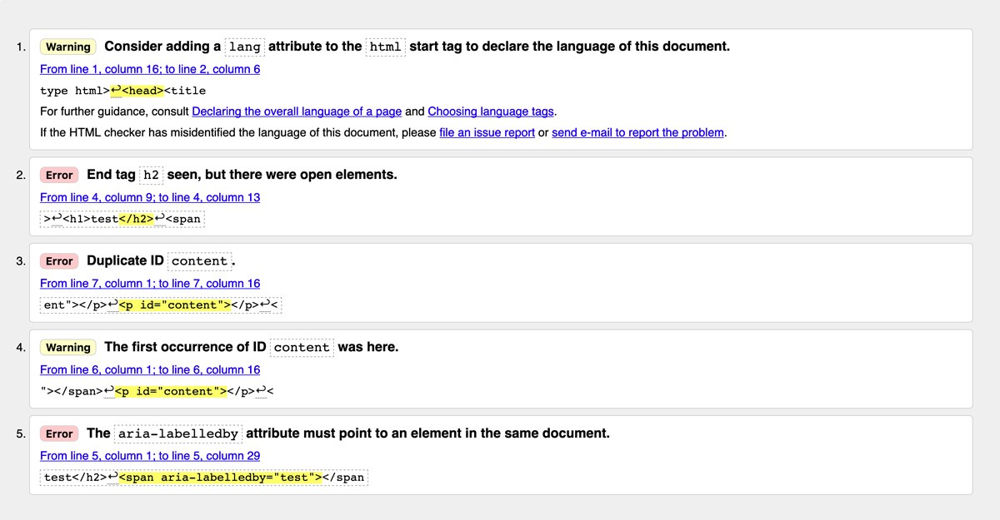
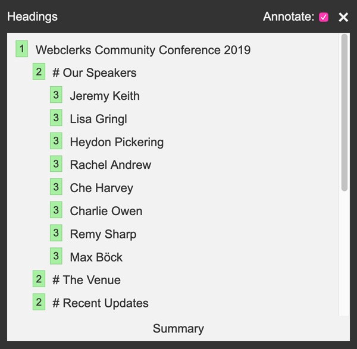
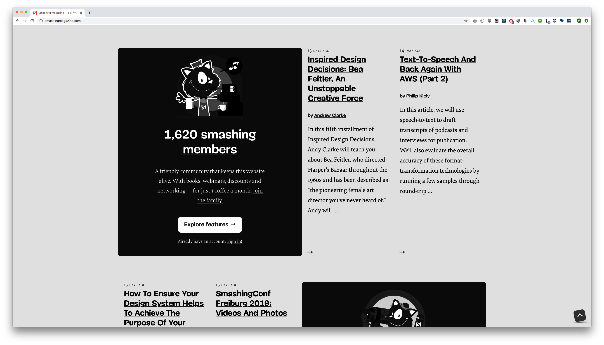

Я только что закончил аудит доступности для заказчика и решил поделиться некоторыми быстрыми проверками, которые я провожу всегда, когда работаю с сайтами. Вы можете прямо сейчас применить их к своему проекту, вам не придётся разбираться со специальными инструментами или софтом.

### 0. Автоматизированное тестирование

Прежде всего я запускаю тест доступности в [Lighthouse](https://developers.google.com/web/tools/lighthouse), чтобы выяснить, есть ли какие-то очевидные проблемы. Автоматизированные тесты хороши, но они проверяют только часть того, что должны. [Можно получить 100 баллов или 0 ошибок, но это не означает, что уже всё хорошо](https://www.matuzo.at/blog/building-the-most-inaccessible-site-possible-with-a-perfect-lighthouse-score/). Вы лишь заложили основу для ручного тестирования.

### 1. Проверьте описания изображений

Первый полуавтоматический тест, который я выполняю, — проверяю, есть ли у изображения описание и правильное ли оно. Для этого я использую браузерное расширение [Web Developer](https://addons.mozilla.org/de/firefox/addon/web-developer/). С его помощью можно выделить картинки, у которых нет атрибута ```alt```, а также вывести значение ```alt``` рядом с изображением.


_Раздел настроек изображений в панели инструментов расширения Web Developer_

### 2. Отключите все стили

Ещё одной полезной функцией расширения [Web Developer](https://addons.mozilla.org/de/firefox/addon/web-developer/) является его способность отключения стилей на странице. Отключение CSS поможет проверить различные вещи:

- Работает ли сайт без стилей? (например, когда они не загрузились)
- Правильный ли порядок элементов на странице?
- Корректный ли размер у картинок и иконок?
- Хорошо ли структурирован ваш документ?


_Страница расписания на сайте webclerks.at с отключённым CSS_

### 3. Валидируйте HTML

Вы можете использовать [W3C Markup Validation Service](http://validator.w3.org/) для проверки разметки. Валидатор не отлавливает все ошибки, но это в любом случае хороший способ обнаружения очевидных багов в вашем HTML, например, дублирующихся ```id``` или сломанных ARIA-атрибутов.


_Ошибки на странице результатов W3C-валидатора_

### 4. Проверьте структуру документа

[Большое значение имеет хорошо продуманная структура документа](https://webaim.org/projects/screenreadersurvey8/#finding). Она должна начинаться с ```<h1>```, за которым в иерархическом порядке следуют ```<h2>```, ```<h3>```, и т.д. Это отлично подходит для поисковых систем и пользователей скринридеров, ведь так они могут перемещаться по вашему сайту, прыгая по заголовкам.


_Список заголовоков на сайте webclerks.at (скриншот из tota11y)_

Для проверки структуры документа можно использовать [W3C Markup Validation Service](https://validator.w3.org/) или инструмент [tota11y](https://khan.github.io/tota11y/) (см. скриншот выше).

### 5. Включите монохромный режим

Для отображения сайтов в монохромном режиме я использую браузерное расширение [High Contrast](https://chrome.google.com/webstore/detail/high-contrast/djcfdncoelnlbldjfhinnjlhdjlikmph). Это важный тест: он покажет те элементы дизайна, которые работают только с цветом. Следует убедиться, что вы не используете исключительно цвет для передачи информации. Идеальный пример — ссылки: они должны быть подчёркнуты, чтобы можно было легко отличить их от обычного текста. [Подчёркивания — это прекрасно!](https://adrianroselli.com/2019/01/underlines-are-beautiful.html)
> # Подчёркивайте ваши чёртовы ссылки, социопаты! — Хейдон Пикеринг


_Сайт The Smashing Magazine в монохромном режиме._

Не обязательно устанавливать расширение, можно использовать CSS для получения такого же эффекта:

    body {
      filter: grayscale(100%);
    }

### 6. Используйте клавиатуру

Уберите подальше свою мышь, пройдитесь по странице, используя только клавишу Tab, и проверьте, можете ли вы попасть в каждую отдельную её часть без мыши или тачпада. Tab — это мощный инструмент тестирования, он расскажет вам многое о вашем сайте:

- Хорошо ли видны стили состояния фокуса?
- Всё ли, что должно иметь фокус, может его получить?
- Действительно ли ваши кнопки ```<button>```?
- Удобно ли вообще использовать клавиатуру на вашем сайте?
- Правильно ли вы управляете фокусом?
- Правильно ли прячутся и отображаются элементы?
- Соответствует ли визуальный порядок элементов реальному порядку в DOM-дереве?
- Можете ли вы использовать кастомные JS-компоненты без мыши?

Есть даже [npm-пакет для отключения курсора мыши](https://www.npmjs.com/package/no-mouse-days), созданный чудесной [Марси Саттон](https://twitter.com/marcysutton).

Это не конец истории. Существует ещё немало вещей, которые стоит тестировать, но сейчас хватит и этих. Я расскажу больше в другом посте :)
