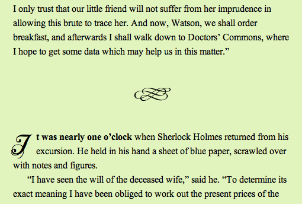
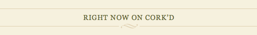

Не так давно мы писали [о презентационных элементах `<i>` и `<b>`](/articles/i-b-em-strong-elements/) из HTML4, возродившихся к новой семантической жизни. Другие два элемента, которые претерпели изменения, чтобы получить значения в HTML5 — это `<small>` и `
`:

- `<small>` — использовался раньше для того, чтобы просто сделать текст помельче, теперь же он предназначен для пометок и небольших надписей ([W3C:Markup](http://dev.w3.org/html5/markup/small.html), [WHATWG](http://www.whatwg.org/specs/web-apps/current-work/multipage/text-level-semantics.html#the-small-element));
- `
` — использовался раньше для создания горизонтальных линеек, теперь предназначен для смысловой разбивки на уровне текстовых блоков ([W3C:Markup](http://dev.w3.org/html5/markup/hr.html), [WHATWG](http://www.whatwg.org/specs/web-apps/current-work/multipage/grouping-content.html#the-hr-element)).

## Элемент `<small>`

> Элемент `<small>` представляет собой так называемые «надписи мелким шрифтом», вроде тех, что используются для предостережений и оговорок в юридических документах.
> [Спецификация W3C](http://dev.w3.org/html5/markup/small.html)

Теперь `<small>` применяется для пометок и является более локальным аналогом элемента `<aside>` — для второстепенной информации на странице. Типичным примером будет следующая за основным содержимым юридическая болтовня, вроде заявлений об авторском праве в подвале, отказе от ответственности, или же информации о лицензии. Он также может быть использован для указания авторства. **Не используйте его для содержимого на блочном уровне** (параграфы, списки и т.д.), иначе это будет воспринято как основное содержимое.

    

        Я использую
        Museo Slab,
        <small class="font-license">
            шрифт Жоса Буйвенга (exljbris)
            <a href="http://www.exljbris.nl/">www.exljbris.nl</a>
        </small>
    

Использование `<small class="font-license">` для того, чтобы выполнить требования лицензионного соглашения

    <small>
        <a href="http://creativecommons.org/licenses/by-sa/3.0/"
            rel="license">
            Creative Commons Attribution Share-alike license
        </a>
    </small>

Использование `<small>` вокруг ссылки на [Creative Commons license](http://creativecommons.org/choose/) с `rel="license"`

Текст внутри `<small>` необязательно должен быть меньше, чем окружающий — если же вам нужен именно мелкий текст, то для этого лучше подойдет CSS. Используйте `<small>` только на строчном уровне. В конце концов, `<small>` не влияет на семантику `<em>` или `<strong>`.

## Элемент `
`

> `
` служит для смысловой разбивки на уровне блоков текста
> [Спецификация W3C](http://dev.w3.org/html5/markup/hr.html)

Пообщавшись с [Яном Хиксоном](http://ian.hixie.ch/) (редактором HTML5) я понял, что до сих пор неправильно понимал [модель поведения содержимого](http://www.whatwg.org/specs/web-apps/current-work/multipage/content-models.html#paragraph). Я узнал, что `
` на самом деле означает <q>конец одной секции и начало другой</q> — что семантически равносильно `</section><section>`. Но поскольку элементы вроде `<section>` и так указывают на это, получается, что `
` больше подходит для смысловой разбивки, вроде смыслового разделения внутри блока текста или отделения одной сцены в романе от другой. В любом случае, вы можете использовать этот элемент везде, где вы используете элемент `
`. Из-за унылого вида в браузерах по умолчанию, `
` не слишком распространён сегодня, однако это не мешает оформить его при помощи CSS в виде красивого вензеля.

    hr {
        margin: 3em 0;
        height: 24px;
        border: 0;
        background: url(flourish.png) 50% 50% no-repeat;
    }

Оформите `
` красиво: уберите рамку, поля и добавьте фоновую картинку.

IE7 и младше оправдывают свою дурную репутацию, добавляя рамку вокруг изображения, несмотря на наши усилия, [но и это можно исправить](http://blog.neatlysliced.com/2008/03/hr-image-replacement/). Или же вы можете просто скрыть `
` в стилях для IE7 и младше. Если переход между частями содержимого очевиден или разделение чисто визуальное, а не смысловое, то вместо `
` лучше нарисовать рамку или фоновую картинку на другом элементе.

На [Cork’d](http://content.corkd.com/) используется декоративная фоновая картинка для заголовков. Но несмотря на обилие линеек, это совсем неподходящий случай для использования `
`.

## В заключение

В момент выхода HTML4, презентационные элементы `<basefont>`, ``, `<s>`, `<strike>` и `<u>` уже были помечены как нежелательные для использования, в пользу применения CSS. HTML5 завершил этот процесс, избавившись от элементов `<big>` и `<tt>`.

Остальные презентационные элементы из HTML4 — долго игнорируемые `<small>` и `
` ([наряду с `<i>` и `<b>`](/articles/i-b-em-strong-elements/)) — были пересмотрены в HTML5 с учетом их полезных, медиа-независимых семантических свойств, которые имеют отношение к их типичному использованию. Будете ли _вы_ использовать их? Выскажитесь в комментариях!
