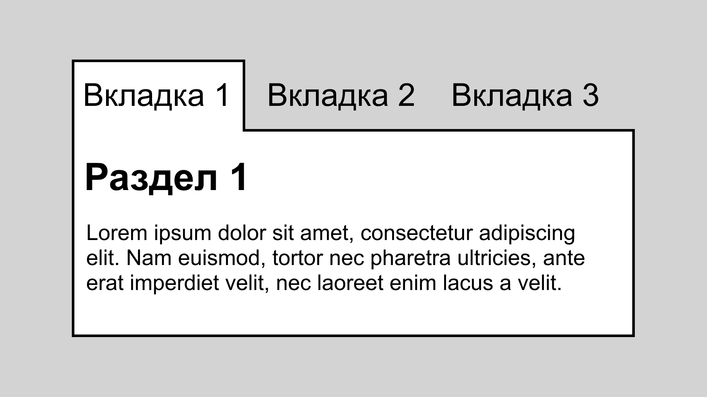
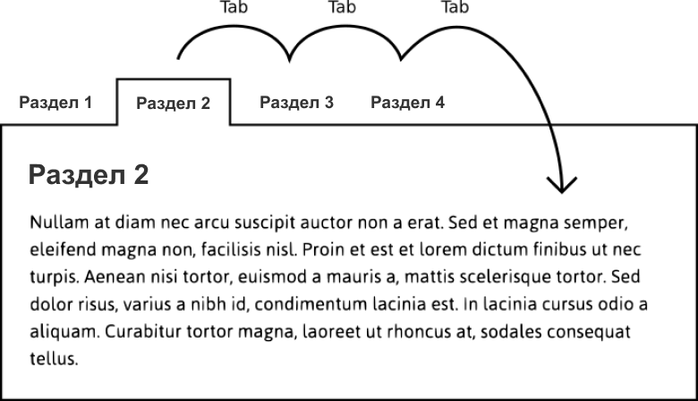
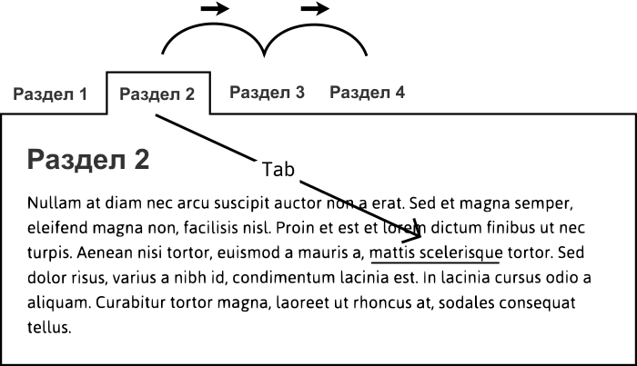
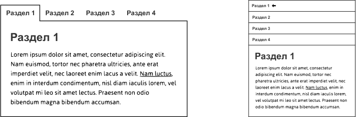

Если вы задумаетесь о том, что же именно происходит с интерфейсами, когда вы взаимодействуете с ними, то чаще всего что-то показывается или скрывается. Я уже рассказывал о [кнопках меню](https://inclusive-components.design/menus-menu-buttons/) (_есть в [переводе на русский](/articles/menu-buttons). — прим. переводчика_), при клике по которым появляется выпадающее меню, и их родственниках — более простых и менее очевидных [тултипах и тоглтипах](https://inclusive-components.design/tooltips-toggletips/) (_тоже есть в [переводе](/articles/tooltips-toggletips). — прим. переводчика_). Вы можете добавить к этому списку простые виджеты для раскрытия блоков, составные «аккордеоны» **и интерфейсы со вкладками** (_от англ. «tabbed interfaces», дальше я буду называть их просто «вкладками». — прим. переводчика_). Стоит также отметить, что одностраничные приложения (single-page applications, SPA) эмулируют отображение и скрытие целых страниц при помощи JavaScript.

Как мы уже знаем, разница между панелями вкладок, представлениями приложений и простым фрагментом документа не так очевидна, как может показаться. Тем не менее, нам нужно быть уверенными в том, какой именно интерфейс мы предоставляем пользователям. Иначе им будет сложно понять, как им правильно пользоваться.

Сторонники прогрессивного улучшения под термином интерфейс в первую очередь понимают структурированный статический контент, а уже потом то, как он может быть расширен и сделан интерактивным с помощью JavaScript. Даже если вы хотите использовать JavaScript на ранних этапах проектирования интерфейса, полезно создать надёжную основу с помощью семантического HTML, опирающегося на стандартное поведение браузера. Иногда вы даже можете обнаружить, что JavaScript — это шаг, который вообще не нужен.

Ставлю деньги на то, что изначально вкладки — это просто [оглавление с якорными ссылками](https://inclusive-components.design/menus-menu-buttons/#tablesofcontent), которые ведут к разным разделам страницы. Список вкладок, как и оглавление, позволяет пользователю выбирать между различными разделами контента.

- Оглавление → список вкладок.
- Якорные ссылки → вкладки.
- Разделы → панели вкладок.


## Улучшение с помощью CSS

Что, если я использую немного CSS, чтобы визуализировать выбор раздела из моего оглавления? Конечно, это можно сделать при помощи псевдокласса `:target`.

```css
section:not(:target) {
    display: none;
}
```

<iframe src="https://codepen.io/heydon/pen/VMMrgN"></iframe>

Давая пользователям возможность раскрывать контент, мы превращаем наше оглавление во вкладки с помощью CSS. Поскольку `display: none` скрывает контент от вспомогательных технологий, то это улучшение затрагивает пользователей скринридеров так же, как и всех остальных.

Возьмите ссылки из оглавления и выровняйте их по горизонтали: тогда этот небольшой CSS-эксперимент действительно приведёт к тому, что оглавление станет похожим на вкладки. Но в этом и заключается проблема.

Во [второй главе своей книги «Resilient Web Design»](https://resilientwebdesign.com/chapter2/) Джереми Кит рассказывает о _материальной честности_ (material honesty) следующее: «Один материал не должен использоваться в качестве замены другому». В этом случае мы делаем оглавление всего лишь _похожим_ на список вкладок. Следует этого избегать. Пользователи, которые видят вкладки, ожидают определённого поведения, которого нет у простого списка ссылок.

По этой же причине элементы, по дизайну похожие на вкладки, не должны использоваться для навигации по всему сайту. По крайней мере, когда пользователь выбирает «вкладку», он не ожидает перехода на новую страницу!

Я встречал огромное количество полноценных вкладок, написанных на JavaScript и обвешанных атрибутами ARIA, для которых простые оглавления разделов страницы хорошо работали. Так даже лучше, ведь они более надёжны и эффективны. Но ради всего святого, пусть они _выглядят_ как оглавления. Пусть семантика и поведение соответствуют тем ожиданиям, которые продиктованы визуальным дизайном интерфейса.

## Настоящие вкладки

Преимущество использования списков якорных ссылок и стандартного поведения браузера, на котором они основаны, заключается в том, что в их случае всё просто и понятно. Их поведение специфично для веба.

Вкладки, с другой стороны, парадигма, которая пришла из десктопных приложений. Если она _вообще_ и понятна пользователям в контексте веб-страниц, то только благодаря аккуратному, хорошо проработанному визуальному дизайну и семантике ARIA.

Что делает вкладки вкладками, так это удобство взаимодействия с ними с клавиатуры. На самом деле единственная причина, по которой в этом случае нужна семантика ARIA — это для предупреждения пользователей скринридеров об ожидаемом поведении клавиатуры. Ниже базовая семантическая структура и примечания к ней:

```html
<ul role="tablist">
    <li role="presentation">
        <a role="tab" href="#section1" id="tab1" aria-selected="true">
            Раздел 1
        </a>
    </li>
    <li role="presentation">
        <a role="tab" href="#section2" id="tab2">
            Раздел 2
        </a>
    </li>
    <li role="presentation">
         <a role="tab" href="#section3" id="tab3">
             Раздел 3
         </a>
    </li>
</ul>
<section role="tabpanel" id="section1" aria-labelledby="tab1">
    …
</section>
<section role="tabpanel" id="section2" aria-labelledby="tab2" hidden>
    …
</section>
<section role="tabpanel" id="section3" aria-labelledby="tab3" hidden>
    …
</section>
```

- Эти вкладки прогрессивно улучшаются за счёт оглавления и соответствующих разделов страницы. В некоторых случаях требуется добавление (`aria-selected`) или переопределение (`role="tab"`) семантики. В других (`role="presentation"`) — удаление семантики, которую больше нельзя применять или от которой нет никакой пользы. Вам не нужно, чтобы вкладки объявлялись так же, как простой список.
- `role="tablist"` не распространяется на дочерние элементы. Эту роль нужно сочетать вместе с отдельными ролями `tab`, чтобы их могли обнаружить и перечислить вспомогательные технологии.
- Элементы `tabpanel`, которые не связаны с выбранной вкладкой, скрываются с помощью атрибута `hidden`.
- Пользователи, которые выбирают вкладку, должны быть уверены в её назначении. Следовательно, `aria-labelledby` используется для добавления подписи к панели вкладок при помощи названия вкладки. На практике это приводит к тому, что пользователь скринридера, попавший в панель вкладок и сделавший фокус на ссылке, услышит что-то вроде: _«Панель вкладок, раздел 1, [текст ссылки], ссылка»_.

### Поведение клавиатуры

В отличие от якорных ссылок, вкладки не перемещают пользователя к связанным с ними разделам и панелям. Они просто показывают скрытый контент. Это удобно для зрячих пользователей (включая тех из них, кто пользуется скринридерами). Такие пользователи хотят переключаться между различными разделами и не возвращаться в начало страницы каждый раз, когда хотят выбрать новый.

Тут есть и побочный эффект: если пользователь хочет перейти к разделу с помощью клавиатуры и взаимодействовать с его внутренним содержимым, то он вынужден пройти через все вкладки справа от текущей, которые расположены в порядке фокуса.



Эту проблему можно решить, если реализовать переключение между вкладками с помощью клавиш со стрелками. Пользователь может выбрать и активировать вкладки стрелками, в то время как клавиша Tab используется для того, чтобы установить фокус на контенте внутри панели вкладок или под активной. Другими словами, клавиша Tab нужна не для вкладок, что, признаю, немного сбивает с толку. Хотелось бы, чтобы у клавиши и контрола были разные имена, но увы.



Не менее важно то, что пользователя возвращает к выбранной вкладке после нажатия Shift Tab. Всё это можно сделать, если добавить для каждой вкладки атрибут `tabindex="-1"`, кроме выбранной в данный момент. Это убирает интерактивные вкладки из порядка фокуса, но даёт возможность установить его с помощью скрипта. В примере ниже выбрана вторая вкладка, которой задано состояние `aria-selected` со значением `true`.

```html
<ul role="tablist">
    <li role="presentation">
        <a role="tab" tabindex="-1" href="#section1">
            Раздел 1
        </a>
    </li>
    <li role="presentation">
        <a role="tab" href="#section2" aria-selected="true">
            Раздел 2</a>
    </li>
    <li role="presentation">
         <a role="tab" tabindex="-1" href="#section2">
             Раздел 3
         </a>
    </li>
</ul>
```

При помощи атрибута `tabindex="-1"` я могу для оставшихся вкладок отслеживать событие `keydown` для клавиш с левой и правой стрелками, чтобы сделать активной нужную неактивную вкладку.

```js
tab.addEventListener('keydown', e => {
    let dir = e.which === 37 ? 'left' : 39 ? 'right' : null;
    if (dir) {
        switchTab(e.eventTarget, dir);
    }
})
```

Каждый раз, когда пользователь выбирает новую вкладку, появляется связанная с ней панель вкладок. Когда первая из четырёх вкладок выбрана, то любой скринридер объявит примерно следующее: _«[Название вкладки] выбрана, вкладка, 2 из 4»_. Исчерпывающая информация.

### Проблема чтения панелей вкладок

Теперь, когда при нажатии на клавишу Tab вкладки пропускаются, пользователям клавиатуры легко переместить фокус на первую ссылку или другие интерактивные элементы в открытой панели.

Для пользователей скринридеров такое решение не настолько оптимально. Хотя незрячие пользователи тоже могут сделать фокус на элементах внутри панели выбранной вкладки, они не смогут увидеть контент, который появляется до или после этого взаимодействия. Если в панели вкладок вообще нет интерактивного контента, то они случайно сделают фокус на первом интерактивном элементе за пределами вкладок или под ними.

При работе со скринридерами, такими как NVDA и JAWS, [стрелка вниз перемещает пользователя к следующему элементу](https://webaim.org/resources/shortcuts/nvda#reading) (тому, на котором можно сделать фокус или к какому-то другому), после чего они объявят его. Если не изменять поведение, то это будет следующая вкладка в `tablist`. Вместо этого можно перехватить нажатие клавиши со стрелкой вниз и программно переместить фокус на открытую панель вкладок, убедившись, что она не пропущена. Посмотрите на `panels[i].focus()` в следующем фрагменте кода:

```js
tab.addEventListener('keydown', e => {
    let index = Array.prototype.indexOf.call(tabs, e.currentTarget);
    let dir =
        e.which === 37 ? index - 1 :
        e.which === 39 ? index + 1 :
        e.which === 40 ? 'down' : null;
    if (dir !== null) {
        e.preventDefault();
        dir === 'down' ? panels[i].focus() :
        tabs[dir] ? switchTab(e.currentTarget, tabs[dir]) : void 0;
    }
});
```

Часть с `void 0` означает «не делай ничего» в случае, если соседней вкладки не существует (так как вы находитесь в начале или в конце `tablist`). Можете посмотреть полное [демо на CodePen](https://codepen.io/heydon/pen/veeaEa/).

После того, как панелям со вкладками задан лейбл при помощи связанных с ними вкладок, то, когда сделан фокус на нужной вкладке и нажата клавиша со стрелкой вниз, скринридер объявит: _«[Название вкладки], панель вкладок»_. Таким образом пользователи точно узнают о своём новом местоположении в интерфейсе. Оттуда они могут продолжить просматривать дочерние элементы панели вкладок или нажать сочетание Shift Tab, чтобы вернуться к `tablist` и выбранной вкладке.

Хотя зрячие пользователи клавиатуры с меньшей вероятностью будут использовать клавишу со стрелкой вниз, важно, чтобы у выбранной панели вкладок был стиль для фокуса, который указывает на изменение его положения. Всё это не помешает работе зрячих пользователей клавиатуры, которые могут делать всё, что нужно, со вкладками с помощью клавиши Tab и левой и правой стрелок.

## Фокус на неинтерактивных элементах

В этой реализации мы, технически, даём пользователям возможность сделать на неинтерактивных элементах фокус при помощи нестандартных клавиш.

Главное правило гласит, что пользователь не должен иметь возможность сделать фокус на неинтерактивных элементах, так как тогда он будет ожидать, что каждый из них _что-то делает_. Следовательно, код вроде этого не соответствует критерию WCAG [2.4.3 Порядок фокуса](https://www.w3.org/TR/UNDERSTANDING-WCAG20/navigation-mechanisms-focus-order.html). В нём есть непригодный для использования элемент.

```html
<h2 tabindex="0">Раздел 3</h2>
```

Однако установление фокуса на элементе с помощью скрипта допустимо, когда пользователь _выбрал_ это изменение контекста. В некоторых реализациях одностраничных приложений, если пользователь выбирает новое «представление» (view), то фокус устанавливается на вновь созданном элементе представления или на его основном заголовке.

```html
<h2 tabindex="-1">Представление приложения</h2>
```

При фокусе на заголовке будет объявлено его содержимое, которое дублируется как лейбл представления. Это помогает пользователям скринридеров узнать об изменениях контекста. Обратите внимание на то, как использован атрибут `tabindex="-1"`. Как и в случае со вкладками, которыми мы управляем при помощи стрелок, это даёт возможность настроить фокус с помощью скрипта без участия пользователя (если не назначена кастомная клавиша). На практике это позволяет нам перемещать фокус без добавления элемента, на котором сделан фокус, в пользовательский порядок табуляции, как в случае со свойством `tabindex="0"`.

Вот [демо со вкладками на CodePen](https://codepen.io/heydon/pen/veeaEa/), которое написано на JavaScript. Также там есть пояснения о поведении элементов и их семантике. Это список ссылок и элементов `<section>`, которые были прогрессивно улучшены и минифицированы до 1,3 Кб:

<iframe src="https://codepen.io/heydon/pen/veeaEa/"></iframe>

## Адаптивный дизайн

Адаптивный дизайн — это инклюзивный дизайн. Он не только совместим с максимальным числом устройств, но также чувствителен к пользовательским настройкам увеличения страницы. За масштабирование всей страницы отвечает `@media` точно так же, как и за уменьшение области просмотра — вьюпорта.

Для вкладок нужен брейкпоинт, на котором недостаточно места для размещения всех вкладок по горизонтали. Самый быстрый способ исправить это — перестроить контент в один столбец.



С визуальной точки зрения это нельзя больше считать вкладками, так как они больше не выглядят как _вкладки_. Это не обязательно проблема, если выбранная вкладка (или опция) чётко обозначена. Не визуально, с точки зрения скринридеров, такой элемент выглядит и ведёт себя точно так же.

## Аккордеоны для небольших вьюпортов?

Некоторые пытаются превратить вкладки в аккордеоны на небольших вьюпортах. Учитывая, что последние структурированы, реализованы и управляются совершенно иначе, чем вкладки, я бы не рекомендовал так делать.

Аккордеоны имеют свои преимущества: они объединяют заголовок и кнопку с их контентом, что, возможно, лучше подходит для одной колонки. Но адаптивный гибрид вкладок и аккордеона просто не стоит того с точки зрения производительности.

Там, где много вкладок или их количество заранее не известно, аккордеон безопаснее всего для _всех_ размеров экранов. Одноколоночная раскладка адаптивна вне зависимости от количества контента. Проще простого.


## Когда панели вкладок — представления

Ранее я замечал, что группа ссылок для навигации по сайту в виде вкладок может ввести в заблуждение: пользователь ожидает от клавиатуры поведения как со вкладками, а также того, что фокус будет установлен на вкладке на текущей странице. Ссылка, ведущая на другую страницу, приведёт к загрузке этой страницы, а фокус переместится на сам документ (`<body>`).

Что касается «представлений» в одностраничных приложениях, то разные ли пути у разных экранов? Технически, они ближе к панелям вкладок, которые при этом являются полностью страницами. Но это не говорит о том, что их стоит _связывать_ с панелями вкладок. Это не то, что может ожидать пользователь.

Представления одностраничных приложений, как правило, должны выглядеть как отдельные страницы или области на них, так что об этом стоит рассказать подробнее. Вот некоторые условия, которые нужно выполнять:

### 1. Используйте ссылки!

Убедитесь, что ссылки, которые дают пользователям возможность выбирать между представлениями, действительно являются ссылками. Даже если эти ссылки `return false` и вы используете JavaScript для переключения представлений. Поскольку благодаря этим контролам пользователи будут ориентироваться в навигации (путём изменения местоположения фокуса, см. ниже), роль ссылки больше всего подходит для такого случая. Ссылкам не нужна ARIA-роль `link`. Они объявляются скринридерами как «ссылка» по умолчанию.

В [Xiao](https://heydon.github.io/xiao/#home) (_читается как «сяо». — прим. переводчика_), прогрессивно улучшенном роутере для одностраничных приложений, для обозначения представлений используются стандартные хеш-фрагменты. Ссылки на них будут объявлены как _«якорные ссылки»_ большинством вспомогательных технологий. В их основе лежит стандартное поведение браузера, так что пользователь будет знать о том, что он попадёт на новую, отдельную часть страницы или приложения.

```html
<a href="#some-route">Какой-то путь</a>
```

### 2. Управляйте фокусом

Простая замена какого-то контента на странице не приводит к тому, что пользователя автоматически переносит к этому контенту или (в случае слепых пользователей вспомогательных технологий), что его предупреждают о существовании такого контента. Как сказано выше в примечании «Фокус на неинтерактивных элементах», можно сделать фокус на основном заголовке нового представления или на внешнем элементе. Если вы делаете фокус на последнем, то рекомендуется задать ему подпись либо непосредственно при помощи `aria-label`, либо по принципу заголовка с использованием `aria-labelledby`.

```html
<div aria-label="На главную" role="region" tabindex="-1">
    ...
</div>
```

Когда вы используете этот атрибут вместе с ролью `region` (как во фрагменте кода выше), то, если на элементе сделан фокус, скринридеры сделают объявление с контекстной информацией: _«На главную, область»_.

Если использовать Xiao, то фокус не будет сделан ни на одной области главной страницы при её загрузке. Это означает, что документ или `<body>` получают фокус по умолчанию и `<title>` объявляется скринридерами (см. ниже).

### 3. Обновляйте `<title>`

Название приложения должно быть для конкретного представления добавлено к лейблу. Это соответствует рекомендованному паттерну для статических сайтов, где к названию сайта добавляется имя страницы.

```html
<title>[Название приложения] | [Название представления]</title>
```

Вы можете подгрузить приложение с роутером Xiao для любого пути, просто добавив хеш-фрагмент пути в URL. При событии загрузки `<title>;` принимает значение лейбла этого пути, а скринридеры идентифицируют приложение и конкретный роутер.

## Заключение

С помощью JavaScript можно легко показывать и скрывать или создавать и удалять контент, но у этих событий в DOM могут быть разные цели и значения в зависимости от контекста. В этой статье мы упростили показ и скрытие элементов при помощи JavaScript для создания двух совершенно разных интерфейсов: вкладок и навигации в одностраничном приложении.

В инклюзивном дизайне нет чего-то правильного и неправильного. Это просто попытка сделать всё возможное, чтобы как можно больше людей получило ценный для них опыт. По большому счёту всё сводится к объединению представления и поведения таким образом, чтобы пользователи, вне зависимости от характера взаимодействия с интерфейсом и особенностей чтения контента, знали, что поставленные задачи выполняются.

## Чеклист

- Не используйте вкладки, если они не подходят для вашей ситуации и не будут поняты и оценены пользователем. То, что вы можете что-то сделать, не означает, что вы это должны делать.
- Оглавления и якорные ссылки более простое и надёжное решение для различных вариантов использования вкладок.
- Убедитесь, что интерфейсы, которые выглядят как вкладки, имеют ожидаемую семантику и поведение.
- Одностраничные приложения не должны выглядеть и вести себя как вкладки несмотря на то, что в них используется JavaScript для переключения между панелями содержимого или для наполнения их содержимым.
