По мере того, как мы создаём сайты, всё более и более зависящие от JavaScript, мы иногда теряем производительность. В этой статье я расскажу про соблюдение некоторых правил, которые могут помочь, если вы хотите, чтобы ваш интерактивный сайт быстро загружался на мобильных устройствах.

**TL;DR** Меньше кода = меньше парсить и компилировать + меньше передавать + меньше распаковывать

### Сеть

Когда большинство разработчиков задумываются о стоимости JavaScript, они думают об этом с точки зрения скорости загрузки и выполнения. Отправка большего количества байт JavaScript обходится дороже при медленном подключении пользователя.

<figure>
    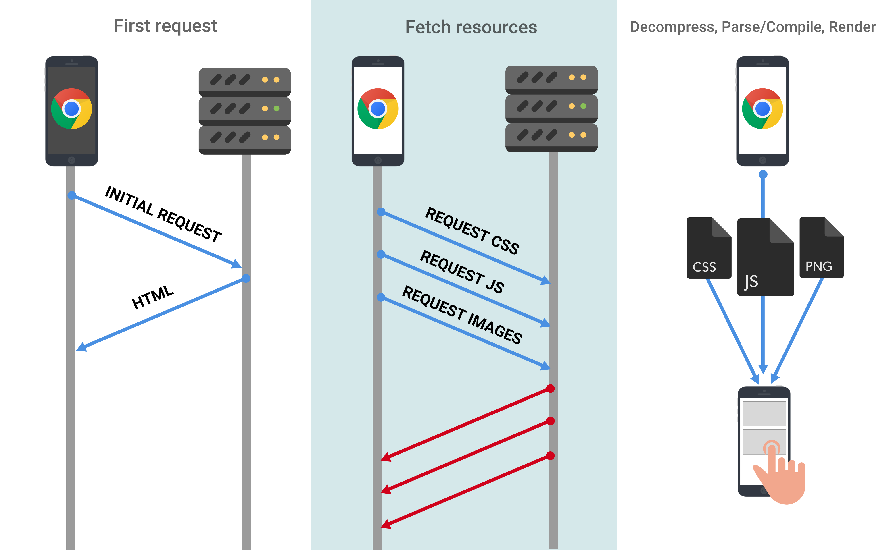
</figure>

Это может быть проблемой даже в развитых странах, так как _фактическая_ скорость соединения пользователя далеко не всегда соответствует максимально возможной в 3G, 4G или Wi-Fi. Вы можете быть подключены к сети Wi-Fi в кафе, но скорость её передачи может не достигать даже 2G.

Вы можете снизить затраты на JavaScript следующими способами:

- Отправляйте только тот код, который нужен пользователю. Разделение кода может вам в этом помочь.
- [Сокращайте код](https://developers.google.com/web/fundamentals/performance/optimizing-content-efficiency/optimize-encoding-and-transfer) ([uglify](https://github.com/mishoo/UglifyJS) для ES5, [babel-minify](https://github.com/babel/minify) или [uglify-es](https://www.npmjs.com/package/uglify-es) для ES6)
- [Сжимайте сильнее](https://developers.google.com/web/fundamentals/performance/optimizing-content-efficiency/optimize-encoding-and-transfer) (используйте [Brotli](https://www.smashingmagazine.com/2016/10/next-generation-server-compression-with-brotli/), [q11](https://twitter.com/paulcalvano/status/924660429846208514), Zopfli или gzip). Brotli превосходит gzip по степени сжатия. Это помогло CertSimple [сэкономить 17%](https://speakerdeck.com/addyosmani/the-browser-hackers-guide-to-instant-loading?slide=30) на размере сжатого JS и LinkedIn [сэкономить 4%](https://engineering.linkedin.com/blog/2017/05/boosting-site-speed-using-brotli-compression) на времени загрузки.
- Удаляйте неиспользуемый код. Его можно отследить в [DevTools во вкладке Coverage](https://developers.google.com/web/updates/2017/04/devtools-release-notes). Посмотрите в сторону [tree-shaking](https://webpack.js.org/guides/tree-shaking/), [Closure Compiler](https://developers.google.com/closure/compiler/) и других библиотек оптимизации библиотек, вроде [lodash-babel-plugin](https://github.com/lodash/babel-plugin-lodash) или [ContextReplacementPlugin](https://iamakulov.com/notes/webpack-front-end-size-caching/#moment-js) для Webpack — особенно для таких библиотек, как Moment.js. Используйте babel-preset-env и browserlist, чтобы избежать транспиляции новых возможностей, которые уже доступны в современных браузерах. Продвинутые разработчики уже умеют делать подробный [анализ бандлов ](https://github.com/webpack-contrib/webpack-bundle-analyzer)[Webpack](https://github.com/webpack-contrib/webpack-bundle-analyzer) для избавления от ненужных зависимостей.
- [Кэшируйте](https://developers.google.com/web/fundamentals/performance/optimizing-content-efficiency/http-caching) , чтобы избежать лишней нагрузки на сеть. Определите оптимальное время жизни для скриптов (max-age) и используйте токены ETag, чтобы избежать загрузки неизменённых данных. Сервис-воркеры позволят сделать ваше приложение более независимым от сети и дадут доступ к [кэшированию кода в V8](https://v8project.blogspot.com/2015/07/code-caching.html). Узнайте о долгосрочном кэшировании — [хэширование имени файла](https://webpack.js.org/guides/caching/).

<figure>
    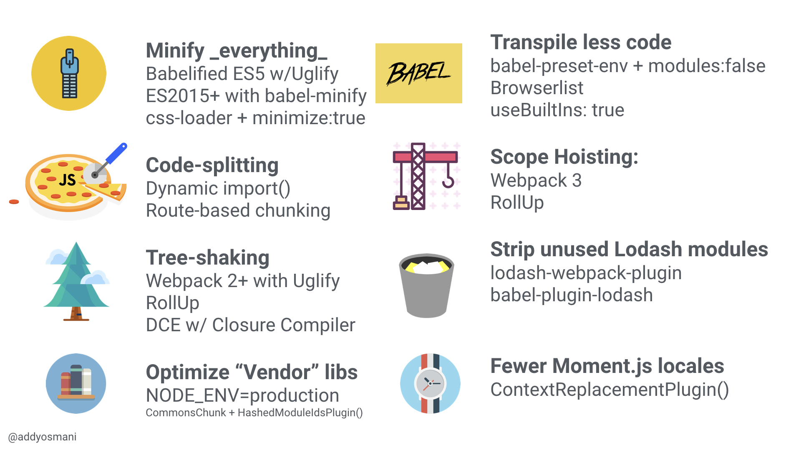
</figure>

### Парсинг и компиляция

После загрузки, JS-движок тратит уйму времени на парсинг и компиляцию кода. В Chrome DevTools время парсинга и компиляции показаны желтым в панели Perfomance.

<figure>
    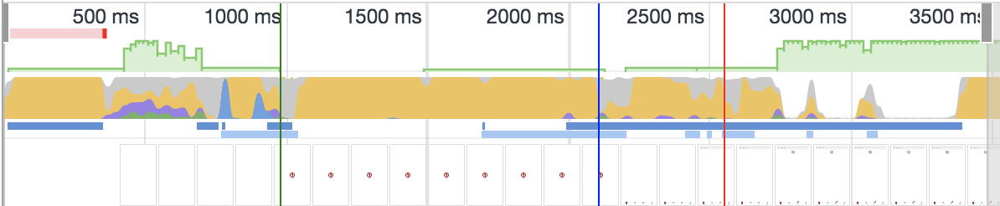
</figure>

Вкладки Bottom-Up и Call Tree позволят оценить время, затраченное на эти задачи:

<figure>
    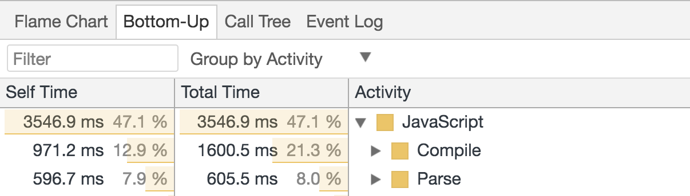
    <figcaption>Панель Performance в Chrome DevTools: Bottom-Up.</figcaption>
</figure>

Но, почему это имеет значение?

<figure>
    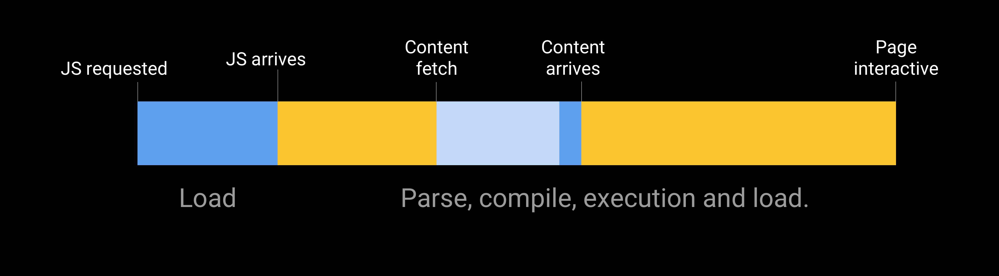
</figure>

Затраты на парсинг и компиляцию кода могут значительно задержать процесс взаимодействия пользователя с сайтом. Чем больше JavaScript вы отправите, тем больше времени потребуется, чтобы проанализировать и скомпилировать его, а ведь только после этого ваш сайт станет интерактивным.

<figure>
    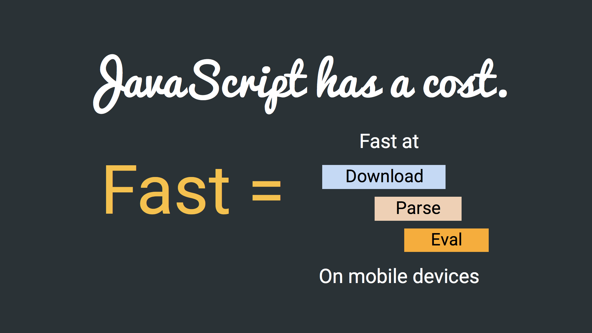
</figure>

> Байт за байтом, JavaScript является более ресурсозатратным для браузера, чем изображения или шрифты того же размера.
> Том Дэйл

Помимо JavaScript, существует множество затрат, связанных с обработкой изображений эквивалентного размера (они все еще должны быть декодированы!), однако с большей вероятностью именно (загрузка и выполнение) JavaScript негативно скажется на интерактивности страницы.

<figure>
    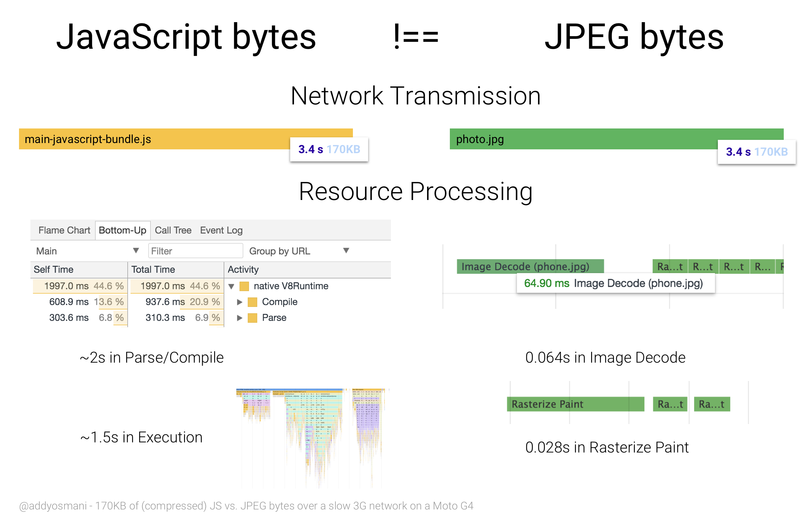
    <figcaption>170 КБ сжатого JS против байтов JPEG на Moto G4 в медленной сети.</figcaption>
</figure>

Байты JavaScript и изображений имеют разную стоимость. Изображения обычно не блокируют основной поток или не препятствуют взаимодействию интерфейсов при декодировании и растеризации. Однако JS может задерживать взаимодействие с сайтом из-за парсинга, компиляции и выполнения.

Когда мы говорим о медленном выполнении парсинга и компиляции, не стоит забывать, что мы рассматриваем среднестатистическое мобильное устройство. Однако многие пользователи могут иметь телефоны с медленными ЦП и графическими процессорами, без кэша L2 или L3 и могут быть ограничены памятью.

> Возможности сети и устройства не всегда совпадают. Пользователь с удивительно быстрым подключением не обязательно имеет лучший процессор для анализа и исполнения JavaScript, отправленного на его устройство. Это также верно и наоборот: ужасное сетевое подключение, но невероятно быстрый процессор.
> Кристофер Бакстер, LinkedIn

При проведении тестов скорости JavaScript, я замерял стоимость парсинга ≈1 МБ обычного (несжатого) JavaScript на медленных и высокопроизводительных устройствах. Среднестатистическое устройство тратит на парсинг и компиляцию кода в 2–5 раз больше времени, чем флагманские устройства.

<figure>
    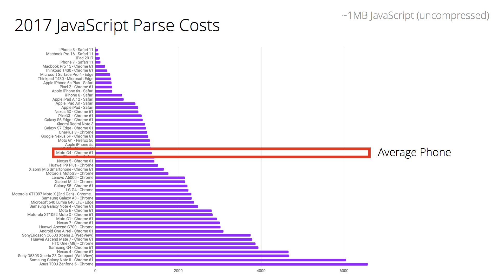
    <figcaption>Время парсинга для 1Мб JS бандла (≈250KB gzip) на настольных и мобильных устройствах различных классов.</figcaption>
</figure>

А что если мы проверим реально существующий сайт, например [CNN](http://cnn.com/)?

iPhone 8 потребуется для этого всего 4 секунды, в то время как для среднего по характеристикам смартфона (в нашем случае, Moto G4), необходимо около 14 секунд. Это существенно повлияет на то, как быстро пользователь сможет полностью взаимодействовать с этим сайтом.

<figure>
    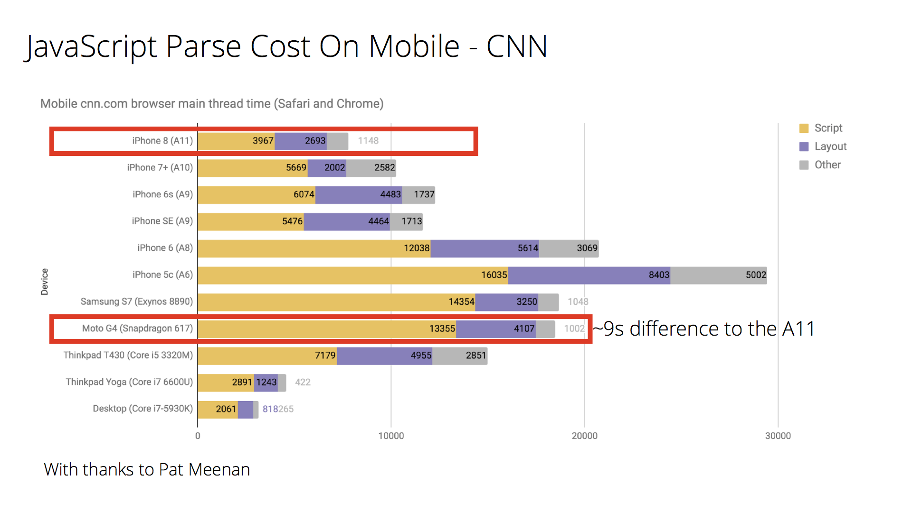
    <figcaption>Сравнение производительности чипа A11 Bionic и Snapdragon 617.</figcaption>
</figure>

Это подчеркивает важность проведения тестов на среднестатистических устройствах, а не только на тех, которые могут быть у вас в кармане. Однако контекст очень важен. Оптимизируйте JS для тех типов подключений и устройств, на которых нацелен ваш продукт.

<figure>
    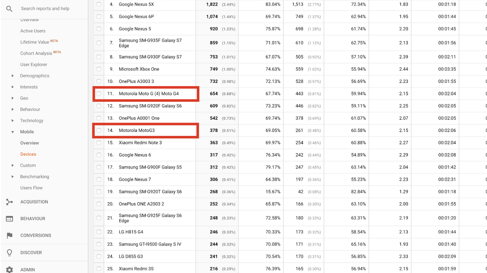
</figure>

Аналитика поможет вам определить какой тип мобильных устройств используют посетители вашего сайта. Это позволит вам понять реальные ограничения ЦП и ГП, с которыми они работают.

А мы точно отправляем слишком много JavaScript? Может я ошибся :)

Используем [HTTP Archive](http://httparchive.org/) (топ 500 000 сайтов) для анализа. Прежде чем стать интерактивными, 50% сайтов тратят более 14 секунд, из которых около 4 уходит на парсинг и компиляцию кода.

<figure>
    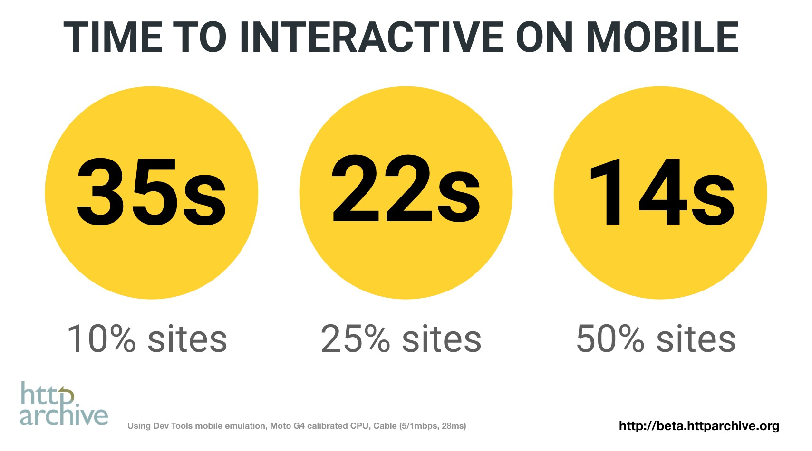
</figure>

Много времени требуется для анализа и обработки JS и других ресурсов, и не удивительно, что пользователям приходится ждать, прежде чем начать взаимодействовать со страницей. Мы определённо можем ускорить этот процесс.

Удаление некритичного JavaScript с ваших страниц может сократить время передачи, анализа, компиляции и потенциальную нагрузку на память. Это также поможет вашим страницам быстрее стать интерактивными.

### Время исполнения

Это не просто парсинг и компиляция. Исполнение JavaScript (выполнение кода после анализа и компиляции) — одна из операций, которая должна выполняться в основном потоке. Этот процесс так же влияет на то, как скоро пользователь сможет взаимодействовать с сайтом.

<figure>
    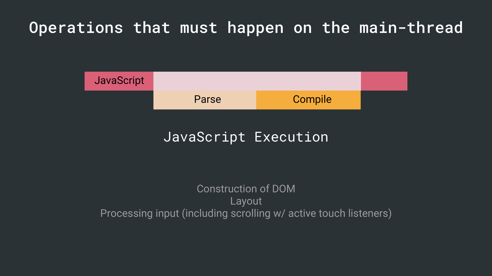
</figure>

> Если скрипт исполняется более 50 мс, то время до интерактивности задерживается на всё время, необходимое для загрузки, компиляции, и исполнения.
> Алекс Рассел

Для решения этой проблемы JavaScript разбивается на небольшие фрагменты, чтобы избежать блокировки основного потока. Посмотрим, можно ли сократить объем выполняемой работы во время выполнения.

### Паттерны для уменьшения стоимости JS

Существуют подходы, которые могут помочь при медленном парсинге, компиляции и невысокой скорости сетевой передачи. Например разбиение фрагментов на основе маршрутов или [PRPL](https://developers.google.com/web/fundamentals/performance/prpl-pattern/).

PRPL — это паттерн, основанный на агрессивном разделении и кэшировании кода.

<figure>
    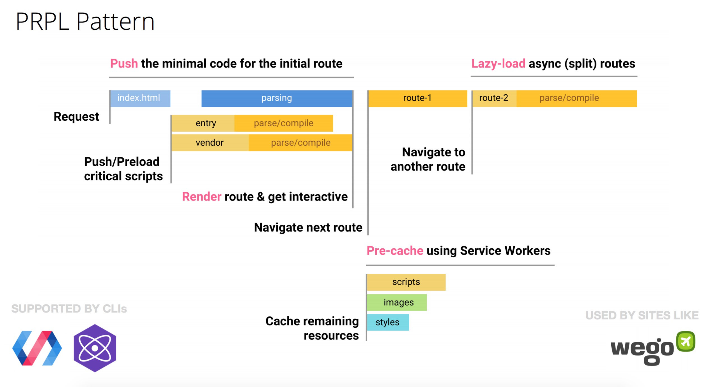
</figure>

Давайте наглядно посмотрим, насколько это улучшит производительность. Проанализируем время загрузки популярных мобильных сайтов и прогрессивных веб-приложений, используя статистику вызовов V8 в рантайме. Как мы видим, на парсинг (показано оранжевым цветом) браузеры тратят значительную часть времени:

<figure>
    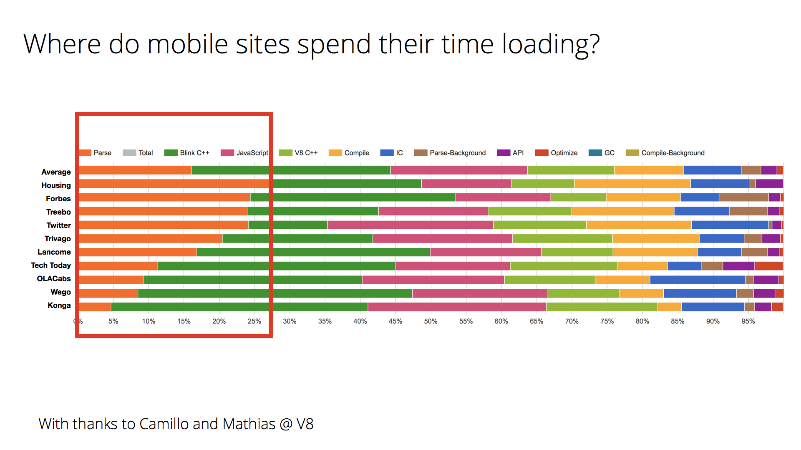
</figure>

Сайту [Wego](https://wego.com), который использует PRPL, удается поддерживать низкое время синтаксического анализа для своих маршрутов, получая интерактивность очень быстро. Многие из вышеперечисленных сайтов сделали акцент на разбиении кода, чтобы попытаться повысить производительность.

### Другие факторы

JavaScript может влиять на производительность страниц другими способами:

- Память. Выполнение страниц может приостанавливаться для очистки памяти. Когда браузер освобождает память, выполнение JS приостанавливается, и это может происходить довольно часто, что нам не очень-то понравится. Избегайте утечек памяти и частых пауз GC, чтобы уменьшить притормаживания страниц.
- Длительное исполнение JavaScript может блокировать основной поток, из-за чего страницы могут не отвечать на запросы. Разбивка выполнения на мелкие части (с помощью `requestAnimationFrame()` или `requestIdleCallback()`) позволяет свести к минимуму такие проблемы.

### Прогрессивная загрузка

Многие сайты оптимизируют видимую часть контента. Для быстрой первоначальной отрисовки, при наличии JS большого размера, разработчики разделяют этот процесс на два этапа: выполняют первоначальный рендер на сервере, а затем подгружают JavaScript.

Будьте осторожны — это тоже требует ресурсов. Как правило, передается более крупный HTML-ответ, который может ограничить вашу интерактивность. Во-вторых, вы частично лишаете пользователя возможности взаимодействия с интерфейсом, пока JavaScript не подгрузится.

Прогрессивная загрузка может быть лучшим подходом. Отправляется минимально функциональная страница (состоящая только из HTML, JS и CSS, необходимых для текущего состояния). По мере поступления дополнительных ресурсов, приложение выполняет отложенную загрузку и разблокирует дополнительные возможности.

<figure>
    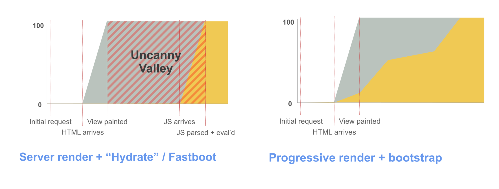
    <figcaption>
        <a href="https://twitter.com/aerotwist/status/729712502943174657">
            Progressive Bootstrapping
        </a>, иллюстрация Пола Льюиса.
    </figcaption>
</figure>

Загрузка кода должны быть оптимальной. PRPL и прогрессивная загрузка — это паттерны, которые могут помочь в достижении этой цели.

### Подведём итоги

Размер передаваемой информации критически важен для сетей с медленной скоростью. Время парсинга важно для устройств, со слабым ГП. Запомните это.

Команды разработчиков добиваются успеха устанавливая для себя жёсткие ограничения производительности (бюджет быстродействия), соблюдение которых заключается в минимизации затрат на передачу, парсинг и компиляцию JS-кода. Читайте «[Can You Afford It? Real-world Web Performance Budgets](https://infrequently.org/2017/10/can-you-afford-it-real-world-web-performance-budgets/)» Алекса Рассела для более подробного изучения темы.

<figure>
    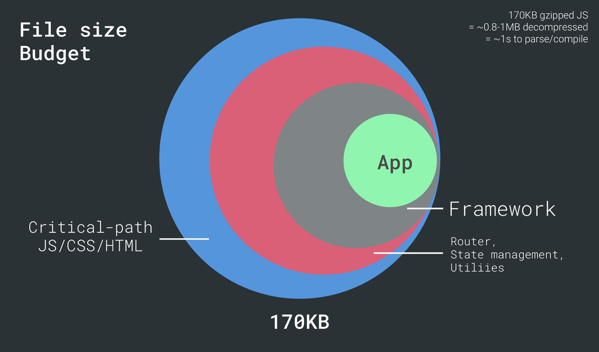
    <figcaption>Полезно посмотреть, какой объём выделяется для логики приложения.</figcaption>
</figure>

Если вы создаете сайт, ориентированный на мобильные устройства, сделайте все возможное для тестирования на нужных типах устройств, держите на низком уровне время парсинга и компиляции JavaScript и утвердите бюджет производительности для того, чтобы команда могла следить за оптимизацией JavaScript.

### Подробнее

<iframe width="560" height="315" src="https://www.youtube.com/embed/_srJ7eHS3IM" allowfullscreen></iframe>

- [JavaScript Start-up Performance](https://medium.com/reloading/javascript-start-up-performance-69200f43b201)
- [Solving the web performance crisis](https://nolanlawson.github.io/frontendday-2016/) Нолана Лоусон
- [Can you afford it? Real-world performance budgets](https://infrequently.org/2017/10/can-you-afford-it-real-world-web-performance-budgets/) Алекса Рассела
- [Evaluating web frameworks and libraries](https://twitter.com/kristoferbaxter/status/908144931125858304) Кристофера Бакстера
- [Results of experimenting with Brotli](https://blog.cloudflare.com/results-experimenting-brotli/), опыт Cloudflare
- [Performance Futures](https://medium.com/@samccone/performance-futures-bundling-281543d9a0d5), Сэма Сакконе

Отдельное спасибо Нолану Лоусону, Кристоферу Бакстеру и Джереми Вагнеру.
