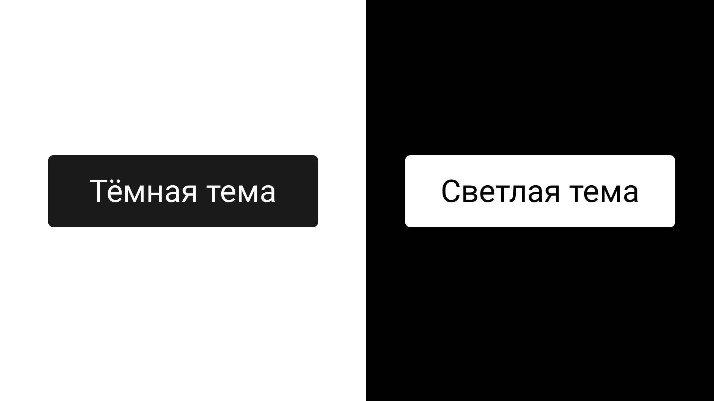
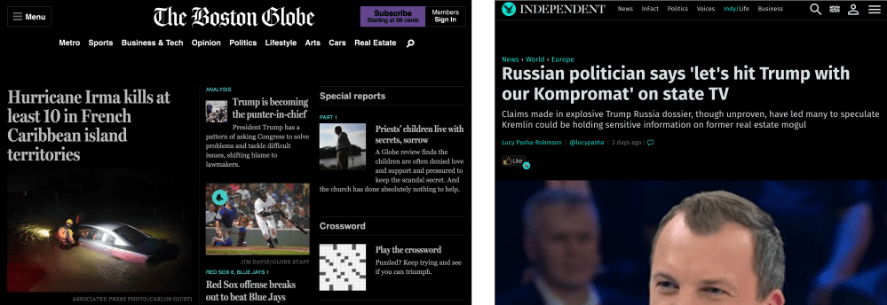
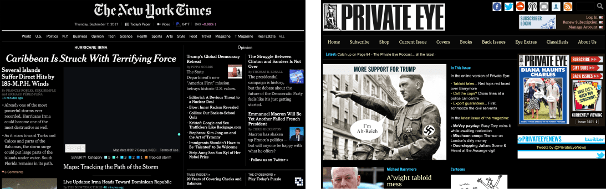
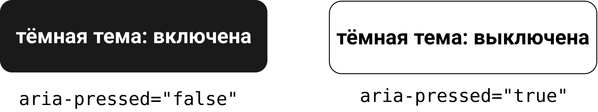

Моя мантра при создании веб-интерфейсов: «Если нельзя сделать это грамотно, не делай это вообще». Я учил людей [писать как можно меньше дурацкого кода](https://vimeo.com/190834530) в Великобритании, Европе и Китае. Если фича может быть реализована только при значительном снижении производительности, то конечный результат будет отрицательным: так что от такой фичи следует отказаться. Насколько важна в вебе производительность.

Предлагать пользователям выбор того, как будет выглядеть интерфейс, правильно, если вы его не навязываете. Это отвечает одному из принципов инклюзивного дизайна — [предлагать варианты](https://inclusivedesignprinciples.org/#offer-choice). _Однако_ выбор настроек, например, темы, прекрасен и должен быть реализован только тогда, когда когда это можно сделать грамотно.

Обычно альтернативные темы создаются как отдельные таблицы стилей, между которыми можно переключаться при помощи JavaScript. В некоторых случаях они приводят к проблемам с производительностью (так как перезаписывание темы требует загрузки большого количества дополнительного CSS) и, в большинстве случаев, к проблеме их дальнейшей поддержки (потому что отдельные таблицы стилей должны постоянно обновляться по мере развития сайта).

Один тип альтернативных тем, который имеет ценность для пользователей, — это «ночной режим» с низкой яркостью. Это не только проще для глаз, когда читаешь в темноте, но также уменьшает вероятность появления мигрени и разных нарушений, связанных со светобоязнью. Для меня, как для человека, страдающего от мигреней, это важно!

В этой статье я расскажу о том, как грамотно сделать React-компонент, который позволит пользователям переключать светлую тему, установленную по умолчанию, на «тёмный режим», и настроить его с помощью API `localStorage`.

В случае со светлой темой (чаще всего это тёмный текст на светлом фоне) самым разумным будет создать не полностью новую таблицу стилей, а расширить существующие стили настолько, насколько это возможно. К счастью, в CSS есть свойство `filter`, которое позволяет инвертировать цвета. Хотя его часто связывают с изображениями, оно может быть применено к любому элементу, включая `<html>`:

```css
:root {
    filter: invert(100%);
}
```

**Примечание**: далеко не все браузеры поддерживают сокращённую запись `invert()`. Используйте `100%` для лучшей поддержки.

Единственная проблема заключается в том, что `filter` может инвертировать только _явно заданные_ цвета. Поэтому, если у элемента нет фонового цвета, текст инвертируется, при этом фоновый цвет по умолчанию (белый) останется прежним. Что в итоге? Светлый текст на светлом фоне.

Это легко исправить, присвоив для `background-color` светлый цвет.

```css
:root {
    background-color: #fefefe;
    filter: invert(100%);
}
```

Но у нас всё ещё остаётся проблема с дочерним элементом, у которого также нет цвета фона. И это тот случай, когда нам пригодится ключевое слово из CSS — `inherit`.

```css
:root {
    background-color: #fefefe;
    filter: invert(100%);
}

* {
    background-color: inherit;
}
```

На первый взгляд может показаться, что мы обладаем слишком большими возможностями, но не стоит переживать: у селектора `*` очень низкая специфичность. Он влияет только на цвет фона для элементов, для которых он ещё не задан. На практике `#fefefe` — это просто фолбэк.

## Сохранение растровых изображений

Когда мы хотим инвертировать тему, то, скорее всего, не собираемся инвертировать растровые изображения или видео. В противном случае интерфейс будет заполнен жуткими негативами. Хитрость заключается в дважды инвертированных ``. Селектор, который я использую, исключает SVG-изображения. Они, как правило, легко и просто инвертируются из-за того, что представлены в виде простых цветовых схем.

```css
:root {
    background-color: #fefefe;
    filter: invert(100%);
}

* {
    background-color: inherit;
}

img:not([src*=".svg"]), video {
    filter: invert(100%);
}
```

Получилось 153 байта без сжатия: об этом позаботилась поддержка тёмных тем. Если вы всё ещё не не уверены, то вот стили, которые используются на популярных новостных сайтах:

<figure>
    
    <figcaption>
        The Boston Globe и The Independent.
    </figcaption>
</figure>

<figure>
    
    <figcaption>
        The New York Times и Private Eye.
    </figcaption>
</figure>

## Компонент переключения темы

Поскольку переключение между светлой (по умолчанию) и тёмной (инвертированной) темами — это просто включение и выключение, мы можем использовать для этого что-то простое, например, [переключатели](https://inclusive-components.design/toggle-button/). Мы разбирали их в предыдущей статье (_[перевод на русский](https://medium.com/web-standards/toggle-buttons-a41388e80974) — прим. переводчика_). Однако в этот раз мы сделаем переключатель частью [React](https://react-cn.github.io/react/index.html)-компонента. На это есть несколько причин:

- Возможность повторного использования в проектах на основе React, в которых вы привыкли работать.
- Возможность использовать преимущества React: `props` и `defaultProps`.
- Некоторые люди думают, что фреймворки вроде React и Angular мешают им писать доступный HTML. Это заблуждение должно уйти в прошлое.

Также мы не забудем про прогрессивное улучшение и будем показывать компонент только тогда, когда браузер поддерживает свойство `filter: invert(100%)`.

### Настройка

Если у вас ещё не настроено окружение для React, то можете легко это сделать, установив `create-react-app`.

```sh
npm i -g create-react-app
create-react-app theme-switch
cd theme-switch
npm start
```

Теперь заготовка приложения будет работать на `localhost:3000`. В новом проекте `theme-switch` наш компонент называется **ThemeSwitch** и будет добавлен в `render()` в `App.js` как `<ThemeSwitch/>`.

```jsx
class App extends Component {
    render() {
        return (
            <div className="App">
                <div className="App-header">
                    
                    <h2>Добро пожаловать в React</h2>
                </div>
                <p className="App-intro">
                    Чтобы начать, отредактируйте {gfm-js-extract-pre-1}
                    и сохраните для перезагрузки.
                </p>
                <ThemeSwitch/>
            </div>
        );
    }
}
```

**Примечание**: я ленивый, поэтому оставляю заготовку. Чтобы протестировать переключатель тем, добавьте его вместе со стилизованным контентом, взятым из другого проекта. Вы можете включить CSS в `App.css`.

Не забудьте импортировать компонент **ThemeSwitch** в начале файла `App.js`:

```jsx
import ThemeSwitch from './components/ThemeSwitch'
```

## Файл основы компонента

Как следует из пути в строке с импортом выше, мы будем работать с файлом `ThemeSwitch.js`, размещённом в новой папке «components». Так что нужно создать папку и файл. Основа для **ThemeSwitch** выглядит так:

```jsx
import React, { Component } from 'react';

class ThemeSwitch extends Component {
    render() {
    // Разметка компонента в JSX
    }
}
export default ThemeSwitch;
```

После рендеринга разметка переключателя, имеющего неактивное состояние и состояние по умолчанию, будет выглядеть таким образом (примечания после этого фрагмента кода):

```jsx
<div>
    <button aria-pressed="false">
        тёмная тема:
        <span aria-hidden="true">выключить</span>
    </button>
    <style media="none">
        html { filter: invert(100%); background: #fefefe }
        * { background-color: inherit }
        img:not([src*=".svg"]), video { filter: invert(100%) }
    </style>
</div>
```

- Не все переключатели создаются одинаково. В этом случае мы используем `aria-pressed` для переключения доступного состояния, и явных «включена» и «выключена» для тех, кто не пользуется скринридерами. Так что часть компонента с «включена» или «выключена» не объявляется. Чтобы не было конфликта между этими состояниями, она скрыта от вспомогательных технологий при помощи `aria-hidden`. Пользователи скринридеров услышат: _«кнопка переключения тёмной темы, не нажата»_, _«кнопка переключения тёмной темы, нажата»_ или что-то похожее на это.
- CSS настолько лаконичен, что можно использовать его в инлайновом виде. Зададим `media="none"` или `media="screen"`, когда включена тёмная тема.

Скоро эта разметка станет очень сложной, так как мы конвертируем её в JSX.

## Состояние переключения

Наш компонент будет хранить текущее состояние. Это позволит пользователю переключаться между активным и неактивным состояниями тёмной темы. Сначала мы инициализируем состояние в конструкторе компонента:

```jsx
constructor(props) {
    super(props);

    this.state = {
        active: 'false'
    };
}
```

Чтобы оживить компонент, включим вспомогательную функцию `isActive()`, а также `toggle()`, которая фактически переключает состояние:

```jsx
isActive = () => this.state.active;
toggle = () => {
    this.setState({
        active: !this.isActive()
    });
}
```

**Примечание**: стрелочные функции неявно возвращают отдельные операторы, отсюда и краткость функции `isActive()`.

В `render()` для компонента мы можем использовать `isActive()` для переключения значения `aria-pressed`, текста кнопки и значения CSS-атрибута `media`:

```jsx
return (
    <div>
        <button aria-pressed={this.isActive()} onClick={this.toggle}>
            тёмная тема:
            <span aria-hidden="true">
                {this.isActive() ? 'включена' : 'выключена'}
            </span>
        </Button>
        <style media={this.isActive() ? 'screen' : 'none'}>
            {this.css}
        </style>
    </div>
);
```

<figure>
    
    <figcaption>
        Конечно, когда выбрана тёмная тема, то сама кнопка тоже инвертирована.
    </figcaption>
</figure>

Обратите внимание на часть с `{this.css}`. JSX напрямую не поддерживает встроенный CSS, поэтому мы должны сохранить его в переменной и ввести здесь динамически. В конструкторе:

```jsx
this.css = `
html { filter: invert(100%); background: #fefefe; }
* { background-color: inherit }
img:not([src*=".svg"]), video { filter: invert(100%) }`;
```

### Боремся с проблемами браузеров

К сожалению, не во всех браузерах применяются нужные стили, когда переключаешься между `media="none"` и `media="screen"`. Для того, чтобы вызвать перерисовку, мы должны перезаписать текстовое содержимое тега `<style>`. Самый простой способ, который я нашёл, — это использовать метод `trim()`. Любопытно, что он нужен только для Chrome.

```jsx
{this.isActive() ? this.css.trim() : this.css}
```

## Сохраняем настройки темы

Для того, чтобы сохранить выбор темы, сделанный пользователем, нам нужно использовать `localStorage` и методы жизненного цикла. Во-первых, я задал алиасы для `localStorage` в конструкторе. Это устраняет ошибки линтинга, которые возникают при прямом вызове `localStorage`.

```jsx
this.store = typeof localStorage === 'undefined' ? null : localStorage;
```

Используя метод `componentDidMount`, я могу отследить и применить сохранённые настройки после того, как компонент подключится. В выражении по умолчанию используется значение `false`, если элемент ещё не создан.

```jsx
componentDidMount() {
    if (this.store) {
        this.setState({
            active: this.store.getItem('ThemeSwitch') || false
        });
    }
}
```

Так как управление состоянием в React происходит асинхронно, недостаточно просто сохранять изменённое состояние после того, как оно было дополнено. Вместо этого мне нужно использовать метод `componentDidUpdate`:

```jsx
componentDidUpdate() {
    if (this.store) {
        this.store.setItem('ThemeSwitch', this.state.active);
    }
}
```

## Скрываем в неподдерживаемых браузерах

Некоторые браузеры ещё не поддерживают `filter: invert(100%)`. Для них нужно скрыть наш переключатель темы. Лучше, если он просто недоступен, чем когда доступен и при этом не работает. Благодаря специальной функции `invertSupported` мы можем узнать о поддержке свойства, чтобы установить состояние `supported`.

Если вы когда-нибудь имели дело с [Modernizr](https://modernizr.com/), то могли бы использовать похожий тест свойства и его значения для CSS. Однако не стоит его здесь использовать, поскольку мы не хотим, чтобы наш компонент имел какие-либо зависимости, если в этом нет необходимости.

```jsx
invertSupported (property, value) {
    var prop = property + ':',
        el = document.createElement('test'),
        mStyle = el.style;
    el.style.cssText = prop + value;
    return mStyle[property];
}

componentDidMount() {
    if (this.store) {
        this.setState({
            supported: this.invertSupported('filter', 'invert(100%)'),
            active: this.store.getItem('ThemeSwitch') || false
        });
    }
}
```

Это можно использовать в нашем JSX для того, чтобы скрыть компонент интерфейса с помощью свойства `hidden` там, где оно не поддерживается.

```html
<div hidden={!this.state.supported}>
    <!-- контент компонента -->
</div>
```

В современных браузерах свойство `hidden` скроет компонент от вспомогательных технологий и запретит делать на них фокус с клавиатуры. Для того, чтобы в старых браузерах оно тоже работало, используйте в стилях этот селектор:

```css
[hidden] {
    display: none;
}
```

В качестве альтернативы вы можете вообще отказаться от отображения содержимого компонента на странице, возвращая `null`.

```jsx
render() {
    if (!this.supported) {
        return null;
    }

    return (
        <div>
            <button aria-pressed={this.state.active} onClick={this.toggle}>
                inverted theme:
                <span aria-hidden="true">
                    {this.state.active ? 'on' : 'off'}
                </span>
            </button>
            <style media={this.state.active ? 'screen' : 'none'}>
                {this.state.active ? this.css.trim() : this.css}
            </style>
        </div>
    );
}
```

## Режим высокой контрастности в Windows

Пользователям Windows предлагается ряд тем с высокой контрастностью уже на уровне операционной системы: несколько светлых и тёмных (свет в темноте) как наша инверсированная тема. Важно убедиться, что WHCM (_Windows High Contrast Mode. — прим. переводчика_) поддерживается настолько, насколько это возможно. Вот несколько советов:

- Не используйте фоновые изображения в качестве контента. Это не только инвертирует изображения в нашей инвертированной тёмной теме, но и полностью исключает их из большинства тем с высокой контрастностью Windows. Используйте в тегах `` изображения со смысловой нагрузкой, а не декоративные, с хорошо описывающим их `alt`.
- Для инлайновых SVG-иконок используйте значение `currentColor` в `fill` и `stroke`. Благодаря этому цвет иконки будет меняться вместе с цветом окружающего текста при включении высококонтрастной темы.
- Если вам нужно определить WHCM, чтобы добавить улучшения, вы можете использовать следующий медиазапрос:

```css
@media (-ms-high-contrast: active) {
    /* Относящийся к WHCM код */
}
```

## Проп `preserveRasters`

Пропсы (свойства компонентов) — это стандартный способ настройки компонентов. Конфигурируемый компонент может использоваться в разных ситуациях и проектах, что делает его более инклюзивным.

В нашем случае, почему бы нам не сделать так, чтобы у Implementor был выбор: действительно ли сохранить растровые изображения или инвертировать их вместе со всем остальным контентом. Я создам проп `preserveRasters`, который принимает значения «true» или «false». Вот как это выглядит на примере нашего компонента:

```jsx
<ThemeSwitch preserveRasters={false} />
```

Я могу запросить этот проп в виде строки CSS и повторно инвертировать изображения, если её значение равно `true`:

```jsx
this.css = `
    html { filter: invert(100%); background: #fefefe; }
    * { background-color: inherit }
    ${this.props.preserveRasters === 'true' ? `img:not([src*=".svg"]), video { filter: invert(100%) }` : ``}`;
```

**Примечание**: допустимо, хотя и немного некрасиво, использовать таким образом тернарные операторы для интерполяции строк.

### Значение по умолчанию

Чтобы сделать компонент более надёжным и дать Implementor возможность пропустить атрибут, мы также можем добавить `defaultProp`. После определения класса компонента можно использовать следующее:

```jsx
ThemeSwitch.defaultProps = { preserveRasters: true }
```

## Устанавливаем компонент

Пример [такого компонента](https://github.com/Heydon/react-theme-switch) есть в NPM:

```sh
npm i --save react-theme-switch
```

Помимо этого, простой пример с JavaScript, в основе которого лежит чекбокс, есть на [СodePen](https://codepen.io/heydon/pen/Vzyrre):

<iframe src="https://codepen.io/heydon/pen/Vzyrre"></iframe>

## Расположение

Осталось только решить, где мы собираемся разместить компонент в документе. Как правило, утилиты вроде выбора темы следует искать в области ориентиров (landmark region), а не в `&lt;main&gt;`, поскольку пользователь скринридера ожидает, что этот контент будет меняться между страницами. Допустимы `&lt;header&gt;` (`role="banner"`) или `&lt;footer&gt;` (`role="contentinfo"`).

Переключатель должен появляться в одном и том же месте на всех страницах, чтобы пользователь мог легко найти его после того, как использовал в первый раз. Примите во внимание [принцип консистентности](http://inclusivedesignprinciples.org/#be-consistent), который здесь применяется.

## Чеклист

- Внедряйте полезные функции только в том случае, если снижение производительности минимально, а конечный интерфейс не становится сильно сложнее.
- Используйте в интерфейсах только поддерживаемые функции. Используйте поддержку фич (feature detection).
- Используйте семантическую разметку в React-компоненте: такие компоненты всегда будут работать!
- Используйте пропсы для того, чтобы сделать ваши компоненты более конфигурируемыми и иметь возможность использовать их много раз.
