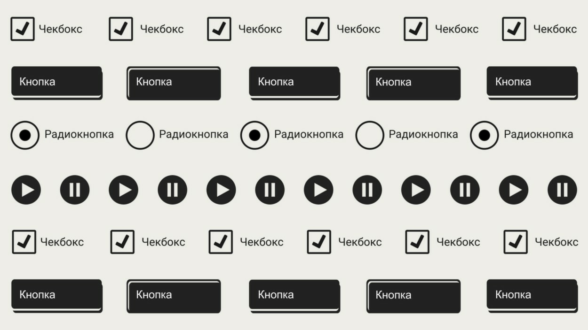
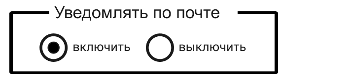
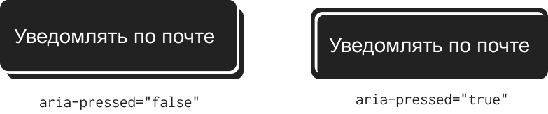
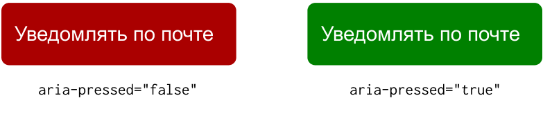
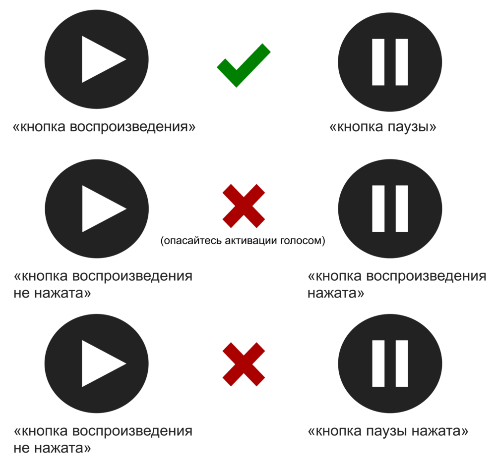
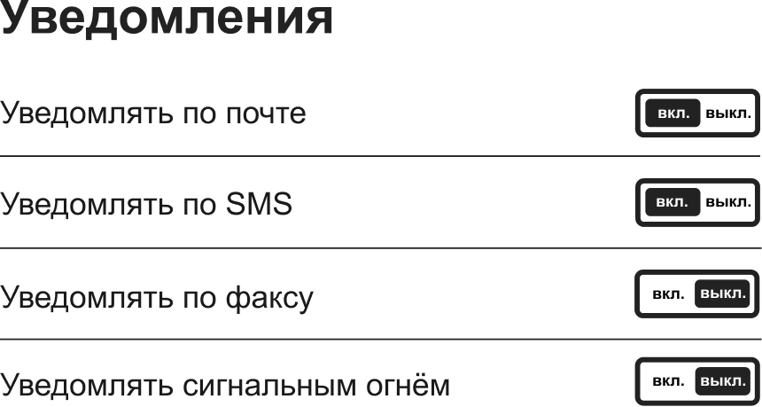

Некоторые вещи либо включены, либо выключены. Когда что-то не включено, то оно обязательно выключено, и наоборот. Эта идея настолько элементарна, что я всё усложнил этим объяснением. Однако не все переключатели одинаковы: хотя они выполняют простые функции, их практическое применение и формы сильно различаются.

В этой статье я объясню, как сделать переключатели инклюзивными _(включающими, доступными для всех, прим. редактора)_. Нет единого способа решения этой проблемы, как и в случае любого другого компонента, особенно когда подобные контролы рассматриваются в разных контекстах. Многое можно испортить или просто забыть сделать, так что попробуем этого избежать.

## Изменение состояния

Если веб-приложение не изменилось так, как ожидал пользователь, такое взаимодействие будет негативным. При этом возможность моментально изменять содержимое страниц, без их обновления, существовала не всегда.

К сожалению, в какой-то момент мы решили, что доступными страницами были те, где мало что происходит: это статические документы, созданные только для чтения. То есть мы прикладывали мало усилий для того, чтобы сделать взаимодействие с ними более богатым, с _сохранением выбора для пользователей_.

Есть распространённое заблуждение о том, что скринридеры _не понимают_ JavaScript. Это совершенно неверно. Все популярные скринридеры реагируют на изменения в DOM по мере их возникновения. Но изменения основных состояний (визуально и для вспомогательных технологий) не обязательно связаны с JavaScript.

## Чекбоксы и радиокнопки

Элементы форм — базовые элементы страниц. Когда мы не используем их напрямую, то всё равно должны уделять пристальное внимание тому, как они себя ведут. Проработка смены состояний у таких элементов установлена принципами юзабилити, которыми глупо было бы пренебрегать.

В принципе, нативный `<input>` с типом checkbox идеально подходит для любых ситуаций, когда нужно что-то включить или выключить. Он обладает всеми основными составляющими доступного контрола при наличии правильного `<label>`: к нему есть доступ у скринридера и клавиатуры на разных платформах и устройствах. Об изменении его состояния с _«установлен» (checked)_ на _«не установлен» (unchecked)_ и наоборот сообщается сразу же.

В примере ниже с помощью чекбокса можно включить или выключить уведомления по электронной почте.

    <input type="checkbox" id="notify" name="notify" value="on">
    <label for="notify">Уведомлять по почте</label>

Скринридеры примерно одинаково интерпретируют этот контрол. При фокусе на нём (если перемещаться по странице с помощью клавиши Tab) будет объявлено что-то вроде _«Уведомлять по почте, флажок не установлен»_. В этом объявлении есть содержимое `<label>`, роль и состояние элемента.

При выборе чекбокса большинство скринридеров сразу же объявит, что состояние изменилось на _«установлен»_ (иногда повторяя информацию о содержимом `<label>` и роли). Состояние элемента будет обработано без использования JavaScript, а скринридер сообщит пользователю информацию об изменениях контрола.

### Примечание: скринридеры нужны не только слепым

Некоторые работают со скринридерами, чтобы было легче понять интерфейс. У других может быть дислексия или низкий уровень грамотности. Есть даже те, у кого имеются незначительные физические или когнитивные проблемы, затрудняющие понимание интерфейса, и кто просто иногда хочет, чтобы им читали вслух.

**Поддержка скринридеров — это поддержка скринридеров, а не только слепых пользователей.** Это инструменты для большого числа разных людей, которым нравится ими пользоваться.

В этом случае часть переключателя, в которой содержатся значения `on` или `off`, не связана с `<label>`, но зато отражает состояние элемента. Напротив, содержимое `<label>` нужно для определения того, что именно мы выключаем или включаем. Если вы считаете, что пользователям необходима более очевидная аналогия с включением и выключением, можно использовать группу радиокнопок.

    <fieldset>
        <legend>Уведомлять по почте</legend>
        <input type="radio" id="notify-on" name="notify" value="on" checked>
        <label for="notify-on">включить</label>
        <input type="radio" id="notify-off" name="notify" value="off">
        <label for="notify-off">выключить</label>
    </fieldset>

Заголовок группы элементов — это мощный инструмент. Как следует из названия, он является общей подписью для связанных (сгруппированных) элементов. В этом случае элемент `<fieldset>` работает вместе с `<legend>` и даёт возможность задать для двух радиокнопок одно описание «Уведомлять по почте». Эти кнопки объединены общим значением атрибута `name`. Благодаря этому можно переключаться между ними при помощи стрелок на клавиатуре. Использование семантического HTML не только сообщает информацию об элементах, но и влияет на их поведение.

В Windows, когда пользователь установил фокус на первом контроле, скринридеры JAWS и NVDA добавляют заголовок группы к отдельному `<label>` этого контрола и считают количество радиокнопок в группе. NVDA ещё добавляет термин «группировка», чтобы стало более очевидно, что это группа радиокнопок. В примере выше фокус сделан на первой (выбранной по умолчанию) радиокнопке. Скринридеры сделают из этого такой вывод: _«Уведомлять по почте, группировка, переключатель выделен, один из двух»_.

Несмотря на то, что выбран первый элемент (некоторые скринридеры объявят _«выделено»_), пользователь может переключаться между ним и второй радиокнопкой. «Включить» и «выключить» — это два возможных, если хотите, _лексических состояния_ у такого составного контрола.

### Примечание: стилизация элементов форм

Печально известно, что элементы форм сложно стилизовать. Однако есть хорошо поддерживаемые CSS-техники для стилизации радиокнопок и чекбоксов, которые я описал в [«Replacing Radio Buttons Without Replacing Radio Buttons»](https://www.sitepoint.com/replacing-radio-buttons-without-replacing-radio-buttons/). Если нужны советы о том, как стилизовать контролы и поля для загрузки файлов, посмотрите гайдлайн [«WTF Forms?»](http://wtfforms.com/) Марка Отто.

## Что-то здесь не так

Логично реализовывать контролы, которые что-то включают и выключают, в виде чекбоксов и радиокнопок. Они доступны для мыши, сенсорных дисплеев, клавиатуры и вспомогательных технологий на разных устройствах, в браузерах и в операционных системах.

Но доступность — это лишь одна из частей инклюзивного дизайна. Эти контролы также должны _иметь смысл_ для пользователей и восприниматься ими однозначно.

Одна из проблем элементов форм — их давняя связь со сбором данных. То есть чекбоксы и радиокнопки воспринимаются как контролы для установки _значений_. Когда пользователь устанавливает чекбокс, он просто переключает состояние, но также ему может _показаться_, что он выбирает значения для отправки на сервер.

Будь то зрячий пользователь, который видит чекбокс, или пользователь скринридера, который слышит информацию об элементе, поведение такого контрола сложно предсказать. Мы ожидаем, что переключатель — это кнопка, а чекбокс и радиокнопка на самом деле части формы.

## Настоящий переключатель

Иногда мы используем элемент `<button>` для отправки форм. Для того, чтобы эти кнопки были полностью совместимы и надёжны, стоит задать им в атрибуте `type` значение `submit`.

    <button type="submit">Отправить</button>

Но это только один вид кнопки, который встречается в определённом сценарии использования. На самом деле элемент с классом `<button>` может использоваться для всего, что угодно, а не только в формах. Это же просто _кнопки_. Мы напоминаем себе об этом, задавая им в `type` значение `button`.

    <button type="button">Отправить</button>

Типовая кнопка — это твой ключевой элемент для изменения чего угодно в интерфейсе (используя JavaScript и без обновления страницы). Кроме случаев, когда нужно переместиться внутри одной страницы или перейти на другую. Это уже задача ссылок.

Кнопки, как и ссылки — это интерактивные элементы, которые стоит активно использовать в веб-приложениях. У них уже есть роль `button` и они по умолчанию доступны для клавиатуры и скринридера. И, в отличие от элементов форм, их просто стилизовать.

Так как нам сделать `<button>` переключателем? Это ситуация, в которой потребуется WAI-ARIA как часть прогрессивного улучшения. Состояний из WAI-ARIA нет в базовом HTML, например, состояния «нажата» (pressed). Представьте себе кнопку включения компьютера. Когда она нажата, то компьютер включён, когда не нажата, то компьютер должен быть выключен.

    <button type="button" aria-pressed="true">
        Уведомление по почте
    </button>

Атрибут состояния из WAI-ARIA вроде `aria-pressed` ведёт себя как булевый тип данных. Однако, в отличие от стандартных атрибутов состояний из HTML, например, `checked`, такие атрибуты должны иметь явно заданные значения `true` или `false`. Недостаточно просто добавить `aria-pressed`. Кроме того, в отсутствие атрибута не будет объявлено _«не нажата» (unpressed)_. Кнопка без атрибута — это просто стандартная кнопка.

Вы можете использовать этот элемент управления внутри формы или за её пределами, в зависимости от ваших целей. Но если вы используете их внутри формы, то важно задать им `type="button"`. Если этого не указать, то некоторые браузеры по умолчанию установят `type="submit"` и попытаются отправить форму.

Переключить состояние с `true` (включён) на `false` (выключен) можно с помощью простого обработчика кликов. Поскольку мы используем `<button>`, то этот вид события может быть запущен по щелчку мыши, нажатию на клавиши Space или Enter или по тапу на сенсорном экране. Отзывчивость для каждого из этих действий — это то, что по умолчанию встроено в элементы `<button>`. Если вы загляните в [HTMLButtonElement](https://developer.mozilla.org/en/docs/Web/API/HTMLButtonElement), то увидите другие значения, такие как `disabled`. Это состояние также доступно из коробки. Если элементы `<button>` не используются, то их поведение нужно воспроизводить с помощью скриптов.

    const toggle = document.querySelector(`[aria-pressed]`);

    toggle.addEventListener(`click`, (e) => {
        let pressed = e.target.getAttribute(`aria-pressed`) === `true`;
        e.target.setAttribute(`aria-pressed`, String(!pressed));
    });

## Более очевидное состояние

Интересное происходит, когда на кнопку с атрибутом `aria-pressed` наталкиваются какие-то скринридеры: они определяют её как _«переключатель»_ или, в некоторых случаях, _«кнопка нажата»_. Наличие атрибута состояния изменяет сущность кнопки.

Когда скринридер NVDA сделает фокус на кнопке с `aria-pressed="true"` из примера, он объявит: _«Уведомлять по почте, переключатель, включено»_. Состояние _«включено» (pressed)_ подходит в данном случае больше, чем _«установлено» (checked)_. Плюс мы избегаем неоднозначного понимания контрола. Когда по кнопке кликнут, то сразу же будет объявлено _«отключено»_.

## Стилизация

Мы выполняем важную часть работы над дизайном и создаём разные вещи для веба с помощью HTML. Я уверен, что если вы создаёте Первый HTML-прототип™, то можете быть уверены в том, что у вас есть надёжная основа для продукта с фирменным стилем.

В случае с нашим переключателем в его основе лежат семантика и поведение, которые делают кнопку совместимой с разными типами ввода данных (например, с программой активации голосом) и их вывода (например, со скринридером) на разных устройствах. Это возможно благодаря HTML. CSS необходим, чтобы сделать управление интерфейсом понятным визуально.

Форма должна соответствовать определённым функциям, чего просто добиться в CSS: всё, что в нашем HTML добавляет для кнопки функцию простого переключателя, также можно использовать для придания ему определённого внешнего вида.

- `<button>` → селектор элемента `button`.
- `aria-pressed="true"` → селектор атрибута `[aria-pressed="true"]`.

В согласованных и, поэтому, лёгких для понимания интерфейсах, кнопки должны иметь конкретный внешний вид и выглядеть как кнопки. Так что стили нашего базового переключателя, вероятно, должны наследоваться от блочного элемента `button`:

    /* Например… */
    button {
        color: white;
        background-color: #000;
        border-radius: 0.5rem;
        padding: 1em 2em;
    }

Есть несколько способов для визуального обозначения того, что кнопка нажата. При буквальной интерпретации, мы могли бы сделать кнопку выглядящей вжатой с помощью `inset` в `box-shadow`. Давайте используем селектор атрибута для этого:

    [aria-pressed="true"] {
        box-shadow: inset 0 0 0 0.15rem #000,
                    inset 0.25em 0.25em 0 #fff;
    }

Чтобы закончить с аналогией с нажатием и его отсутствием, мы можем использовать позиционирование и `box-shadow`, чтобы сделать ненажатую кнопку выпуклой. В каскаде этот блок должен располагаться над блоком `[aria-prressed="true"]`.

    [aria-pressed] {
        position: relative;
        top: -0.25rem;
        left: -0.25rem;
        box-shadow: 0.125em 0.125em 0 #fff,
                    0.25em 0.25em #000;
    }

**Примечание:** это лишь один из многих методов стилизации такой кнопки. Вы можете найти что-то более очевидное, вроде использования текста «включить» и «выключить» как в следующем примере. Это будет понятно большинству пользователей.

### Примечание: не полагайтесь только на цвет

«Включить» часто обозначается зелёным цветом, а «выключить» — красным. Это общепринятое соглашение, и нет ничего плохого в том, чтобы следовать ему. Однако будьте осторожны, когда используете только цвет для описания двух состояний кнопки. В этом случае дальтоники не заметят разницы между ними.

_Эти варианты контрола не соответствуют требованиям [WCAG 2.0 1.4.1 Use Of Color (Level A)](https://www.w3.org/TR/2008/REC-WCAG20-20081211/#visual-audio-contrast-without-color)._

## Стили фокуса

Это важно для кнопок, как и для _всех_ других интерактивных элементов, у которых есть стили фокуса. Если их не будет, то люди, которые используют клавиатуру для навигации, не увидят какой элемент выбран и что с ним можно взаимодействовать.

Лучшие стили фокуса — это те, которые не влияют на расположение (при переходе от одного элемента к другому элементы вокруг них не должны смещаться и отвлекать внимание). Можно использовать `outline`, но, в большинстве браузеров, `outline` — это просто рамка вокруг элемента. Для того, чтобы стиль фокуса повторял закруглённые углы нашей кнопки, лучше подходит свойство `box-shadow`. Если мы уже используем `box-shadow`, то нужно быть осторожными: учитывать два значения `box-shadow`, разделённые запятой, при одновременном нажатии кнопки и фокусе на ней.

    /* Удаляет outline по умолчанию и добавляет внешнюю тень */
    [aria-pressed]:focus {
        outline: none;
        box-shadow: 0 0 0 0.25rem yellow;
    }

    /* Отображает и внутреннюю, и внешнюю тени */
    [aria-pressed="true"]:focus {
        box-shadow: 0 0 0 0.25rem yellow,
                    inset 0 0 0 0.15rem #000,
                    inset 0.25em 0.25em 0 #fff;
    }

## Изменение подписей

В дизайне предыдущего переключателя есть отдельная и уникальная подпись к нему. Разница между двумя состояниями зависит от изменений в атрибуте, которые влияют и на его стиль. Что если нам понадобится сделать кнопку, текст которой изменится с «включён» на «выключен» или с «пауза» на «воспроизведение»?

Это очень просто сделать на JavaScript, но есть пара нюансов, которые нужно учесть.

1. Если подпись изменяется, то что происходит с состоянием элемента?
2. Если текст просто «включён» или «выключен» («воспроизведение» или «пауза», «активен» или «неактивен»), то как мы узнаем, что кнопка на самом деле контрол?

В примере с предыдущим переключателем подпись к нему описывает, что именно будет включено или выключено. Там, где не указано, что включается и выключается, сразу же возникает путаница: нужно ли после того, как я нажал на кнопку и включил что-то, снова на неё нажать, чтобы опять это выключить?

В соответствии с правилом большого пальца _(это общее правило, которое основано на практическом опыте и почти всегда работает — прим. переводчика)_ никогда не нужно изменять одновременно состояние «нажата» и текст кнопки. Если текст изменился, то и состояние кнопки тоже в некотором смысле изменилось, но не благодаря явному управлению состоянием с помощью WAI-ARIA.

В примере ниже изменяется только текст кнопки.

    const button = document.querySelector(`button`);

    button.addEventListener(`click`, (e) => {
        let text = e.target.textContent === `Play` ? `Pause` : `Play`;
        e.target.textContent = text;
    });

Проблема этого метода заключается в том, об изменениях в тексте не объявляется в тот же момент, когда они происходят. Поэтому, когда вы кликаете по кнопке воспроизведения, нет сообщения о том, что она _«нажата»_. Вместо этого вам нужно сначала вручную убрать с неё фокус, а потом выбрать снова, чтобы услышать, что она изменилась. Для зрячих пользователей это не составит труда, но вызовет неудобства у слепых.

Часто у кнопок воспроизведения и паузы изменяются иконки: значок воспроизведения (треугольник, стоящий на одной из граней) заменяется на значок паузы (две вертикальные линии). Мы могли бы при этом сохранить скрытый текст кнопки и одновременно изменить состояние элемента.

    <!-- Пауза -->
    <button type="button" aria-pressed="false" aria-label="play">
        &#x25b6;
    </button>
    <!-- Воспроизведение -->
    <button type="button" aria-pressed="true" aria-label="play">
        &#x23f8;
    </button>

Так как атрибут `aria-label` перезаписывает содержание текстового узла, в котором находятся символы Юникода, то кнопка паузы будет объявлена так: _«Воспроизведение, кнопка не нажата»_. И, в случае с кнопкой воспроизведения, скринридер произнесёт: _«Воспроизведение, кнопка нажата»_.

Это везде хорошо работает, кроме случаев, когда идёт речь о распознавании речи и голосовом управлении. В режиме распознавания речи обычно нужно произносить названия кнопок вслух. И, если пользователь увидел кнопку паузы, то его первой мыслью будет произнести «пауза», а не «воспроизведение». Поэтому более надёжный способ — это изменение подписей к элементам, а не переключение их состояния.

_Никогда не меняйте одновременно подпись и состояние элемента. В этом примере это приведёт к тому, что состояние паузы станет «нажата». Поскольку видео или аудио в этот момент будут воспроизводиться, с точки зрения языка кнопка паузы не может быть нажата в данный момент._

## Добавление дополнительных подписей

В некоторых случаях может понадобиться добавить в переключатель слова «включить» и «выключить». Нужно убедиться в том, что есть чёткая связь между каждым переключателем и соответствующей ему дополнительной подписью.

Представьте настройки уведомления по почте, которые сгруппированы в один список вместе с похожими настройками. Каждый элемент списка содержит описание настройки и выглядит как переключатель. Выражения «включён» и «выключен» — это часть их дизайна. Некоторые элементы `` тут нужны для стилизации.

    <h2>Уведомления</h2>
    <ul>
        <li>
            Уведомлять по почте
            <button>
                вкл.
                выкл.
            </button>
        </li>
        <li>
            Уведомлять по SMS
            <button>
                вкл.
                выкл.
            </button>
        </li>
        <li>
            Уведомлять по факсу
            <button>
              вкл.
              выкл.
            </button>
        </li>
        <li>
            Уведомлять сигнальным огнём
            <button>
                вкл.
                выкл.
            </button>
        </li>
    </ul>

Преимущество списка заключается в том, что как видимые, так и скрытые элементы группируются вместе, поэтому видна связь между ними. Списки не только помогают понять взаимосвязь элементов, но и полезны для некоторых скринридеров, которые могут быстро перемещаться как внутри одного списка, так и между несколькими. Например, в JAWS есть горячие клавиши для списков (L) и элементов списков (I).

Каждая кнопка и подпись к ней связаны общим элементом списка. Однако отсутствие явного и уникального `<label>` — это опасная ситуация, особенно в тех случаях, когда включён режим распознавания речи. Мы можем связать каждую кнопку с текстом элементов списка, используя атрибут `aria-labelledby`:

    <h2>Уведомления</h2>
    <ul>
        <li>
            Уведомлять по почте
            <button aria-labelledby="notify-email">
                <span">вкл.
                выкл.
            </button>
        </li>
        <li>
            Уведомлять по SMS
            <button aria-labelledby="notify-sms">
                вкл.
                выкл.
            </button>
        </li>
        <li>
            Уведомлять по факсу
            <button aria-labelledby="notify-fax">
                вкл.
                выкл.
            </button>
        </li>
        <li>
            Уведомлять сигнальным огнём
            <button aria-labelledby="notify-smoke">
                вкл.
                выкл.
            </button>
        </li>
    </ul>

Каждое значение `aria-labelledby` соответствует значению атрибута `id` у элементов с тегом `` и устанавливает связь между ними и уникальными подписями у кнопок. Это работает также, как атрибут `for` элемента `<label>` для `id` в `<input>`.

## Роль switch

Важно отметить, что атрибут `aria-label` из ARIA переопределяет содержимое каждой кнопки. Это значит, что мы можем снова использовать `aria-pressed` для того, чтобы сообщить о состоянии элемента. Однако, если эти кнопки являются переключателями, то мы можем вместо этого использовать роль switch [из WAI-ARIA](https://www.w3.org/TR/wai-aria-1.1/#switch), которая сообщает о состоянии через атрибут `aria-checked`.

    <h2>Уведомления</h2>
    <ul>
        <li>
            Уведомлять по почте
            <button role="switch" aria-checked="true"
                    aria-labelledby="notify-email">
                вкл.
                выкл.
            </button>
        </li>
        <li>
            Уведомлять по SMS
            <button role="switch" aria-checked="true"
                    aria-labelledby="notify-sms">
                вкл.
                выкл.
            </button>
        </li>
        <li>
            Уведомлять по факсу
            <button role="switch" aria-checked="false"
                    aria-labelledby="notify-fax">
                вкл.
                выкл.
            </button>
        </li>
        <li>
            Уведомлять сигнальным огнём
            <button role="switch" aria-checked="false"
                    aria-labelledby="notify-smoke">
                вкл.
                выкл.
            </button>
        </li>
    </ul>

Как вы будете стилизовать активное состояние контрола зависит от вас. Лично я бы не тратил время на запись классов для `` с помощью JavaScript. Вместо этого лучше использовать пару CSS-псевдоклассов для поиска элементов  с нужными состояниями.

    [role="switch"][aria-checked="true"] :first-child,
    [role="switch"][aria-checked="false"] :last-child {
        background: #000;
        color: #fff;
    }

### Перемещаясь по настройкам

Давайте сейчас поговорим о навигации по этому блоку с настройками, используя два разных способа: с помощью клавиши Tab (перемещаясь только по элементам с фокусом) и с помощью скринридера (проходя через каждый элемент).

Даже если вы используете клавишу Tab, скринридеры объявят не только о сущности и состоянии интерактивных элементов, на которых вы устанавливаете фокус. Например, когда вы выберете первый элемент с классом `<button>`, вы услышите, что это переключатель «оповещать по почте» и что он включён. Состояние элемента с ролью `switch` и `aria-checked="true"` будет определено как _«включено»_.

### Примечание: поддержка `switch`

Роль `switch` поддерживается не так хорошо, как `aria-pressed`. Например, её не распознаёт ChromeVox — скринридер, который можно установить для Chrome.

Однако ChromeVox _не поддерживает_ и `aria-checked`. Это означает, что он, вместо _«Переключатель, уведомлять по почте, включено»_ объявит _«Кнопка, уведомлять по почте, нажата»_. Это вполне корректно, хотя и не так очевидно. Скорее всего, пользователи просто ошибочно примут переключатель за чекбокс.

Любопытно, что NVDA определяет кнопку с `role="switch"` и `aria-checked="true"` как переключатель, если она нажата. Так как включение и выключение и нажатие и не нажатие равносильны, это вполне допустимо (хотя немного не соответствует ожиданиям).

Однако большинство скринридеров объявит, что вы находитесь в списке из четырёх пунктов и в данный момент выбран первый из них: полезная информация о контексте. Принцип работы примерно такой же, как у заголовка группы элементов, о котором я упоминал выше.

Это важно, потому что мы используем `aria-labelledby` для того, чтобы связать уточняющий текст с кнопкой, по аналогии с использованием `<label>`. Это доступно также когда выбран этот режим навигации.

Когда вы перемещаетесь от пункта к пункту (например, с помощью клавиши со стрелкой вниз, когда NVDA включён), будет объявлено всё, что встретится на пути, в том числе заголовки _(«уведомления, заголовок второго уровня»)_. Конечно, когда перемещаешься по странице таким образом, текст _«уведомлять по почте»_ объявляется как отдельно, так и вместе с соседней кнопкой. В какой-то степени это повтор, но в данном случае он имеет смысл: «здесь название настройки, а вот здесь её можно включить или выключить».

Проблема того, насколько явно нужно связать элементы управления с объектами, которыми они управляют, это один из аспектов UX-дизайна, и ему нужно уделить пристальное внимание. В случае, рассмотренном в этом посте, мы сохраняем наш классический переключатель для зрячих пользователей, при этом не запутывая и не вводя в заблуждение пользователей скринридеров вне зависимости от того, какой режим работы клавиатуры они используют. Это достаточно надёжное решение.

## Заключение

Какой дизайн вы выберите и каким образом реализуете переключатели — это ваше дело. Но, надеюсь, вы вспомните этот пост, когда придёт время добавить подобный контрол в вашу библиотеку компонентов. Не вижу причин для того, чтобы переключатели или любой другой элемент интерфейса стали препятствием для пользователей, как это часто бывает.

Вы можете изучить здесь основы и добавить разные штрихи в свой дизайн, включая анимацию. Но, в первую очередь, важно заложить прочный фундамент.

## Чек-лист

- Используйте элементы форм для переключателей, такие как чекбоксы, если уверены, что пользователь понимает, что они не нужны для отправки данных.
- Используйте элементы `<button>` с атрибутами `aria-pressed` или `aria-checked`, а не ссылки.
- Не меняйте одновременно подпись к элементу и его состояние.
- Когда используете в подписи текст «включён» и «выключен» (или что-то подобное), можете переопределить их с помощью атрибута `aria-labelledby`.
- Будьте осторожны и убедитесь, что уровень контраста между текстом кнопки и её фоновым цветом соответствует рекомендациям WCAG 2.0 _(сейчас уже актуальна [WCAG 2.1](https://www.w3.org/TR/WCAG21/#contrast-minimum), прим. переводчика)._
