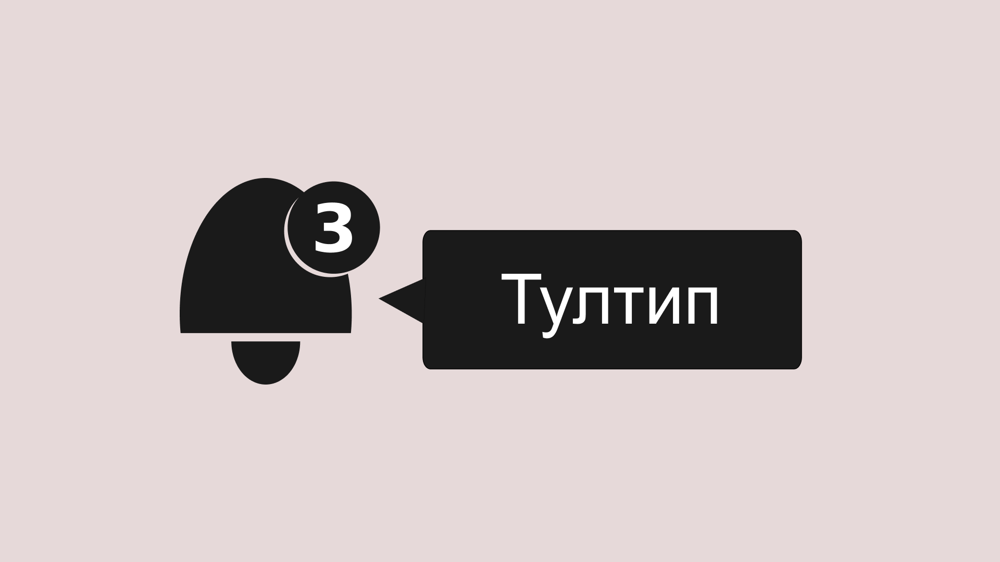
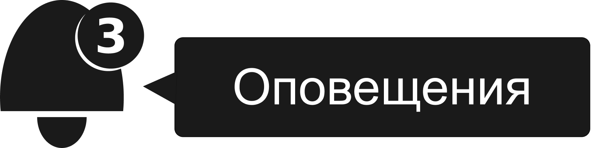
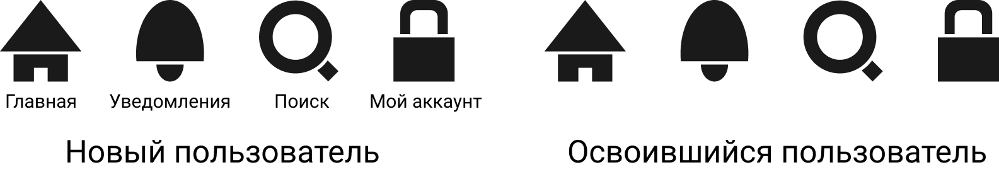
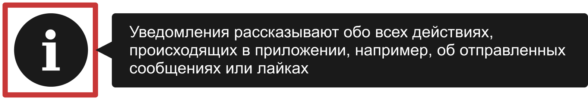

Тултипы _(в этом переводе я буду транслитерировать слово «tooltip», их ещё часто называют подсказкой — прим. переводчика)_, которые мой друг [Стив](https://twitter.com/stevefaulkner) ласково называет «тутлипы» (tootlips), давно устоявшийся интерфейсный паттерн. Буквально это «подсказки для инструментов» в виде небольших пузырей с информацией, которые объясняют цель непонятных контролов и инструментов. Распространённый пример — контрол в виде таинственной иконки, смысл которой пользователь пока ещё не понимает.

Я хотел бы поговорить о том, когда и как эти пузыри должны появляться, так как столкнулся с большим количеством тултипов, которые, кажется, ведут себя немного по-разному. Я сделал вывод, что все эти реализации можно разделить на две самостоятельные группы: настоящие тултипы и паттерны, которые я с опаской называю «тоглтипы» (toggletips). Это слово придумал Стив в ходе [пары исследований и экспериментов](https://developer.paciellogroup.com/blog/2016/01/simple-standalone-toggletip-widget-pattern/), которые не так давно провёл.

Инклюзивный дизайн часто затрагивает проблему того, как обеспечить пользователя правильным инструментом для работы, и как создать правильный тултип к нему. В этой статье я рассмотрю разные ситуации, для которых могут потребоваться тултипы или тоглтипы, и покажу как сделать их инклюзивными.

## Атрибут `title`

Мы не можем говорить о тултипах без упоминания атрибута `title`: стандартный для HTML атрибут, предназначенный для пузырей с контекстной информацией. Блог Paciello Group не обходится без сарказма при описании вклада `title` в веб-интерфейсы:

> Если вы хотите скрыть контент от пользователей мобильных и планшетов, а также от пользователей вспомогательных технологий и клавиатуры, то используйте атрибут `title`.
> [Блог The Paciello Group](https://developer.paciellogroup.com/blog/2013/01/using-the-html-title-attribute-updated/).

Это _довольно плохой_ вклад с точки зрения инклюзивности. На самом деле единственное место, где атрибут title может хорошо работать в связке со скринридерами — это элементы форм вроде `<input>`. Во всех других случаях пользователи мобильных устройств и клавиатуры не смогут увидеть сообщение из `title`. Вкратце: просто добавьте хорошо сформулированный, постоянно видимый лейбл.

Я большой сторонник использования стандартных HTML-элементов и атрибутов тогда, когда они доступны. Это наиболее эффективный и правильный с точки зрения производительности путь создания удобных веб-интерфейсов. Но, несмотря на то, что атрибут `title` поддерживается спецификацией, он действительно не подходит для своей цели.

Опять же, нам ещё предстоит определить эту цель. Для чего _следует_ использовать тултипы? И даже если мы сможем сделать их такими, что с ними смогут взаимодействовать многие пользователи, нужны ли они вообще?

## Случаи использования тултипов

Как мы уже установили, тултипы нужны для пояснений: они дают _недостающую_ информацию. Но почему эта информация должна изначально отсутствовать? Как я писал в [Inclusive Design Patterns](https://shop.smashingmagazine.com/products/inclusive-design-patterns), иконки могут упростить понимание интерфейса и помочь в его интернационализации. Существуя отдельно, они всегда могут запутать пользователя, потому что _ничего не объясняют_. Иконки не содержат информации для пользователей, которые не узнают или не могут расшифровать их.

В большинстве случаев вы должны просто размещать текст рядом с иконками. Как и видимые подписи к полям, которые я только что упомянул, текстовые лейблы являются самым простым способом добавления подписей к элементам. Также они автоматически доступны для скринридеров, если это настоящий текст (а не картинки с текстом).

Типичное объяснение, почему лейблов нет — это «нет места». И это, вероятно, так, если вы решили не использовать их в первую очередь. Если вы считаете их важными с самого начала, то найдёте способ это сделать.

<figure>
    
    <figcaption>Всегда есть место для текста, если вы решили его добавить. Однако в некоторых случаях для него остаётся больше места, чем в других.</figcaption>
</figure>

Тултипы — последнее средство там, где пространство действительно стоит дорого — возможно, из-за огромного количества элементов управления, как на панели инструментов в редакторе WYSIWYG. Итак, как бы мы разработали их максимально инклюзивно?

## Инклюзивные тултипы

Первое, что нужно сделать, — это сделать текст в тултипах доступным для вспомогательных технологий. Есть несколько способов привязки тултипа к контролу, и мы выбираем между ними исходя из его конкретной роли: это основной лейбл или он нужен для дополнительного пояснения?

У контрола для управления уведомлениями с тултипом «Уведомления» — это основной лейбл. А тултип «Просмотр уведомлений и управление настройками» является дополнительным.

## Тултип как основной лейбл

Чтобы связать один элемент с другим в качестве основного лейбла, нужно использовать `aria-labelledby`. Связь устанавливается благодаря `aria-labelledby` и `id` с одинаковыми значениями.

    <button class="notifications"
            aria-labelledby="notifications-label">
        <svg>
            <use xlink:href="#notifications-icon"></use>
        </svg>
    </button>
    

        Уведомления
    

- Обратите внимание, как устанавливается роль `tooltip`. С практической точки зрения она гарантирует, что `aria-describedby` точно работает там, где поддерживается. Как указывает Леони Уотсон, [ARIA-лейблы и описания иногда работают не со всеми элементами](https://developer.paciellogroup.com/blog/2017/07/short-note-on-aria-label-aria-labelledby-and-aria-describedby/), если вы не используете соответствующую роль. В этом случае самой важной является роль кнопки по умолчанию у элемента `<button>`. Однако `role="tooltip"` может расширить поддержку этого метода присвоения лейблов в некоторых программах.
- Каким бы ни был текст в SVG, он не будет прочитан. `aria-labelledby` _переопределяет_ текстовое содержимое кнопки на то, которое есть у лейбла.

Сейчас пример выше для скринридеров и их пользователей с точки зрения функциональности похож на простую подпись вроде этой:

    <button class="notifications">
        Уведомления
    </button>

Текст тултипа доступен при фокусе так же, как если бы на него навёл курсор зрячий пользователь. На самом деле, если бы весь текст появлялся только при наведении, то для зрячих пользователей интерфейс был бы в некоторой степени аналогичен интерфейсу пользователей скринридеров.

## Примечание: лишние тултипы

Всё то время, что я работаю консультантом по дизайну интерфейсов, я вижу людей, которые добавляют атрибут `title` для ссылок с точно таким же текстом:

    <a href="/some/path"
       title="Специальная страница Хейдона">
        Специальная страница Хейдона
    </a>

Если текстовое содержимое элемента хорошо видно, то это избыточно.
`title` ничего не делает для скринридеров, кроме повтора в некоторых случаях.

### Добавляем счётчик уведомлений

Что, если кнопка показывает число непрочитанных сообщений, как это часто бывает (я имею в виду, конечно, Twitter)?

К счастью, атрибут `aria-labelledby` может содержать несколько `id`, разделённых пробелами.

    <button class="notifications"
            aria-labelledby="notifications-count notifications-label">
        <svg>
            <use xlink:href="#notifications-icon"></use>
        </svg>
        3
    </button>
    

        Уведомления
    

Несмотря на то, что элемент с `#notifications-count` находится внутри `<button>`, он не является сам по себе лейблом: он формирует первую часть лейбла в качестве первого `id`, указанного в значении `aria-labelledby`. Элемент расположен там, где он находится (в разметке), так что дизайнер может использовать относительное и абсолютное позиционирование, чтобы разместить элемент в нужном месте.

Сейчас для пользователей скринридеров лейбл — это «три уведомления». Такое решение лаконично и элемент работает одновременно как счётчик текущих уведомлений и как напоминание о том, что это контрол для управления уведомлениями.

## Тултип как дополнительное описание

Давайте попробуем сейчас создать тултип в виде дополнительного описания. Это его классическая форма. Как и плейсхолдер для `<input>`, тултип нужен для добавления информации и пояснений.

Некоторые интерактивные элементы могут иметь доступные описания, но все они нуждаются в доступных лейблах. Если мы используем `aria-describedby` для связи текста тултипа, нам нужен другой метод для добавления лейбла «Уведомления». В отличие от `aria-labelledby` мы можем добавить визуально скрытый `` для текстового содержимого кнопки рядом со счётчиком «3».

    <button class="notifications"
            aria-describedby="notifications-desc">
        <svg>
            <use xlink:href="#notifications-icon"></use>
        </svg>
        3
        Уведомления
    </button>
    

        Посмотреть и изменить настройки уведомлений
    

Класс `visually-hidden` аналогичен специальному CSS, который мы обсуждали ранее в Inclusive Components. Он скрывает `` визуально, при этом оставляя его доступным для объявления скринридерами.

    .visually-hidden {
        clip-path: inset(100%);
        clip: rect(1px, 1px, 1px, 1px);
        height: 1px;
        overflow: hidden;
        position: absolute;
        white-space: nowrap;
        width: 1px;
    }

Предписанное поведение `aria-describedby` заключается в том, чтобы давать последнюю информацию об изменениях для контрола после объявления лейбла и роли. В этом случае будет объявлено следующее:

> Кнопка, уведомления… Посмотреть и изменить настройки уведомлений.

Большинство скринридеров сделают паузу перед описанием.

### Взаимодействие

Чтобы улучшить поведение печально известного атрибута `title`, наши тултипы должны появляться как при фокусе, так и при наведении. Добавить всплывающую подсказку в элементе рядом с кнопкой мы можем только с помощью CSS:

    [role="tooltip"] {
        display: none;
    }

    button:hover + [role="tooltip"],
    button:focus + [role="tooltip"] {
        display: block;
    }

Однако, нам может понадобиться обернуть кнопку и тултип в один контейнер для позиционирования:

    .button-and-tooltip {
        position: relative;
    }

    [role="tooltip"] {
        position: absolute;
        /* требуются значения для
           left, top, right, bottom */
    }

## Взаимодействие с тач-устройствами

Пока что всё это не работает хорошо для пользователей тач-экранов, потому что фокус и активное состояние существуют одновременно. На практике это означает, что вы увидите всплывающую подсказку только при нажатии на кнопку.

То, насколько _много_ проблем возникает в этой ситуации, зависит от природы приложения в котором есть этот контрол. Насколько плохо, если пользователь нажимает на контрол без понимания того, что он сделает в первый раз? Насколько легко такие контролы могут восстанавливать первоначальное состояние?

Есть другая вещь, которую вы можете попробовать. Можно было бы запретить для кнопки действие по умолчанию при первом нажатии, чтобы она _просто_ показывала в этот момент тултип. Вы можете развить идею с «режимом обучения» дальше и показать тултипы в виде инлайнового текста для новичков, а затем упростить интерфейс и показывать только иконки освоившимся пользователям. К этому времени они должны понять, что означают иконки.

<figure>
    
    <figcaption>В других случаях экран для каждого из вариантов должен иметь понятный (`<h1>`) заголовок с тем же самым текстом, что и у лейбла. Тогда, по крайней мере, пользователь узнает, что это за иконка, когда зайдёт на страницу.</figcaption>
</figure>

Это может помочь избавиться от тултипов, что, вероятно, к лучшему. Однако, родственник тултипов — тоглтип, может работать как при взаимодействии с мышью, так и у пользователей, использующих клавиатуры и сенсорные экраны.

## Инклюзивные тоглтипы

Тоглтипы _(буквально «подсказка-переключатель» — прим. переводчика)_ похожи на тултипы в том, что они могут предоставить дополнительную информацию или что-то разъяснить. Но они отличаются тем, что их контрол сам по себе вспомогательный: тоглтипы существуют для того, чтобы показывать пузыри с информацией. Больше у них нет никакой цели.

Часто они имеют вид иконки с маленькой «i»:

Работая с тапами так же хорошо, как с мышкой и клавиатурой, тоглтипы появляются чаще при клике, чем при наведении или фокусе. Это значит, что `aria-describedby` больше не подходит. Почему? Потому что пользователь скринридера не может получить доступ к информации до того, как нажмёт на кнопку, так что это нажатие ничего не изменит. Технически, у них есть _доступ_ к информации, которая делает контрол «доступным», но сам по себе он просто не имеет смысла. Другими словами, это больше проблема пользовательского опыта, чем доступности. Однако, это важная проблема.

## Тоглтипы с интерактивными областями

Хитрость заключается в том, чтобы скринридеры объявляли информацию после события по клику. Это подходящий случай для использования интерактивных областей ([live region](https://developer.mozilla.org/en-US/docs/Web/Accessibility/ARIA/ARIA_Live_Regions)). Мы можем добавить пустую интерактивную область и заполнить её событиями при инициализации тоглтипов. Это поможет одновременно отобразить пузырь c информацией и сделать объявление о тултипе.

Ниже разметка с пустой интерактивной областью. Обратите внимание на элемент `.tooltip-container`, который нужен для позиционирования. Для него должно быть задано свойство `position: relative`, которое позволяет абсолютно позиционировать рядом элемент `.toggletip-bubble`.

    
      <button type="button"
        aria-label="больше информации"
        data-toggletip-content="Это уточняет то, что нужно уточнить">
          i
      </button>
      
    

Также обратите внимание на атрибут `type="button"`, запрещающий некоторым браузерам определять элемент как кнопку отправки данных, если он расположен внутри формы. Вот разметка с интерактивной областью, в которой происходят какие-то события (после того, как на кнопку с тоглтипом кликнули):

    
      <button type="button"
        aria-label="больше информации"
        data-toggletip-content="Это уточняет то, что нужно уточнить">
          i
      </button>
      
        
          Это уточняет то, что нужно уточнить
        
      
    

Дополнительный скрипт с комментариями и CodePen:

    (function() {
      // Получаем все кнопки-тоглтипы
      var toggletips = document.querySelectorAll('[data-toggletip-content]');

      // Обходим их
      Array.prototype.forEach.call(toggletips, function (toggletip) {
        // Получим сообщение из элемента с data-content
        var message = toggletip.getAttribute('data-toggletip-content');

        // Получаем все элементы с интерактивными областями
        var liveRegion = toggletip.nextElementSibling;

        // Переключаем сообщение
        toggletip.addEventListener('click', function () {
            liveRegion.innerHTML = '';
            window.setTimeout(function() {
              liveRegion.innerHTML =
                '' +
                  message +
                '';
            }, 100);
        });

        // Закрываем по клику на другую область
        document.addEventListener('click', function (e) {
          if (toggletip !== e.target) {
            liveRegion.innerHTML = '';
          }
        });

        // Убираем тоглтип по нажатию на Esc
        toggletip.addEventListener('keydown', function(e) {
          if ((e.keyCode || e.which) === 27)
          liveRegion.innerHTML = '';
        });
      });
    }());

<iframe src="https://codepen.io/heydon/embed/zdYdQv/?height=265&theme-id=0&amp;default-tab=js,result"></iframe>

### Примечания

- Наша кнопка не переключатель, по крайне мере в обычном понимании. При нажатии она только показывает пузырь с информацией, а не показывает и скрывает его. Чтобы скрыть пузырь, нужно убрать фокус с кнопки, кликнуть мышью в другой области или нажать клавишу Esc.
- Когда по кнопке кликнули во второй (или третий, четвёртый, пятый раз…) интерактивная область снова заполняется событиями через определённый интервал времени, после чего скринридеры повторно объявляют контент. Это проще и интуитивно понятнее в отличие от состояний при переключении (состояние «сообщение получено» не имеет особого смысла, особенно если оно уже было объявлено).
- Сдержанный интервал (discreet interval) у последнего элемента добавлен при помощи `setTimeout`. Без этого невозможно было бы зарегистрировать повторное заполнение интерактивной области событиями и объявить контент снова.
- Атрибут `role="tooltip"` не подходит из-за того, что для интерактивной области задан `role="status"`.

### Прогрессивное улучшение `title`

Как я уже упоминал, атрибут `title` _действительно_ ненадёжный. Но он, по крайней мере, добавляет доступный лейбл для некоторых вспомогательных технологий, присутствующий, когда на кнопке сделан фокус. Мы можем с помощью `title` добавить контент для пузыря и использовать его для создания атрибута `data-toggletip-content` при загрузке страницы. Первоначальный хук нашего скрипта теперь становится логическим `data-toggletip`:

    <button data-toggletip
            aria-label="больше информации"
            title="Это уточняет то, что нужно уточнить">
        i
    </button>

В скрипте нам нужно взять значение `title` для создания `data-tooltip-content`, а после удалить `title`, так как он нам не нужен. Если не трогать его, то его всё ещё может объявить скринридер.

    var toggletips = document.querySelectorAll('[data-toggletip][title]');

    Array.prototype.forEach(toggletips, function (toggletip) {
        var message = toggletip.getAttribute('title');
        toggletip.setAttribute('data-tooltip-content', message);
        toggletip.removeAttribute('title');
    });

### Более совершенное прогрессивное улучшение

Кнопка, которая ничего не делает и имеет атрибут `title`, — не самое хорошее начало. Вместо этого я бы порекомендовал инлайново отображать контент тоглтипа, а затем улучшать его, создавая кнопку динамически.

Вот ещё один CodePen, в котором обычный параграф прогрессивно улучшается до тоглтипа:

<iframe src="https://codepen.io/heydon/embed/Vzwdpy/?height=265&theme-id=0&default-tab=js,result"></iframe>

## Тесты и сообщения об ошибках

О чём я ещё не говорил в Inclusive Components, это написание тестов. Давайте немного обсудим это здесь. Не волнуйтесь, я не имею в виду юнит-тесты.

Если наш компонент, тоглтип, является частью дизайн-системы, его могут взять и использовать разные люди. Когда мы пишем тесты и включаем предупреждения, то можем убедиться, что они не используются неправильно.

Тоглтип-кнопка, которая не является `<button>`, обманывает вспомогательные технологии и на ней нельзя сделать фокус с помощью клавиатуры (если это не другой неправильный в данном случае элемент вроде ссылки). В нашем скрипте мы можем обнаружить элемент nodeName и вернуть сообщение об ошибке, если это не BUTTON. Мы используем `return`, чтобы остановить выполнение оставшейся части IIFE _(Immediately Invoked Function Expression — немедленно вызываемой функции — прим. переводчика)._

    if (toggletip.nodeName !== 'BUTTON') {
        console.error('Тоглтипы должны быть элементами <button>.')
        return;
    }

## CSS-тесты и сообщения об ошибках

В [Inclusive Design Patterns](https://shop.smashingmagazine.com/products/inclusive-design-patterns) я писал про использование визуальной регрессии для того, чтобы подсветить ошибки в коде и добавить сообщения об ошибке в инструменте разработчика.

Ошибка, которую мы ранее отловили с помощью JavaScript, может быть обнаружена с помощью CSS-селектора `[data-tooltip]:not(button)`. Мы можем подсветить элементы с ошибками с помощью красного аутлайна и добавить сообщение о них с помощью `ERROR`:

    [data-tooltip]:not(button) {
      outline: red solid 0.5em;
      ERROR: Тоглтипы должны быть элементами <button>.
    }

ERROR, несмотря на невалидное значение, появится в инструментах разработчика, когда элемент будет изучен.

<figure>
    
    <figcaption>Красный аутлайн показывает, где есть ошибка, и помогает разработчику найти нужный элемент в инспекторе DOM.</figcaption>
</figure>

## Заключение

Чаще всего тултипы не нужны, если вы используете понятные текстовые лейблы или знакомые пользователям иконки. Чаще всего тоглтипы — это сложный способ предоставления информации, которая может быть просто частью контента на странице. Но я всё время встречаю эти компоненты при аудите сайтов, поэтому дал некоторые рекомендации о том, как максимально правильно их использовать.

### Чеклист

- Если у вас есть свободное пространство, не используйте тултипы или тоглтипы. Просто добавьте понятные лейблы и достаточное количество текста на страницу.
- Если вы хотите использовать тултип, решите, следует ли указывать содержание подсказки в качестве лейбла или описания, и выберите соответствующие свойства ARIA.
- Не полагайтесь на атрибуты `title`. Они не доступны для клавиатуры и не поддерживаются многими скринридерами.
- Не описывайте тоглтип при помощи атрибута `aria-describedby`. Это делает кнопку с ним нефункциональной для пользователей скринридеров.
- Не добавляйте в тултипы или тоглтипы интерактивный контент, например, кнопку закрытия или согласия, ссылки. Это работа для более сложных меню и диалоговых компонентов.

_Спасибо [@backwardok](https://twitter.com/backwardok), которая заметила, что я создал повторяющийся лейбл, используя текстовый узел для описания того же элемента. Упс!_
