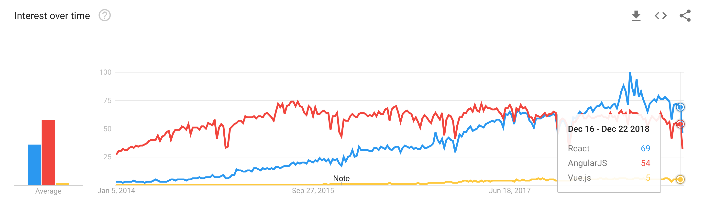
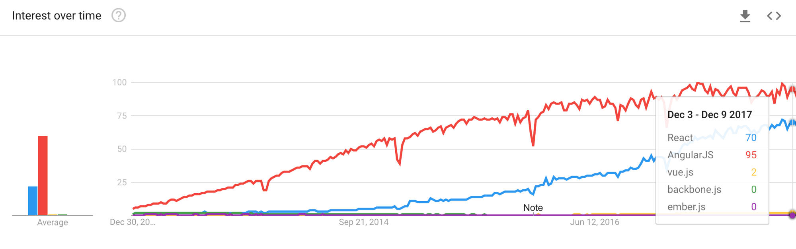
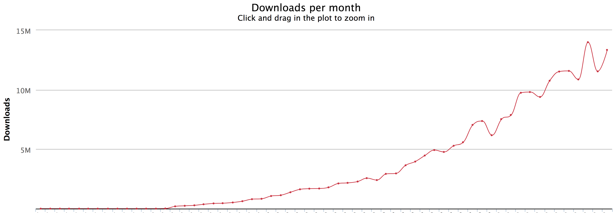
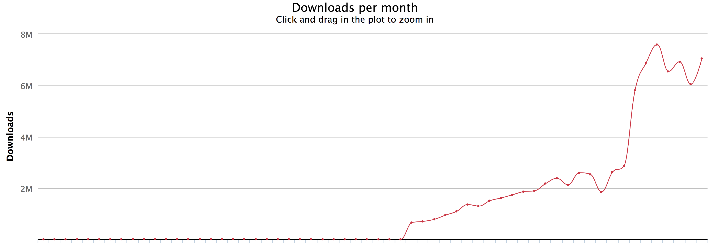
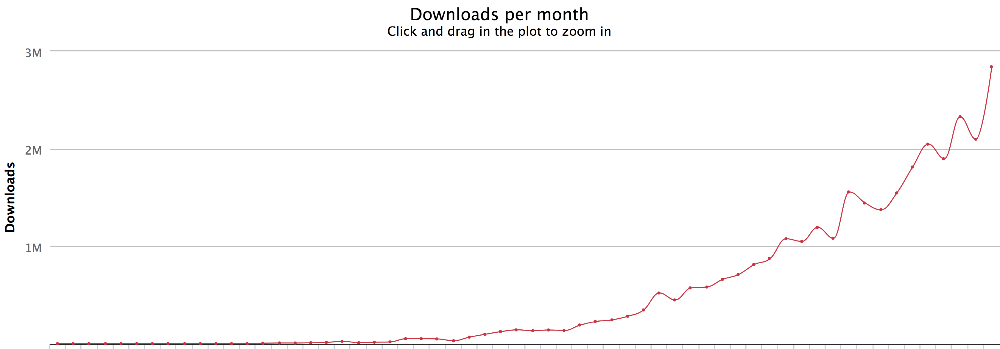
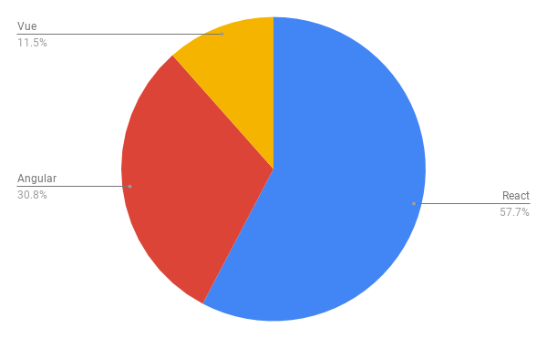
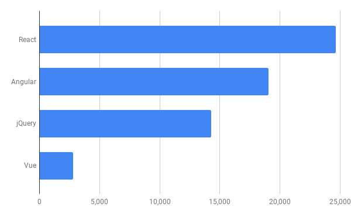
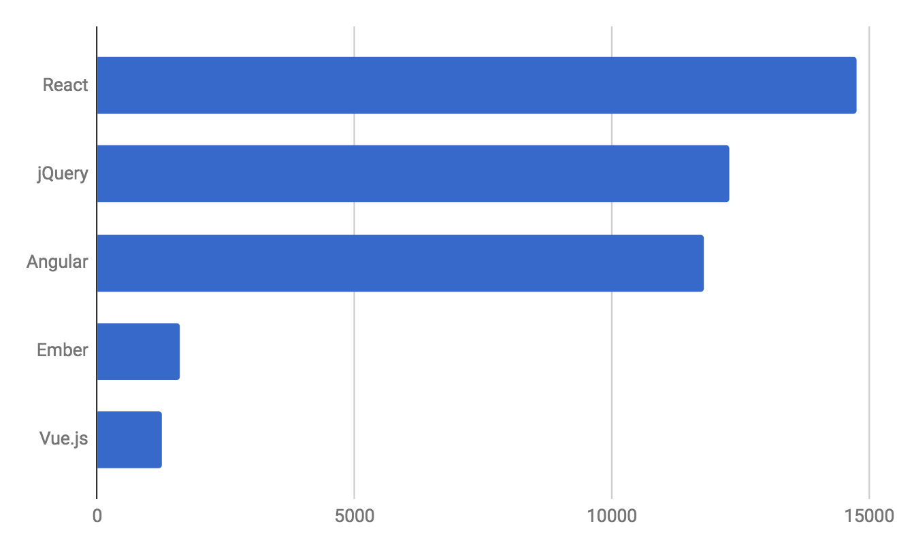
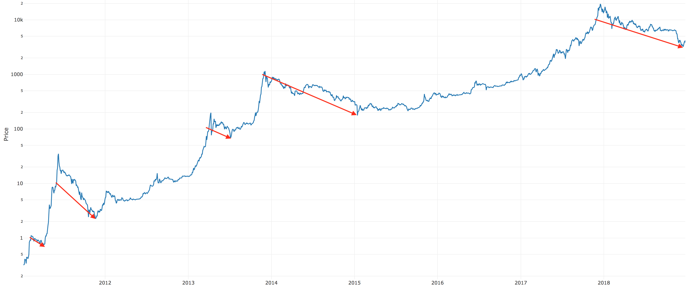
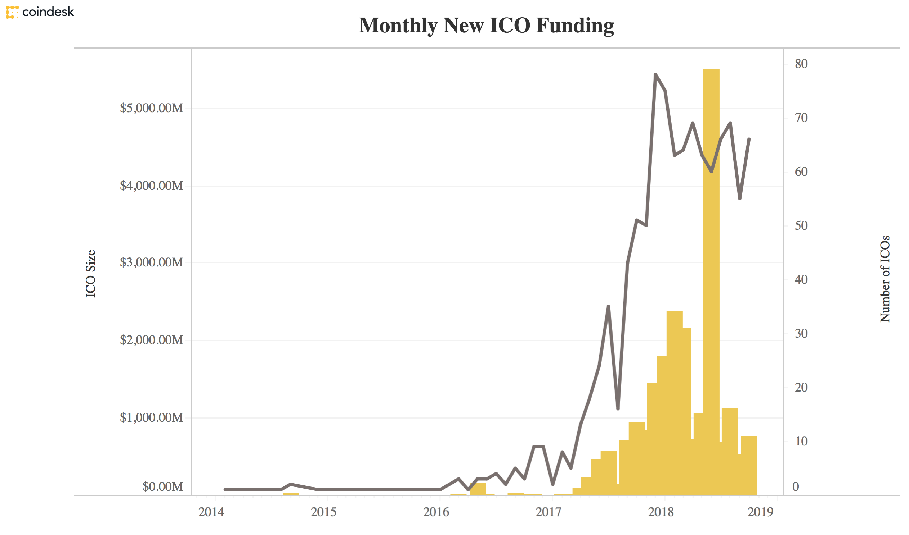

Снова пришло время сделать обзор экосистемы JavaScript за год. Моя цель — определить области и технологии с наивысшим потенциалом для поиска работы. Какие технологии используются? Какие тренды развития существуют? Я не буду говорить _о лучших_, вместо этого предлагаю сфокусироваться на самых востребованных. Тех, которые помогут пройти собеседование и не ударить в грязь лицом, когда интервьюер спросит _«а знаете ли вы ____?»_ (пустую графу заполните сами). Для достижения цели я использую доступные в сети данные.

Я не буду искать самую быструю технологию. Или оптимальную по качеству кода. Предлагаю сделать допущение, что все они самые быстрые и все делают свою работу. Важно другое: их востребованность.

## Компонентные фреймворки

Вопрос, требующий внимания, — компонентные фреймворки, а именно React, Angular и Vue.js, ведь по популярности эта тройка оставила конкурентов далеко позади.

Я уже писал в прошлом году, как быстро растет Vue.js, и что он имеет шансы в 2018 догнать Angular. Этого не случилось, хотя динамика по-прежнему отличная. Я также говорил, что бороться за сердца разработчиков на React им будет сложнее, поскольку уровень удовлетворенности у React значительно выше, чем у Angular. У них просто нет причин менять стек. Мое предсказание подтвердилось, библиотека Facebook в 2018 году сохранила лидерство.

Что примечательно, популярность всех трёх растет по экспоненте, год за годом.

### Прогноз: в 2019 React продолжит доминировать

React сохраняет лидерство [в рейтинге удовлетворенности](https://2018.stateofjs.com/front-end-frameworks/overview/) технологиями. Третий год подряд с тех пор, как мы учитываем его, React не отдаёт и пяди земли конкурентам. Причин для перемен в этом году я не вижу. Только нечто экстраординарное сможет подорвать его позиции.

Впрочем, React становится только лучше. [Hooks API](https://reactjs.org/docs/hooks-reference.html) пришли на смену классам, которые я терпел с версии 0.14. Классы все ещё работают, но хуки — намного, намного лучше! Это и другие нововведения, такие как улучшение поддержки код-сплитинга и [параллельного рендеринга](https://reactjs.org/blog/2018/11/13/react-conf-recap.html), делают его практически непобедимым. На сегодняшний день React — без сомнений наиболее дружелюбный фреймворк во всей экосистеме. А фактора важнее я не знаю.

### Источники данных

Для оценки интереса к технологиям в нашей отрасли, используем следующие метрики:

1. **Тренды поиска Google.** Не назову их лучшим показателем, но он подходит для широкой картины.
2. **Число скачиваний.** Как способ оценки количества реальных пользователей через действие, которое они производят используя фреймворк.
3. **Вакансии на [Indeed](https://indeed.com/).** Используя ту же методику, что и в предыдущие годы для сохранения последовательности.

### Тренды поиска Google

**Поисковые запросы по фреймворкам: январь 2014 — декабрь 2018.**

<figure>
    
</figure>

По поисковым запросам React обогнал Angular в январе 2018 и сохранял лидерство на протяжении всего года. Vue.js стал занимать видимую, но все еще относительно незначительную позицию. Для сравнения, прошлогодние результаты:

**Поисковые запросы по фреймворкам: январь 2014 — декабрь 2017.**

<figure>
    
</figure>

### Число скачиваний

Этот параметр позволяет оценить _реальное_ использование: установка пакета, как правило, означает его необходимость для рабочего процесса.

Кто-то из читателей заметит, что поставить пакет можно и из внутрикорпоративных репозиториев. Отвечу: да, такое возможно, но для всех трех сравниваемых фреймворков. Все они вполне прижились в энтерпрайзе, поэтому имеют сравнимые показатели.

**React, количество скачиваний в месяц: 2014–2018**

<figure>
    
</figure>

**Angular, количество скачиваний в месяц: 2014–2018**

<figure>
    
</figure>

**Vue.js, количество скачиваний в месяц: 2014–2018**

<figure>
    
</figure>

**Визуализация по всем трём одновременно:**

<figure>
    
</figure>

# Но вы забыли про Angular 1.0! Он все еще значителен в энтерпрайзе!

Нет, не забыл. Angular 1.0 используется во многих проектах, так же как используется Windows XP. Эта версия всё ещё актуальная для заметного количества проектов, но новые — давно превзошли её по популярности, что делает Angular 1.0 гораздо менее востребованным, чем другие фреймворки.

Как так вышло? Потому что разработка в целом, как и повсеместное распространение JavaScript, во _всех секторах (включая энтерпрайз)_, развивается настолько быстро, что новые технологии заменяют старые с невероятной скоростью. Пусть даже некоторые проекты _никогда_ не обновятся.

Примите за доказательство приведенные выше графики скачиваний. В одном 2018 их было больше, чем за все прошлые годы _вместе взятые_.

### Вакансии

Indeed агрегирует данные разных сервисов по поиску работы. Раз в год мы подсчитываем количество упоминаний того или иного фреймворка, чтобы понять, чего хотят работодатели. В этом году результаты выглядят так:

**Вакансии для фреймворков, декабрь 2018.**

<figure>
    
    <figcaption>Вакансии для фреймворков, декабрь 2018</figcaption>
</figure>

1. React: 24 640
2. Angular: 19 032
3. jQuery: 14 272
4. Vue.js: 2 816
5. Ember: 2 397 (нет на графике)

Традиционно, вакансий значительно больше, чем годом ранее. Ember я исключил из списка, так как его показатели не растут, в отличие от показателей конкурентов. Я бы не рекомендовал изучать его, если задумываетесь о смене работы. Схожая ситуация с jQuery, спрос на который практически не изменился.

К счастью, число разработчиков в индустрии также выросло. Тем не менее, нам нужно нанимать и обучать новичков (не забывая про [синьоров-менторов](https://devanywhere.io)). Иначе мы просто не успеем за ростом спроса. Ниже, для сравнения, прошлогодний график:

<figure>
    
</figure>

Средняя зарплата продолжила рост: с 110 до 111 тысяч долларов в год _(с 9166 до 9250 $ в месяц, прим. редактора)._ Забавно, но зарплаты при этом отстают от ожиданий соискателей. Рекрутерам будет сложнее нанимать новых и удерживать текущих разработчиков, если они не пойдут навстречу. Удерживание и переманивание кадров остается огромной проблемой. Люди стремятся туда, где больше платят.

**Методология:** использованы данные сервиса [Indeed](http://indeed.com). Чтобы отфильтровать ложные вхождения, использован запрос со словом «software». Это повышает релевантность результатов. Затем полученные значения помножил на коэффициент ≈1,5 (приближенное соотношение вакансий со словом «software» и без него). Все данные были отсортированы по дате и проверены по выборке. Конечно, они точны не на 100%, но достаточно для анализа в рамках статьи.

## Основы JavaScript

Я все время повторяю: сосредоточьтесь на основах. В этом году — я вам немного помогу. Процесс разработки основан на композиции — разделении сложных проблем на мелкие и простые и объединении их решений в полноценную программу.

Однако, когда на интервью я спрашиваю: «что такое функциональная композиция?» или «что такое композиция объектов?» разработчики не могут ответить. Несмотря на то, что используют их каждый день.

Я всегда считал это серьезной проблемой, поэтому написал книгу: [«Composing Software](https://leanpub.com/composingsoftware)». Если вам нечего учить в 2019, учитесь правильной композиции.

### TypeScript

TypeScript растёт. Это по-прежнему переоценённый инструмент, так как [безопасность типизированного код преувеличена](https://medium.com/javascript-scene/the-shocking-secret-about-static-types-514d39bf30a3) и не сильно снижает вероятность ошибок, а [работа с типами](https://medium.com/javascript-scene/you-might-not-need-typescript-or-static-types-aa7cb670a77b) в JavaScript без TypeScript и так неплоха. Можно даже использовать движок последнего с нативным JS в Visual Studio Code. Или установить Tern.js для вашего редактора.

TypeScript подводит при работе с функциями высшего порядка. Или, возможно, это я не научился пользоваться за все годы работы с ним. В этом случае авторам стоит поразмыслить над удобством или документацией (или обоими). Так или иначе, я до сих пор не понимаю, как нормально обрабатывать map-операции. TypeScript как будто вообще не понимает, что происходит в [трансдьюсерах](https://medium.com/javascript-scene/transducers-efficient-data-processing-pipelines-in-javascript-7985330fe73d). Кроме того, он плохо отлавливает ошибки и часто жалуется на ошибки которые ими не являются вовсе.

Попросту говоря, TypeScript не хватает гибкости и функциональности, чтобы соответствовать моему преставлению о написании кода. Но я продолжаю верить, что когда-нибудь он обрастет недостающими возможностями. Идея управления типами (там, где это необходимо), даже несмотря на все сложности внедрения на реальных проектах, мне нравится.

Мое мнение: очень классная технология для узких случаев. При этом она переоценена и имеет низкий КПД на больших проектах. В этом вся ирония: TypeScript позиционирует себя как «JavaScript, который масштабируется», но кажется они забыли одно слово: «JavaScript, который _странно_ масштабируется».

Что нам нужно, так это система типов больше похожая на Huskell, меньше — на Java.

### Другие темы для изучения по JavaScript

- [GraphQL](https://graphql.org/) для запросов
- [Redux](https://redux.js.org/) для управления состоянием приложения
- [Redux-saga](https://github.com/redux-saga/redux-saga) для работы с сайд-эффектами
- [React-feature-toggles](https://github.com/paralleldrive/react-feature-toggles) для непрерывной интеграции и тестирования
- [RITEway](https://github.com/ericelliott/riteway) для прекрасных читаемых юнит-тестов

## Расцвет криптоиндустрии

Год назад я говорил, что блокчейн и финтех станут значимыми в 2018. Мои слова подтвердились. Одной из важнейших тем последних двух лет стал расцвет криптоиндустрии и появление понятия _интернет ценностей_ (Internet of Value). Запомните его. Скоро вы о нем услышите.

Если вы, подобно мне, следите за децентрализованными приложениями со времен P2P, то знаете, процесс не был быстрым. Теперь, когда Биткоин «поджёг фитиль», доказав самодостаточность технологии на примере криптовалюты, взрыва не остановить.

Биткоин вырос в несколько раз всего за несколько лет. Вы могли слышать, что 2018 стал «зимой для криптовалют», и наверняка думаете, что эта сфера столкнулась с проблемами. Ерунда. Что случилось на самом деле: в конце 2017 Биткоин достиг очередного пика, и рынок немного отыграл назад. Такое происходит при каждом достижении десятикратного рубежа стоимости.

**Точки десятикратного роста Биткоина**

<figure>
    
</figure>

Здесь видно, вершина стрелки графика находится на десятикратной позиции, относительно предыдущей, и уходит вниз для коррекции.

Фандрайзинг для ICO достиг пика в начале 2018. Пузырь инвестиций в эту сферу привел к взрывному росту спроса на специалистов, который подошел к отметке в 10 000 открытых вакансий в январе 2018. По данным Indeed, после этого значение опустилась до 2 400. Но мы лишь в начале пути.

<figure>
    
</figure>

О криптоиндустрии можно говорить много, но это заслуживает отдельной публикации. Если интересно, читайте «[Blockchain Platforms and Tech to Watch in 2019](https://medium.com/the-challenge/blockchain-platforms-tech-to-watch-in-2019-f2bfefc5c23)».

### Другие интересные технологии

Как я и предсказывал, эти технологии продолжили расти в 2018:

**Искусственный интеллект/машинное обучение** раскручивается вовсю: 30 000 вакансий на конец 2018 года, [deepfake](https://en.wikipedia.org/wiki/Deepfake), генеративное искусство, потрясающие примеры работы с видео от исследовательских команд таких компаний как Adobe. Еще не было столь подходящего времени для изучения AI.

**Прогрессивные веб-приложения**, теперь поддерживаемые Google, Apple, Microsoft, Amazon и другими гигантами, становятся стандартом. Невероятно, как быстро я стал относиться к PWA на моем телефоне как к должному. У меня больше не стоит приложение Twitter для Android, вместо него я использую [Twitter PWA](http://mobile.twitter.com/home).

**AR** (augmented reality — дополненная реальность), **VR** (virtual reality — виртуальная реальность), **MR** (mixed reality — смешанная реальность), словно Вольтрон, объединились в **XR** (eXtended reality — расширенная реальность). На пороге — полное погружение. Прогнозирую, что через 5–10 лет XR-очки станут массовым товаром. В течение 20 лет — контактные линзы. Тысячи новых вакансий в 2018 году и взрывной рост в 2019.

**Роботы, дроны и беспилотные машины**. Самоуправляемые дроны уже с нами, работы продолжают развиваться, все больше машин на автопилоте. Эти технологии продолжат развиваться и менять мир в 2019 и в течение 20 следующих лет.

**Квантовые вычисления** развивались, но мейнстримом не стали. Пока. Очевидно, мой прогноз, что «перелом произойдет в 2019 году или позже», звучит слишком оптимистично.

В криптоиндустрии большое внимание уделяется квантово-устойчивому шифрованию (квантовые вычисления ломают современные представления о «дорогих» алгоритмах, тогда как блокчейн базируется на «дорогих» вычислениях). Но несмотря на череду интересных исследований, реальное положение дел такое, как описано в [этом докладе](https://www.theregister.co.uk/2018/12/06/quantum_computing_slow/):

> В период с 2000 по 2017 годы квантовые вычисления попадали в [Перспективный список Гартнера](https://www.gartner.com/en/research/methodologies/gartner-hype-cycle) одиннадцать раз. Каждый раз их оценивали, как находящиеся на начальном этапе и требующих как минимум 10 лет для прохождения цикла зрелости.

Это напоминает историю развития искусственного интеллекта. Первые разработки появились в 1950-х. Достигли ограниченного, но интересного результата в 1980-х и 1990-х. Но про настоящий прорыв можно говорить где-то с 2010.

**Эрик Эллиот** — эксперт по распределённым системам, автор книг «[Composing Software](https://leanpub.com/composingsoftware)» и «[Programming JavaScript Applications](https://ericelliottjs.com/product/programming-javascript-applications-ebook/)». Как сооснователь [DevAnywhere.io,](https://devanywhere.io/) обучает разработчиков навыкам, необходимым для удалённой работы и сохранения баланса работа-жизнь. Создаёт и консультирует команды по разработке криптопроектов, участвовал в разработке проектов для Adobe Systems, Zumba Fitness, The Wall Street Journal, ESPN, BBC и популярных музыкантов, включая Usher, Frank Ocean, Metallica и многих других.
