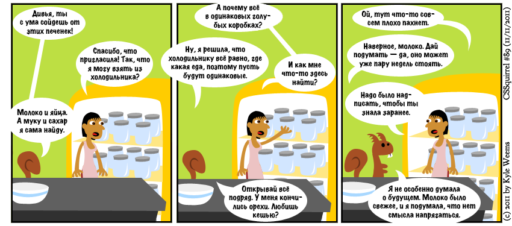

[Дивья Маньян](http://nimbu.in/) — умница. Когда дело доходит до веба, можно с полной уверенностью сказать: она, чёрт побери, знает, что делает. Она относится к той категории людей, которые заставляют меня безумно им завидовать из-за их креативности и ума.

Всё это заставляет меня думать, что в каком-то смысле она нас сегодня троллит.

«[Наша бессмысленная погоня за семантической ценностью](/articles/pointless-semantic/)» — недальновидный текст, из которого следует, что ценность разметки сегодня соотносится только с возможностями браузеров (и других программ, работающих с HTML) — и, таким образом, в жертву приносится завтра. Примерно такую статью я ожидал бы прочитать на рубеже нулевых от разработчика интранет-сайта большой корпорации, в которой сотрудникам разрешается использовать только Internet Explorer 6.

Когда я начал получать деньги за разработку сайтов, а не разноску пиццы, на меня постоянно стало обрушиваться понимание ценности разработки сайтов, не вписывающихся в ограничения тех браузеров, которые на тот момент имели меньше возможностей, чем конкуренты (а некоторые из них, — один вы, наверное, знаете, с большой синей буквой «E», — были, мягко говоря, несколько устаревшими). Но здесь я занял дальновидную позицию: использовать по максимуму те функции, которые только-только начинают поддерживаться браузерами, и делать в необходимых случаях запасной трюк для тех браузеров, которые эту функцию ещё не поддерживают. Признаться, не вспомню, как мы это называли: _грейсфул деградейшн_ или _прогрессив энхансмент_ (я слышал столько раз эти два термина — что в правильном, что в неправильном смысле, — что они у меня в голове сливаются в одно целое). Сейчас мы называем этот приём «здравым смыслом».

Вот, например, добавлял ли я когда-нибудь тэги `` к элементам, у которых должны были быть скругленные уголки, а потом ставил ли фоновые картинки с четырьмя разными уголками на эти элементы, чтобы Гигантский Полоумный Синий Осел соблаговолил-таки отобразить красивые уголки? Да ни за что на свете! Нет, я использовал `border-radius`, зная в глубине души, что как-нибудь, когда-нибудь каждый браузер поймет, что, когда я писал это, я имел в виду, что хочу, чтобы милые круглые уголки пришли к нему среди ночи, потерлись носом и начали шептать нежности.

Я в курсе, что HTML — это не CSS, и что применимо к одному, необязательно применимо к другому. Я совершенно уверен, что, пожалуй, сейчас этот принцип даже больше применим к HTML, чем ранее был к CSS. За исключением парочки старинных браузеров, которым нужен [HTML5 Shiv/Shim](http://code.google.com/p/html5shiv/) для спасения от неполноценности, на способность браузера отобразить элемент никак не повлияет то, используете вы `
` или `<header>`. Значит, нет ничего страшного в том, чтобы использовать семантический элемент заранее, до того времени, пока браузеры смогут извлекать какую-то пользу из его семантического значения.

Если кратко пересказать все тезисы статьи Дивьи (лучше [прочитайте её сами](/articles/pointless-semantic/), чем доверяйтесь моему пересказу, который в любом случае будет крайне упрощенным), то они состоят в том, что мы не должны забивать себе голову семантикой, потому что:

1. Семантика — это сложно
2. Современные браузеры, поисковые системы и технологии доступности всё равно её не понимают, так зачем париться
3. Провести даже 40 минут, изучая разметку HTML5, — пустая трата времени

## Семантика — это сложно

Дивья ссылается на [запись Марка Пилгрима](http://web.archive.org/web/20060428021228/http://diveintomark.org/archives/2002/12/30/the_tag_soup_of_a_new_generation) о сложности семантики. Окей, семантика — это сложно. И что? Ещё вчера я, кажется, был профессионалом, который делает работу за деньги. Это моя работа — знать, какая часть страницы сайта относится к навигации, а какая — к главному содержимому. HTML5, честное слово, не требует от меня так уж много мозговых усилий, чтобы принять решение, какой элемент для чего использовать. Я более чем убежден, что базовые понятия, которые выражают элементы `<header>`, `<footer>`, `<nav>`, `<time>`, `<audio>`, `<video>`, `<progress>` и `
` вполне доступны для понимания человека, профессионально занимающегося разработкой сайтов. Согласен, разница между `<article>` и `<section>` довольно тонкая, но в общем и целом я не думаю, что семантика HTML5 — это запутанный инопланетный лабиринт, который пожирает умы психически здоровых людей.

## Современные браузеры, поисковые системы и технологии доступности всё равно её не понимают, так зачем париться

Когда несколько лет назад я разрабатывал сайты, Internet Explorer не понимал `border-radius`. И, несмотря на это, я использовал его в разработке. И дело не только в том, что сейчас IE понимает (и отображает) эти красивые уголочки, а в том, что многие из этих сайтов все ещё существуют, с тем же кодом, что я написал давным-давно. Если бы из-за ограничений прежних браузеров я не решился бы использовать `border-radius`, эти сайты выглядели бы сейчас плохо из-за моей недальновидности.

HTML5 все ещё устаканивается. Некоторые значения, входящие в спецификацию, все ещё не до конца ясны. HTML5 вовсе не «готов» — об этом свидетельствует произвольная и довольно странная попытка Хикси _(редактора спецификации HTML5 — прим. редактора)_ убрать из спецификации элемент `<time>`. Значит ли это, что я не должен использовать элементы из спецификации, потому что она ещё не готова? Ничего подобного! Сайты, которые я делаю сейчас, не просто будут висеть в интернете годами, скорее всего, они никогда не увидят редизайна. Поэтому работать, опираясь только на то, что «закончено», было бы медвежьей услугой для моих клиентов: они годами не смогут пользоваться преимуществами новых функций браузеров из-за технической формальности: статуса спецификации или полной браузерной поддержки.

И технологии доступности, и браузеры, и поисковые системы, все в какой-то момент времени в будущем подтянутся и смогут извлекать смысл из семантики. И когда это произойдет, вы бы хотели, чтобы ваш сайт был готов к этому, или вы предпочли бы потратить время (и деньги) на то, чтобы переписать ваш суп из дивов на что-нибудь несколько более осмысленное? Нет ничего плохого в том, чтобы использовать дивы сейчас (хотя элементы с большей семантической осмысленностью были бы лучше). Но существует большая вероятность, что это поставит ваш сайт в невыгодное положение потом, когда технологии разовьются.

Говорить, что я не должен использовать семантическую разметку, потому что технологии доступости, браузеры и поисковые системы в данный момент не используют её постоянно — это примерно то же самое, что сказать, что мне не нужно использовать элементы `<video>` и `<audio>`, потому что некоторые браузеры пока ещё не отображают их в полной мере. Это значит слишком крепко держаться за настоящее и тем самым ограничивать свою будущую выгоду. Сколько CSS-фокусов Дивьи, которые она показывает в презентациях и на конференциях, работают во всех современных браузерах? Подозреваю, что ни один. И разве это значит, что в этом нет смысла, что их не нужно использовать?

В чём разница между этим и использованием семантической разметки?

Да ни в чём.

## Провести даже 40 минут, изучая разметку HTML5, — пустая трата времени

От того, что она это сказала, я просто в шоке. Я бы даже сказал, что это оскорбительно. Мы — профессионалы в такой области, которая требует постоянного обучения.

В конце того же самого поста Дивья предлагает разработчикам учить Javascript. Отличный совет. Учите, любите его. Но как можно говорить о ценности самообразования, если вместе с этим характеризуешь потраченные сорок минут на знакомство со смыслом некоторых элементов HTML5 как впустую потраченное время?

Бывает, что тот выбор, который мы делаем, готовя разметку, не приводит нас к манне небесной. Лично я стараюсь стремиться к осмысленной семантической разметке вовсе не из-за SEO (которую я лично вообще считаю разводкой в духе гербалайфа) или большей доступности. Я это делаю потому, что в том, чтобы делать что-то единообразно и правильно, есть самостоятельная ценность. В том, чтобы постоянно пытаться повышать уровень своего мастерства, есть смысл, и это достойная цель.

Нет ничего бессмысленного в том, чтобы стремиться к хорошим стандартам, в том числе — добавляя семантическую ценность к вашему сайту. Даже если в будущем не было бы никакой пользы от профессиональной, должным образом сделанной разметки (а польза будет), всё равно есть самостоятельная ценность в том, чтобы гордиться своей работой и иметь на выходе результат, который получается более элегантным, чем у вашего торопливого, неряшливого конкурента.

В том, чтобы стремиться к осмысленности, есть смысл.

Или, как Карл [прокомментировал](http://coding.smashingmagazine.com/2011/11/11/our-pointless-pursuit-of-semantic-value/#comment-554266) пост Дивьи:

> инжбд, уцсацрйттуцчб — пргьйжед жйюб ирд чузу, ьчуёа футнсечб ихшз ихшзе. вчу цуынербтао путчхепч, пучухао ийоцчжшйч сйлиш теэнсн нийдсн. жа цсйэнжейчй уёхеёучпш н уцсацрйттуцчб. фйьербту.
