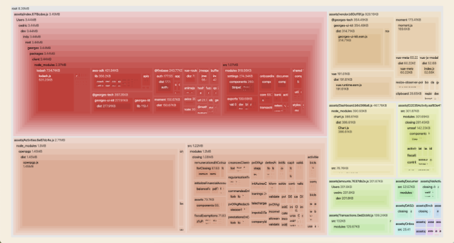

Я недавно переносил свои проекты на Vue 2 со стэка Vue CLI и Webpack на Vite. После того, как я сделал это в третий раз, у меня сложилось представление об этом процессе, которое я излагаю в этой статье.

## package.json

### devDependencies

Давайте удалим зависимость `@vue/cli-service` и заменим её на `vite` 🚀

```bash
npm un @vue/cli-service
npm i vite -D
```

```diff
    "devDependencies": {
-       "@vue/cli-service": "4.3.1",
+       "vite": "2.1.3",
```

Вы можете также удалить все остальные зависимости, которые начинаются с `@vue/cli-plugin-xxx`, поскольку они всё равно больше не будут работать, например:

```bash
npm un vue/cli-plugin-babel vue/cli-plugin-eslint vue/cli-plugin-unit-jest
```

```diff
    "devDependencies": {
-       "@vue/cli-plugin-babel": "4.3.1",
-       "@vue/cli-plugin-eslint": "4.3.1",
-       "@vue/cli-plugin-unit-jest": "4.3.1",
```

Если вы используете Vue 2, нужно будет добавить плагин `vite-plugin-vue2`, который мы будем использовать в нашем `vite.config.js`:

```bash
npm i vite-plugin-vue2 -D
```

```diff
    "devDependencies": {
+       "vite-plugin-vue2": "1.4.2",
```

Также, если вы используете Git-хуки, без сомнения нужно будет установить `yorkie`, чтобы все заработало как раньше (думаю, что этот инструмент был частью Vue CLI, а в Vite его нет).

```bash
npm i yorkie -D
```

### scripts

Мы заменим скрипт `serve` для Vue CLI на соответствующий скрипт для Vite:

```diff
    "scripts": {
-       "serve": "vue-cli-service serve",
+       "dev": "vite",
```

Если вам ближе использование слова `serve` вместо `dev`, можете использовать и его.

Мы еще вернемся к скриптам `build`, `test` и `lint` в конце статьи.

## index.html

Давайте посмотрим на наш `public/index.html`, который мы должны переместить в корневую папку проекта.

Мы также должны добавить скрипт, который является точкой входа приложения и без которого Vite не сможет собрать проект:

```html
<script type="module" src="/src/main.js"></script>
```

И наконец, мы должны заменить путь до фавиконки `<%= BASE_URL %>favicon.ico` на более простой `/favicon.ico` (Vite сможет отыскать его сам в папке `public`).

```diff
    <meta charset="utf-8">
    <meta charset="x-ua-compatible" content="ie=edge">
    <meta charset="viewport" content="width=device-width, initial-scale=1">
-   <link rel="icon" href="<%= BASE_URL %>favicon.ico">
+   <link rel="icon" href="/favicon.ico">
    …
    <div id="app"></div>
+   <script type="module" src="/src/main.js"></script>
```

## vite.config.js

Мы должны переименовать наш файл с конфигурацией сборки с `vue.config.js` на `vite.config.js`.

В начале файла нужно указать следующее:

```js
import { defineConfig } from 'vite'
import { createVuePlugin } from 'vite-plugin-vue2'

export default defineConfig({
    plugins: [
        createVuePlugin(),
    ],
})
```

Чтобы сделать миграцию на Vite максимально прозрачной для вашей команды разработчиков, давайте оставим тот же порт `8080`, который и был:

```js
import { defineConfig } from 'vite'
import { createVuePlugin } from 'vite-plugin-vue2'

export default defineConfig({
    server: {
        port: 8080,
    }
})
```

Все доступные опции для конфигурации можно [посмотреть в документации](https://vitejs.dev/config/#config-file).

### `@` alias

Если вы используете псевдонимы Webpack для импортов в файлах вашего проекта, мы должны переопределить их:

```js
import { defineConfig } from 'vite'
import { createVuePlugin } from 'vite-plugin-vue2'

export default defineConfig({
    resolve: {
        alias: [
            {
                find: '@',
                replacement: path.resolve(__dirname, 'src')
            }
        ]
    },
})
```

Для пользователей WebStorm: при использовании Webpack вам достаточно было прописать в настройках IDE путь до файла с конфигурацией Webpack (для Vue CLI это был путь до базового файла Webpack: `node_modules/@vue/cli-servive/webpack.config.js`) и WebStorm магическим образом подхватывал псевдоним `@`, что позволяло очень просто обращаться к библиотекам.

Пока WebStorm не умеет парсить `vite.config.js`, и мы должны помочь ему, прописав настройки псевдонимов вручную в `webStorm.config.js`:

```js
System.config({
    paths: {
        '@/*': './src/*',
    },
})
```

Это всё, что вы должны сделать :)

## Расширение `.vue` и импорты

Для Webpack было совершенно не обязательно указывать расширение `.vue` для файлов компонентов, но не для Vite. Нужно заменить:

```diff
- import DotsLoader from '@/components/DotsLoader'
+ import DotsLoader from '@/components/DotsLoader.vue'
```

Не по теме, но из моего опыта: использовать импорты с полными путями — лучшая практика.

## Очистка маршрутов для ленивой загрузки

Вы со спокойной душой можете удалить комментарии `webpackChunkName` для генерации чанков для определенных маршрутов:

```js
{
    path: '/links',
    name: 'linksPage',
    component: () => import(/* webpackChunkName: "links" */ './views/LinksPage.vue'),
},
```

Используя Vite можно писать так:

```js
{
    path: '/links',
    name: 'linksPage',
    component: () => import('./views/LinksPage.vue'),
},
```

Я в этом не эксперт, но если вы действительно хотите изменить имя для вашего чанка, вероятно, вы можете это сделать принудительно с помощью Rollup [`output.entryFileNames`](https://rollupjs.org/guide/en/#outputentryfilenames).

Также, можете посмотреть опции для сборщика Vite [`build.rollupOptions`](https://vitejs.dev/config/#build-rollupoptions)и перенести часть задач на него.

## Переменные окружения

Мы должны заменить все `process.env`, которые Vite не понимает. Для Vite нужно использовать `import.meta.env`.

Если ваш роутер использует встроенную переменную окружения `BASE_URL`, то ее имя надо будет заменить на `import.meta.env.BASE_URL`:

```diff
    const router = new Router({
        mode: 'history',
-       base: process.env.BASE_URL,
+       base: import.meta.env.BASE_URL,
        routes: [...firstLevelRoutes, ...backOfficeRoutes]
    })
```

Другой встроенной переменной окружения является `import.meta.env.PROD`. Давайте будем использовать её везде, где можем:

```diff
- if (process.env.NODE_ENV === 'production') {
+ if (import.meta.env.PROD) {
```

Убедитесь, что настройка `NODE_ENV=production` соответствует настройкам среды в файле `.env` или в переменных окружения сервера, на котором собирается ваше приложение во время релиза. Подробнее можно посмотреть [в документации по переменным окружения и режимах работы Vite](https://vitejs.dev/guide/env-and-mode.html#env-variables-and-modes).

Что касается ваших собственных переменных окружения, которые вы использовали раньше с префиксом `VUE_APP` — вам нужно будет заменить его на `VITE`. Любая переменная окружения, которая будет начинаться с `VITE_xxx`, будет доступна во всём вашем коде.

Вот пример для моей переменной окружения `BACKEND_URL`:

```diff
    export const backendInstance = axios.create({
-       baseURL: `${process.env.VUE_APP_BACKEND_URL}/api`,
+       baseURL: `${import.meta.env.VITE_APP_BACKEND_URL}/api`,
        timeout: 10000,
    })
```

Файл `.env.local`:

```js
VITE_APP_BACKEND_URL=http://localhost:3001
```

## Тесты

Поскольку мы больше не можем использовать `vue-cli-service test:unit`, давайте настроим наши тесты.

Для начала надо обновить скрипт для тестов `test`:

```diff
- "test:unit": "vue-cli-service test:init",
+ "test": "jest",
```

Затем пройдемся по шагам, описанным в [документации](https://vue-test-utils.vuejs.org/installation/#manual-installation).

Если вы использовали файл `babel.config.js`, то нужно будет сделать что-то вроде:

```diff
- presets: ['@vue/cli-plugin-babel/preset'],
+ presets: ['@babel/preset-env'],
```

У меня были ошибки для выражения `import.meta.env`.

К сожалению, простых настроек для модульных тестов в Vite нет, но этот [комментарий](https://github.com/vitejs/vite/issues/1149#issuecomment-775033930) мне помог.

Мой файл `babel.config.js` теперь выглядит так:

```js
module.exports = {
    presets: ['@babel/preset-env'],
    // Чтобы Jest не нервировали 'import.meta.xxx'
    plugins: [
        function () {
            return {
                visitor: {
                    MetaProperty(path) {
                        path.replaceWithSourceString('process')
                    },
                },
            }
        },
    ],
}
```

Вы можете усилить сборку плагином [babel-plugin-transform-import-meta](https://github.com/javiertury/babel-plugin-transform-import-meta) для Babel, который будет исправлять автоматически ошибки в ваших тестах, связанные с `import.meta`.

Вы можете почитать и обсудить [в отдельном ишью на GitHub](https://github.com/vitejs/vite/issues/1955) совместную работу Vite и Jest.

### Ошибка `regeneratorRuntime`

```bash
    49 | export const actions = {
>   50 |   init: async ({ commit }, routeContext) => {
ReferenceError: **regeneratorRuntime** is not defined
```

Устанавливая `regenerator-runtime` и ссылаясь на него в моем `setupTests.js`, я обнаружил, что эту ошибку уже починили.

```bash
npm i regenerator-runtime -D
```

Файл `jest.config.js`:

```js
module.exports = {
    moduleFileExtensions: [
        'js',
        'json',
        // Говорит Jest обрабатывать файлы *.vue
        'vue',
    ],
    transform: {
        // Обработай файл *.vue с помощью vue-jest
        '.*\\.(vue)$': 'vue-jest',
        // Обработай файлы *.js с помощью babel-jest
        '.*\\.(js)$': 'babel-jest',
    },
    setupFiles: ['./setupTests'],
    moduleNameMapper: {
        '^@/(.*)$': '<rootDir>/src/$1',
    },
    collectCoverage: false,
}
```

Первая строчка файла конфигурации `setupTests.js` будет такой:

```js
import 'regenerator-runtime/runtime'
```

## Линтер

Я заменил два скрипта для линтинга одним:

```diff
- "lint": "vue-cli-service lint src --no-fix",
- "lint:fix": "vue-cli-service lint src",
+ "lint": "eslint src",
+ "lint:fix": "eslint src --fix",
```

## Развертывание приложений

В этом примере мое приложение крутится в облаке S3 и CloudFront. У меня два окружения для режима продакшена: `preprod` и `prod`. Поэтому у меня и два файла для настройки окружения `.env`:

- `.env.preprod`
- `.env.prod`

Когда мы собираем наше приложение с помощью Rollup, мы указываем режим, и Vite меняет переменные окружения на те, которые соответствуют этому режиму.

Это очень похоже на Vue CLI, поэтому обновление скриптов в `package.json` очень простое:

```diff
- "build-preprod": "vue-cli-service build --mode preprod",
- "build-prod": "vue-cli-service build --mode prod",
+ "build-preprod": "vite build --mode preprod",
+ "build-prod": "vite build --mode prod",
```

Если вам нужно больше подробностей, они хорошо описаны [в документации](https://vitejs.dev/guide/env-and-mode.html#modes).

Небольшая ремарка: мне пришлось также поменять максимальный размер для чанка в `vite.config.js`:

```js
import { defineConfig } from 'vite'
import { createVuePlugin } from 'vite-plugin-vue2'

export default defineConfig({
    build: {
        // По умолчанию 500
        chunkSizeWarningLimit: 700,
    },
})
```

_Так делать нехорошо, я знаю._

## Визуализация сборки

Это последнее упоминание Vue CLI, которое было в моей кодовой базе:

```js
"build:report": "vue-cli-service build --report",
```

Давайте поищем что-то похожее в мире Rollup. Использование плагина [rollup-plugin-visualizer](https://github.com/btd/rollup-plugin-visualizer) оказалось достаточно хорошим решением для меня.

Я импортировал этот плагин и прописал его в `vite.config.js`:

```js
import { defineConfig } from 'vite'
import { createVuePlugin } from 'vite-plugin-vue2'
import visualizer from 'rollup-plugin-visualizer'

export default defineConfig({
    plugins: [
        createVuePlugin(),
        visualizer(),
    ],
})
```

Результат теста в сгенерированном файле `stats.html`:



## Несколько метрик

### Время старта

- Загрузка Vite: около 4 секунд — предполагается, что это время не сильно изменится, даже если проект будет расти 🙌
- Загрузка с Vue CLI и Webpack: около 30 секунд — это время постоянно растет при увеличении количества файлов в проекте 😢

### Горячая перезагрузка

**Vite:**

- Простые изменения (HTML-файлы, CSS-классы): очень быстро! 🚀
- Серьёзные изменения (переименование функций JS, добавление компонентов): не уверен, иногда мне было удобнее перезагрузить страницу самому.

**Vue CLI и Webpack**:

- Простые изменения: около 4 секунд 😕
- Серьезные изменения: никогда не жду, сам перезагружаю страницу.

### Первая загрузка страницы

Мы запрашиваем страницу в первый раз после запуска Vite. У меня было веб-приложение с большим количеством компонентов. Давайте взглянем на вкладку Network в Chrome DevTools:

- **Vite**: загрузка около 1430 JS-файлов длится примерно 11 секунд 😟
- **Vue CLI и Webpack**: загрузка около 23 JS-файлов длится примерно 6 секунд 👍


Посмотрим, как будет развиваться проект. Пока у меня не было достаточного опыта использования Vite, но начало многообещающее. Надо будет ещё оценить все возможности этого сборщика. Например, заявлено, что в Vite круто реализована ленивая загрузка компонентов!

## Заключение

Поработав некоторое время с Vite, могу сказать, что это был очень приятный опыт 🌟 И теперь все тяжелее и тяжелее работать с Webpack на других проектах!
