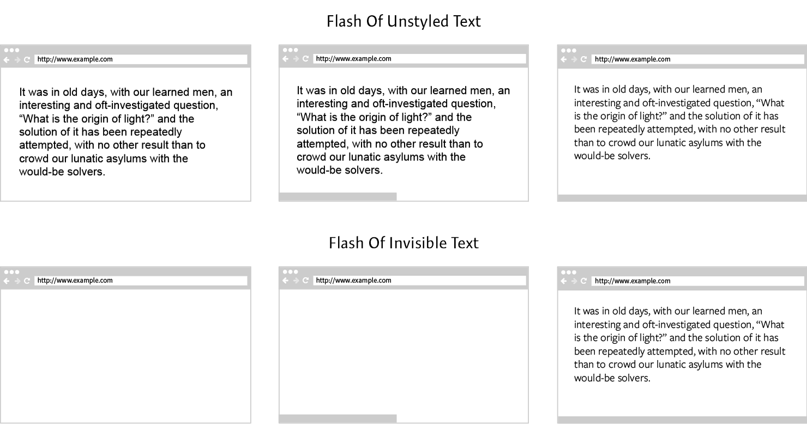

_Загрузка веб-шрифтов может показаться сложной задачей. Однако, на самом деле, она довольно проста, если вы будете использовать описанные ниже паттерны. Комбинируя их, вы сможете управлять загрузкой веб-шрифтов во всех браузерах._

В этих паттернах используется [Font Face Observer](https://github.com/bramstein/fontfaceobserver), простая и небольшая библиотека загрузки веб-шрифтов. Font Face Observer выбирает наиболее эффективный способ загрузки шрифта, основываясь на его браузерной поддержке, так что мы можем загружать шрифты, не беспокоясь о кроссбраузерности.

1. [Обычная загрузка шрифтов](#part-1)
2. [Загрузка группы шрифтов](#part-2)
3. [Загрузка шрифтов с таймером](#part-3)
4. [Приоритетная загрузка](#part-4)
5. [Особое отображение шрифтов](#part-5)
6. [Оптимизация для кэширования](#part-6)

Невозможно посоветовать единый паттерн, который идеально подходил бы каждому. Внимательно изучите свой сайт, его аудиторию, и на основании этого выберите тот способ загрузки или их комбинацию, которые подойдут лучше всего.

## Обычная загрузка шрифтов

Font Face Observer даёт вам возможность контролировать загрузку веб-шрифтов через простой интерфейс, основанный на промисах. Не имеет значения, откуда будут загружаться шрифты: вы можете размещать их как у себя, так и подключать через сервисы — [Google Fonts](https://www.google.com/fonts), [Typekit](https://typekit.com/), [Fonts.com](https://fonts.com/), и [Webtype](http://www.webtype.com/).

Чтобы не перегружать паттерны лишним кодом, будем считать, что вы размещаете веб-шрифты у себя. Это означает, что в ваших CSS-файлах будет одно или несколько объявлений `@font-face`, в которых указано, какие шрифты нужно загрузить через Font Face Observer. Для краткости мы не будем объявлять каждое из подобных правил в коде, но будем считать, что они есть.

```css
@font-face {
    font-family: Output Sans;
    src: url(output-sans.woff2) format('woff2'),
            url(output-sans.woff) format('woff');
}
```

Рассмотрим самую обычную задачу: вам надо загрузить один или несколько разных шрифтов. Создайте несколько экземпляров `FontFaceObserver`, по одному на каждый шрифт, и вызовите их метод `load`.

```js
var output = new FontFaceObserver('Output Sans');
var input = new FontFaceObserver('Input Mono');

output.load().then(function () {
    console.log('Загружен Output Sans');
});

input.load().then(function () {
    console.log('Загружен Input Mono');
});
```

Этот способ загрузит каждый шрифт независимо от остальных. Это полезно, когда шрифты не связаны друг с другом, и мы ожидаем, что они отрисуются постепенно (т.е. как только загрузятся, так и отрисуются). В отличие от стандартного [API загрузки шрифтов](https://www.w3.org/TR/css-font-loading/) вы не передаёте URL шрифтов в Font Face Observer. Для загрузки шрифтов он использует объявления `@font-face`, уже доступные в CSS. Это позволяет загружать веб-шрифты вручную через JavaScript, предусмотрев постепенную деградацию к обычному CSS.

## Загрузка групп шрифтов

Вы можете загружать несколько шрифтов одновременно, группируя их: вся группа либо загрузится полностью, либо выдаст ошибку. Это полезно использовать, когда загружаемые шрифты принадлежат к одному семейству, и вы не хотите, чтобы группа отрисовывалась, пока не загрузятся все шрифты из неё. Тем самым, браузер не будет отображать стили, пока шрифты представлены не полностью.

```js
var normal = new FontFaceObserver('Output Sans');
var italic = new FontFaceObserver('Output Sans', {
    style: 'italic'
});

Promise.all([
    normal.load(),
    italic.load()
]).then(function () {
    console.log('Загружено семейство Output Sans');
});
```

Вы можете сгруппировать шрифты через `Promise.all`. Когда промис будет выполнен, мы будем знать, что все шрифты загружены. Если промис отклонён — как минимум один из шрифтов не смог загрузиться.

Ещё один пример применения группировки шрифтов — уменьшение количества перекомпоновок страницы. Если вы загружаете и отрисовываете веб-шрифты постепенно, браузер будет выполнять перекомпоновку страницы множество раз, так как характеристики начертаний запасного и веб-шрифта различны. Группировка позволит сократить количество перекомпоновок до одной.

## Загрузка шрифтов с таймером

Иногда шрифты загружаются очень долго. Это может стать проблемой, поскольку веб-шрифты отвечают за текст — главную часть контента вашей страницы. Невозможно ждать загрузки шрифтов бесконечно. Мы можем исправить это, добавив таймер к загрузке.

Следующая вспомогательная функция создаёт таймеры, возвращающие промис, отклоняющийся по срабатыванию таймера.

```js
function timer(time) {
    return new Promise(function (resolve, reject) {
        setTimeout(reject, time);
    });
}
```

С помощью `Promise.race` мы можем заставить таймер и загрузку шрифта «соревноваться» друг с другом. Например, если загрузка завершилась до того, как сработал таймер, то шрифт победил, промис выполнен. А если раньше сработал таймер, промис отклонён.

```js
var font = new FontFaceObserver('Output Sans');

Promise.race([
    timer(1000),
    font.load()
]).then(function () {
    console.log('Загружен Output Sans');
}).catch(function () {
    console.log('Время на загрузку Output Sans истекло');
});
```

В этом примере время загрузки шрифта ограничено одной секундой. Вместо того, чтобы работать с одним шрифтом, мы также можем назначить таймер целой группе шрифтов. Это позволит просто и эффективно ограничить время их загрузки.

## Приоритетная загрузка

Обычно, для того, чтобы отрисовать первую половину экрана (_above the fold_ — верхняя половина первого экрана сайта, которую надо отобразить максимально быстро, _прим. переводчика_), нужно лишь несколько шрифтов. Если загружать эти шрифты раньше других, менее важных, мы получим выигрыш в производительности сайта. Это называется приоритетной загрузкой.

```js
var primary = new FontFaceObserver('Primary');
var secondary = new FontFaceObserver('Secondary');

primary.load().then(function () {
    console.log('Загружен основной шрифт')

    secondary.load().then(function () {
        console.log('Загружен второстепенный шрифт')
    });
});
```

При использовании приоритетной загрузки второстепенный шрифт зависит от основного: если не загрузится основной шрифт, то не загрузится и второстепенный. Это может оказаться полезным.

Например, можно применить приоритетную загрузку так: сначала загрузить небольшой основной шрифт, содержащий ограниченное число символов, а затем полный шрифт с большим количеством символов или стилей. Так как основной шрифт мал, он намного быстрее загрузится и отрисуется. А если основной шрифт не смог загрузиться, то, вполне возможно, не следует запрашивать и второстепенный — скорее всего, он тоже не загрузится.

Такое использование приоритетной загрузки более подробно описано в статьях Зака Лезермана: [Flash of Faux Text](https://www.zachleat.com/web/foft/) и [Web Font Anti-Patterns: Data URIs](https://www.zachleat.com/web/web-font-data-uris/).

## Особое отображение шрифтов

Перед тем как браузер сможет показать веб-шрифт, он должен скачать его по сети. Обычно это занимает какое-то время, и каждый браузер по-разному ведёт себя во время скачивания веб-шрифтов: некоторые из них скрывают текст, а другие сразу же показывают его с помощью запасного шрифта. Обычно это называют _мельканием невидимого текста_ (Flash Of Invisible Text, FOIT) и _мельканием текста без стилей_ (Flash Of Unstyled Text, FOUT).

<figure>
    
    <figcaption>FOUT и FOIT.</figcaption>
</figure>

Internet Explorer и Edge используют FOUT и отображают запасные шрифты, пока веб-шрифт не закончит свою загрузку. Все остальные браузеры используют FOIT и прячут текст во время загрузки веб-шрифтов.

Для управления этим поведением ввели новое CSS-свойство, называемое `font-display` ([CSS Font Rendering Controls](https://tabatkins.github.io/specs/css-font-display/)). К сожалению, оно до сих пор находится в разработке и ещё не поддерживается ни одним браузером (на данный момент оно спрятано за флагом в Chrome и Opera). Однако мы можем реализовать аналогичное поведение во всех браузерах с помощью Font Face Observer.

Вы можете обмануть браузеры, использующие FOIT, заставив их сразу же отрисовывать текст запасными шрифтами, используя только полностью загруженные шрифты из вашей цепочки. Если шрифт ещё не в цепочке (поскольку он загружается), браузеры не будут пытаться скрыть текст.

Простейший способ сделать это — устанавливать на элемент `<html>` по классу на каждое из трёх состояний загрузки веб-шрифта: сам процесс загрузки, его завершение и ошибку. Класс `fonts-loading` устанавливается сразу, как начинается загрузка, `fonts-loaded` — когда шрифт загружен, и `fonts-failed` — если загрузка не удалась.

```js
var font = new FontFaceObserver('Output Sans');
var html = document.documentElement;

html.classList.add('fonts-loading');

font.load().then(function () {
    html.classList.remove('fonts-loading');
    html.classList.add('fonts-loaded');
}).catch(function () {
    html.classList.remove('fonts-loading');
    html.classList.add('fonts-failed');
});
```

При помощи этих классов и простого CSS вы можете кроссбраузерно использовать FOUT. Начнём с объявления запасных шрифтов для всех элементов, которым понадобятся веб-шрифты. Когда в `<html>` появляется класс `fonts-loaded`, мы применяем веб-шрифт, изменяя цепочку шрифтов для всех соответствующих элементов. Изменение правила в CSS заставит браузер загрузить веб-шрифт, однако, поскольку к этому моменту он уже будет загружен, перерисовка начнется практически мгновенно.

```css
body {
    font-family: Verdana, sans-serif;
}

.fonts-loaded body {
    font-family: Output Sans, Verdana, sans-serif;
}
```

Такой способ загрузки шрифтов может показаться вам похожим на технику прогрессивного улучшения. Так оно и есть: _мелькание текста без стилей_ (FOUT) соответствует прогрессивному улучшению. Базовый вид в первую очередь отрисовывается запасными шрифтами, а затем улучшается веб-шрифтами.

Реализация FOIT такая же простая. Когда веб-шрифты начинают загрузку, вы скрываете контент, использующий шрифты, а когда они загружены, вы показываете его снова. Не забывайте и об ошибке загрузки — контент должен быть доступен, даже если шрифты не смогли загрузиться.

```css
.fonts-loading body {
    visibility: hidden;
}

.fonts-loaded body,
.fonts-failed body {
    visibility: visible;
}
```

Такой способ сокрытия контента кажется вам странным? Хорошо, если так. Этот паттерн следует применять только в очень специфичных случаях. Например, если у вас нет подходящего запасного шрифта, или вы точно знаете, что шрифт был закэширован ранее.

## Оптимизация для кэширования

Все предыдущие паттерны позволяли вам регулировать когда и как загружаются шрифты. Однако, часто мы хотим, чтобы в зависимости от наличия или отсутствия шрифта в кэше сайт вёл себя по-разному. Например, если шрифт закэширован, нет необходимости отрисовывать текст сначала запасным шрифтом. Такого эффекта можно добиться сохранением в Session Storage статуса о том, был ли шрифт закэширован или нет.

Когда шрифт загружен, мы устанавливаем флаг в Session Storage. Флаг сохраняется на протяжении всей сессии, и с его помощью мы можем определить, находится файл в браузерном кэше или нет.

```js
var font = new FontFaceObserver('Output Sans');

font.load().then(function () {
    sessionStorage.fontsLoaded = true;
}).catch(function () {
    sessionStorage.fontsLoaded = false;
});
```

Теперь вы можете использовать эту информацию, чтобы изменить стратегию загрузки закэшированных шрифтов. Например, можно включить такой фрагмент JavaScript в элемент `<head>` вашей страницы, чтобы сразу же отрисовывать веб-шрифты.

```js
if (sessionStorage.fontsLoaded) {
    var html = document.documentElement;
    html.classList.add('fonts-loaded');
}
```

Если вы будете загружать шрифты этим способом, ваши посетители увидят FOUT только при первом посещении сайта, а при всех дальнейших переходах шрифт будет отрисовываться мгновенно. А значит, с одной стороны, вы сохраните выгоды, которые даёт прогрессивное улучшение, а с другой — сделаете сайт удобным, поскольку загрузка страниц будет меньше раздражать при повторных посещениях.
