В этой статье мы рассмотрим новые возможности инструментов Lighthouse, PageSpeed и DevTools, чтобы помочь разобраться с тем, как улучшить ваш сайт [по метрикам Web Vitals](https://web.dev/vitals).

Коротко вспомним, что это за инструменты. [Lighthouse](https://github.com/GoogleChrome/lighthouse) — это автоматический, постоянно обновляемый инструмент с открытым кодом для улучшения качества страниц. Вы можете найти его в инструментах разработчика [Chrome DevTools](https://developers.google.com/web/tools/chrome-devtools) и запустить в нём любые страницы: публичные или скрытые за авторизацией. Вы также можете найти Lighthouse [в PageSpeed Insights](https://developers.google.com/speed/pagespeed/insights/?url=https%3A%2F%2Fstore.google.com), [CI](https://github.com/GoogleChrome/lighthouse-ci) и [WebPageTest](https://www.webpagetest.org/easy).

Lighthouse 7.x включает новые возможности, например, скриншоты элементов интерфейса, влияющих на пользовательские метрики, вроде тех, что вызывают смещение раскладки.

<video width="1920" height="1080" autoplay loop muted>
    <source src="video/1.webm" type="video/webm">
    <source src="video/1.mp4" type="video/mp4">
</video>

Мы также добавили возможность делать скриншоты элементов страницы в PageSpeed Insights, чтобы легче было найти проблемы, которые возникают при разовой загрузке страницы.

<picture>
    <source srcset="images/1.webp" type="image/webp">
    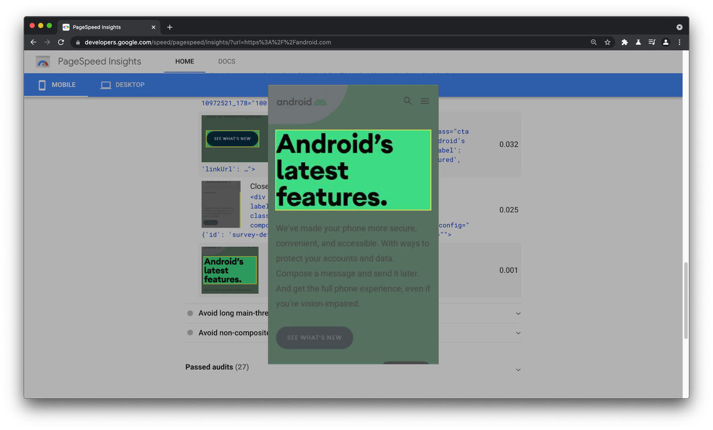
</picture>

## Метрики Core Web Vitals

Lighthouse может [синтетически](https://web.dev/vitals-measurement-getting-started/#measuring-web-vitals-using-lab-data) измерять метрики [Core Web Vitals](https://web.dev/vitals/), включая [Largest Contentful Paint](https://web.dev/lcp/), [Cumulative Layout Shift](https://web.dev/cls/) и [Total Blocking Time](https://web.dev/tbt/) (аналог [First Input Delay](https://web.dev/fid/) для измерения в лабораторных условиях). Эти метрики отражают загрузку, стабильность раскладки и готовность страницы к взаимодействию. Также есть и другие метрики, такие как [First Contentful Paint](https://web.dev/first-contentful-paint/), с запасом [на будущее Core Web Vitals (CWV)](https://developer.chrome.com/devsummit/sessions/future-of-core-web-vitals/).

Раздел «Metrics» в отчёте Lighthouse включает лабораторные версии этих метрик. Его можно использовать как обзор аспектов пользовательского опыта, которые требует вашего внимания.

<picture>
    <source srcset="images/2.webp" type="image/webp">
    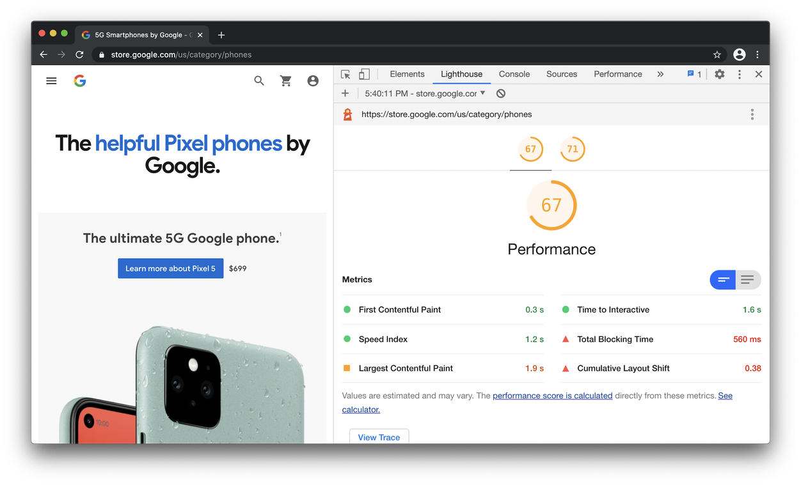
</picture>

Lighthouse фокусируется на оценке пользовательского опыта при начальной загрузке страницы в лабораторных условиях, эмулируя медленный телефон или десктоп. Если сдвиги макета или длительные JavaScript-таски возникнут на странице уже после её загрузки, лабораторные метрики этого не отразят. Для измерения показателей после загрузки страницы стоит обратиться к вкладке «Performance» инструментов разработчика, [Search Console](https://search.google.com/search-console/about), [расширения Web Vitals](https://chrome.google.com/webstore/detail/web-vitals/ahfhijdlegdabablpippeagghigmibma?hl=en) или [RUM](https://web.dev/vitals-measurement-getting-started/#measuring-web-vitals-using-rum-data).

<figure>
    <picture>
        <source srcset="images/3.webp" type="image/webp">
        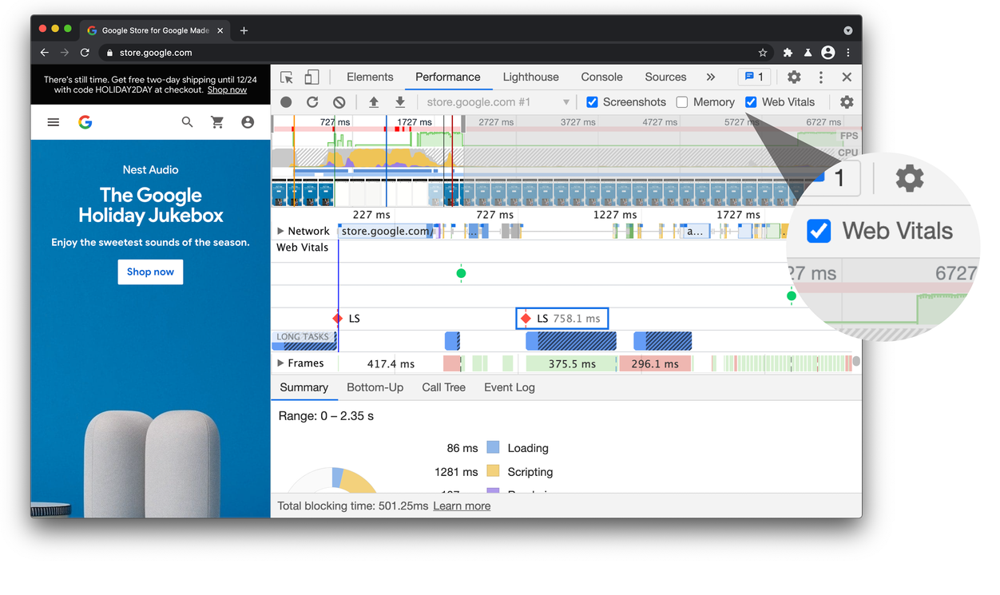
    </picture>
    <figcaption>
        На панели Web Vitals во вкладке Performance инструментов разработчика можно включить индикаторы, соответствующие метрикам. Например, индикаторы для метрики Layout Shift (LS) показаны на скриншоте выше.
    </figcaption>
</figure>

[Полевые метрики](https://web.dev/vitals-field-measurement-best-practices/), которые вы можете найти [в отчёте Chrome User Experience (CrUX)](https://developers.google.com/web/tools/chrome-user-experience-report) или [в RUM](https://developer.mozilla.org/en-US/docs/Web/Performance/Rum-vs-Synthetic), не имеют этих ограничений и полезно дополняют лабораторные метрики. С другой стороны, полевые данные не могут предоставить диагностическую информацию, которую вы можете получить от лабораторных метрик, вот так они и сочетаются вместе.

## Где можно улучшить метрики Web Vitals

### Largest Contentful Paint (LCP)

LCP — характеристика воспринимаемой пользователем загрузки. Она отмечает точку в процессе загрузки страницы, когда главный (или самый большой) контент загрузился и стал видим пользователю.

В Lighthouse есть отчёт «Largest Contentful Paint element», который позволяет выделить такой LCP-элемент. Если навести на элемент в отчёте, он подсветится на странице.

<picture>
    <source srcset="images/4.webp" type="image/webp">
    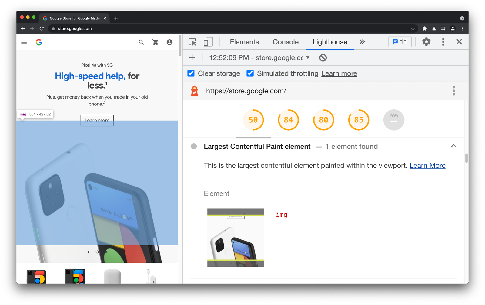
</picture>

Если этот элемент картинка, эта информация подскажет, что вам стоит оптимизировать её загрузку. В Lighthouse есть несколько отчётов по оптимизации графики, которые помогают понять, можно ли лучше сжать картинки, изменить их размеры или использовать более современный формат.

<picture>
    <source srcset="images/5.webp" type="image/webp">
    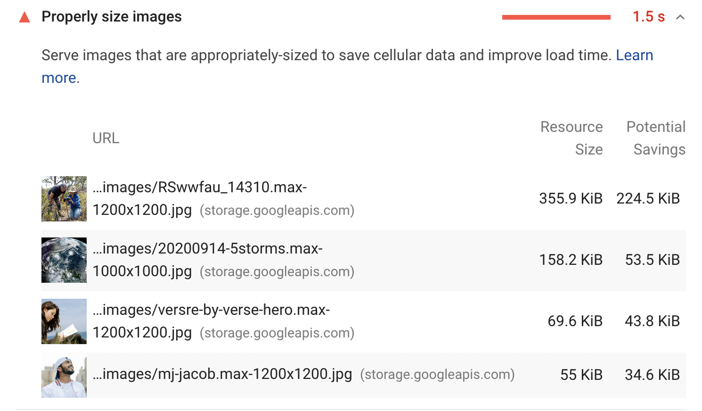
</picture>

Вам может пригодиться [LCP-букмарклет](https://gist.github.com/anniesullie/cf2982342337fd1b2be95c2d5fe5ea06) Энни Салливан, который поможет быстро найти LCP-элемент и подсветить его красной рамкой в один клик.

<picture>
    <source srcset="images/6.webp" type="image/webp">
    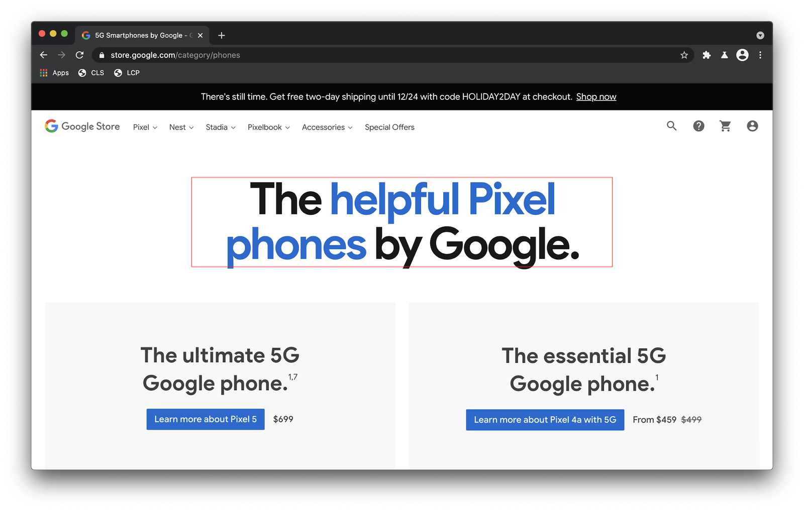
</picture>

### Предзагрузка картинок для улучшения LCP

Чтобы улучшить метрику LCP, вы можете [предзагрузить](https://web.dev/preload-responsive-images/) хиро-картинки _(например, обложки статей — прим. редактора),_ если браузер находит их слишком поздно. Одна из причин позднего обнаружения картинок — если сначала нужно загрузить JS-бандл, чтобы узнать о картинках, которые нужно загрузить.

<picture>
    <source srcset="images/7.webp" type="image/webp">
    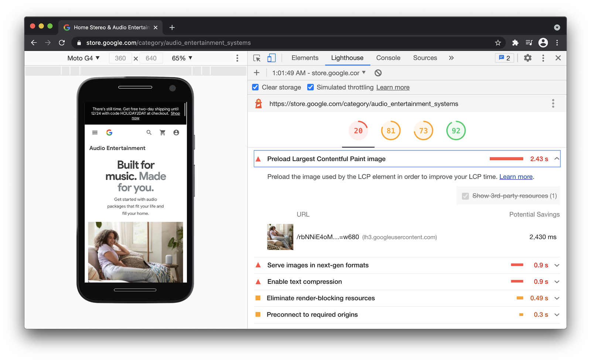
</picture>

**Предзагрузкой нужно пользоваться аккуратно**. Пропускная способность соединения на первом этапе загрузки страницы невелика и предзагрузка картинок может повлиять на загрузку других важных ресурсов. Для эффективной предзагрузки убедитесь, что ресурсы расположены в правильном порядке, чтобы не привести к ухудшению других метрик, когда другие ресурсы тоже считаются важными (например, критический CSS, JS, шрифты). Читайте подробнее [о цене предзагрузки](https://docs.google.com/document/d/1ZEi-XXhpajrnq8oqs5SiW-CXR3jMc20jWIzN5QRy1QA/view) (Google Docs).

Начиная с версии 6.5, Lighthouse предлагает возможности для применения этой оптимизации.

Есть несколько популярных вопросов о предварительной загрузке LCP-картинок, которые стоит рассмотреть.

Можно ли предварительно загрузить адаптивные картинки? [Да, можно](https://web.dev/preload-responsive-images/#imagesrcset-and-imagesizes). Скажем, у вас есть набор хиро-картинок для разных размеров экрана, которые описаны с помощью `srcset` и `sizes`, например:

```html

```

Благодаря атрибутам `imagesrcset` и `imagesizes`, добавленным в `<link>`, вы можете предзагрузить адаптивные картинки, используя ту же логику из `srcset` и `sizes`:

```html
<link rel="preload" as="image"
    href="lighthouse.jpg"
    imagesrcset="lighthouse_400px.jpg 400w,
        lighthouse_800px.jpg 800w,
        lighthouse_1600px.jpg 1600w"
    imagesizes="50vw">
```

Подсветит ли отчёт возможности предзагрузки, если LCP-картинка задана с помощью CSS-фона? Да, конечно.

Любая картинка, помеченная как LCP (будь то `` или фоновая картинка в CSS), это кандидат для аудита, если она обнаружена в водопаде на глубине три уровня и больше.

### Поиск влияний на CLS

Кумулятивный сдвиг раскладки (Cumulative Layout Shift, CLS) — это оценка визуальной стабильности. Она показывает, насколько контент страницы визуально сдвигается во время загрузки. Lighthouse содержит специальный отчёт «Avoid large layout shifts» для отладки CLS.

Этот отчёт выделяет элементы DOM, которые вносят основной вклад в сдвиги на странице. В колонке «Element» отчёта Lighthouse вы увидите список таких элементов DOM, а справа — их вклад в CLS.

<picture>
    <source srcset="images/8.webp" type="image/webp">
    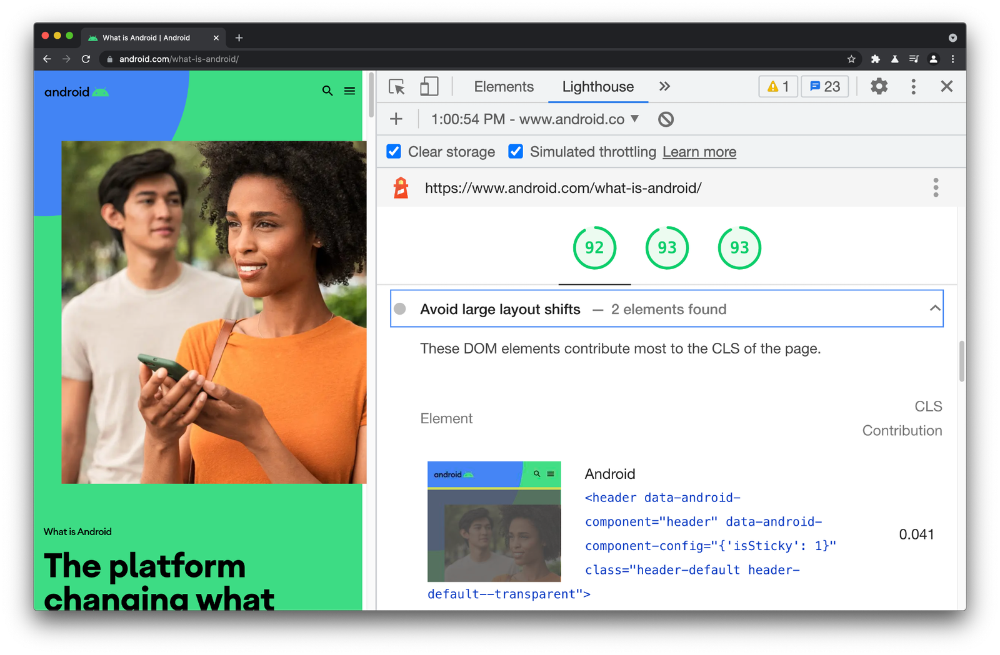
</picture>

Благодаря новой возможности Lighthouse делать скриншот элемента мы теперь можем видеть превью ключевого элемента из отчёта и увеличивать его для более детального просмотра:

<picture>
    <source srcset="images/9.webp" type="image/webp">
    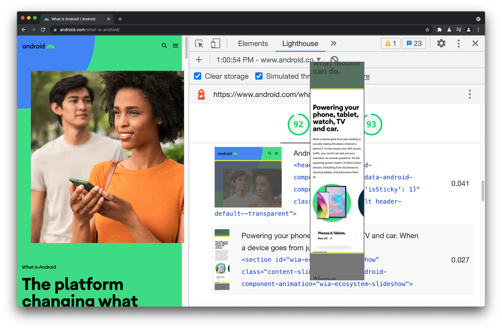
</picture>

Для CLS после загрузки страницы, бывает полезно обозначить элементы, которые оказали наибольшее влияние на сдвиг раскладки. Это можно найти в сторонних инструментах, например, [в панели Core Web Vitals](https://speedcurve.com/blog/web-vitals-user-experience/) от SpeedCurve или [в Layout Shift GIF Generator](https://defaced.dev/tools/layout-shift-gif-generator/) от Defaced, который мне очень нравится:

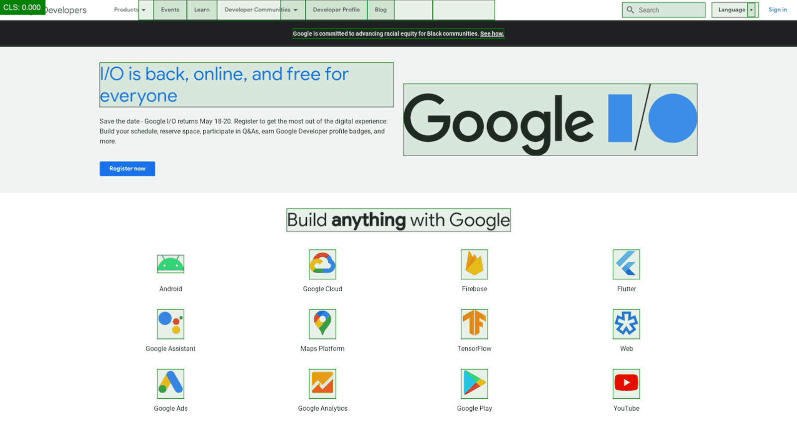

Для анализа сдвигов раскладки для всего сайта мне помогает [отчёт Core Web Vitals](https://support.google.com/webmasters/answer/9205520), который создаёт Google Search Console. Этот отчёт позволяет видеть страницы сайта с высоким значением CLS, что помогает понять, на какие файлы шаблонов мне стоит обратить внимание прежде всего:

<picture>
    <source srcset="images/11.webp" type="image/webp">
    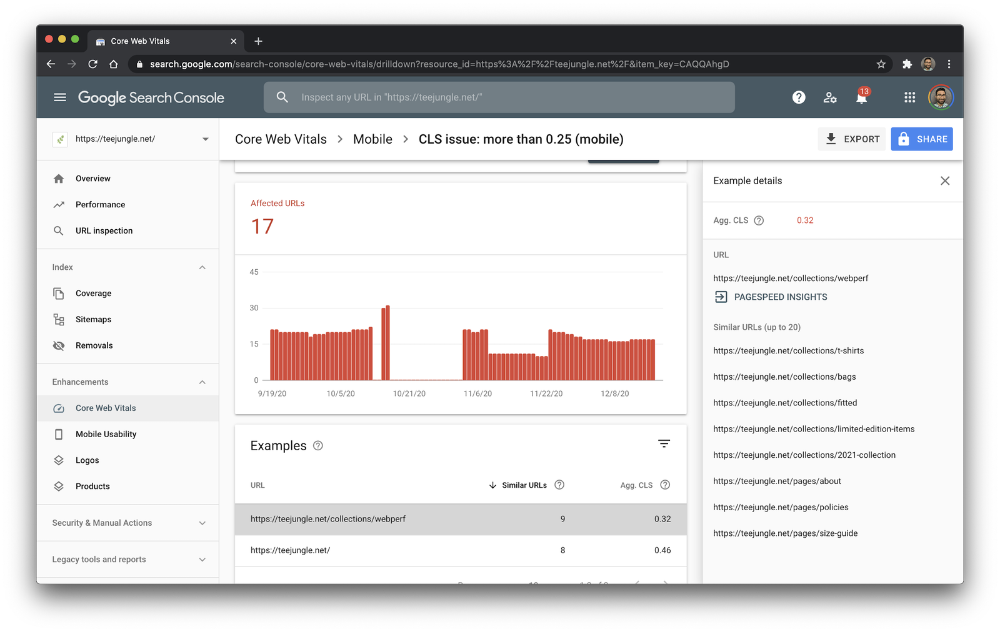
</picture>

Чтобы улучшить показатель CLS для веб-шрифтов, обратите внимание на новый дескриптор [`size-adjust`](https://groups.google.com/a/chromium.org/g/blink-dev/c/1PVr94hZHjU/m/J0xT8-rlAQAJ) для `@font-face`. Он позволяет изменять размер базовых шрифтов для уменьшения значения CLS.

### Поиск картинок без размеров для улучшения CLS

Чтобы [уменьшить](https://web.dev/optimize-cls/#images-without-dimensions) сдвиг раскладки, вызванный загрузкой ресурсов без заданных размеров, задайте картинкам и видео атрибуты `width` и `height`. Это помогает браузеру выделить достаточное место на странице, пока картинки или видео грузятся.

<picture>
    <source srcset="images/12.webp" type="image/webp">
    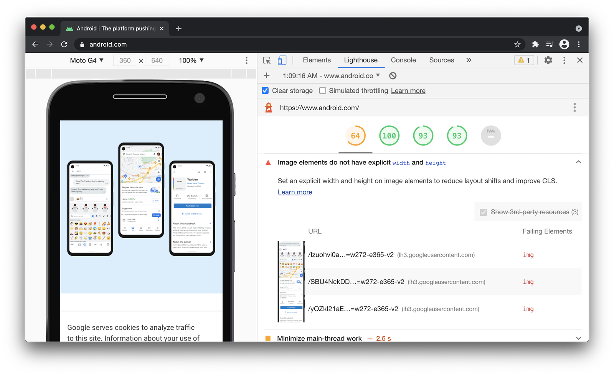
</picture>

Читайте статью «[Setting Height And Width On Images Is Important Again](https://www.smashingmagazine.com/2020/03/setting-height-width-images-important-again/)» для лучшего понимания важности указания размеров и соотношения сторон для картинок.

### Поиск влияния на CLS от рекламы

Отчёт «[Publisher Ads для Lighthouse](https://developers.google.com/publisher-ads-audits)» позволит вам найти возможности загрузку рекламы на ваших страницах, включая роль рекламы в сдвиге раскладки и долгих операций, которые могут отложить интерактивность страницы для пользователей. Вы можете включить этот инструмент в Lighthouse с помощью Community Plugins.

<picture>
    <source srcset="images/13.webp" type="image/webp">
    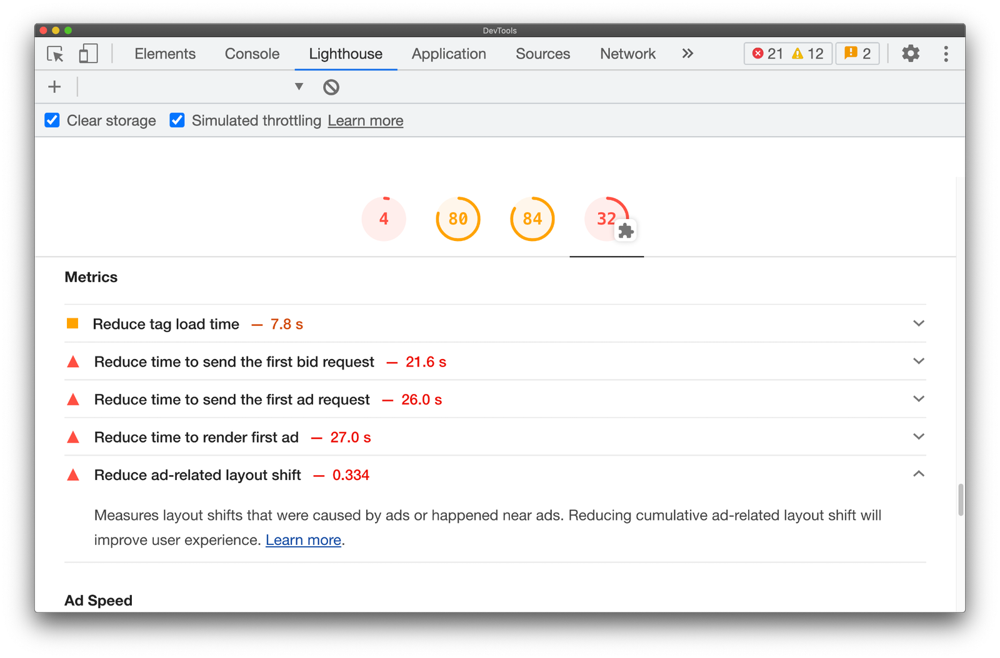
</picture>

Помните, что рекламные баннеры — это элементы, которые по статистике [вносят наибольший вклад](https://web.dev/optimize-cls/#ads-embeds-and-iframes-without-dimensions) в сдвиг раскладки. Важно:

- быть осторожными при размещении рекламы в верхней части вьюпорта;
- зарезервировать больше места для рекламы, чтобы избежать сдвига.

### Избегайте раздельных анимаций

Анимации, не объединённые в общий композитный слой рендеринга, могут дёргаться на слабых устройствах, если исполнение сложных JavaScript-тасков занимает главный поток. Такие анимации могут вызывать и сдвиги раскладки.

Если Chrome обнаруживает, что анимация не может быть выделена в отдельный слой, он сообщает об этом в DevTools. Это позволяет составить список всех элементов, для которых анимация не была композитной и выяснить причину. Вы можете найти эту информацию в отчёте «[Avoid non-composited animations](https://web.dev/non-composited-animations/)».

<picture>
    <source srcset="images/14.webp" type="image/webp">
    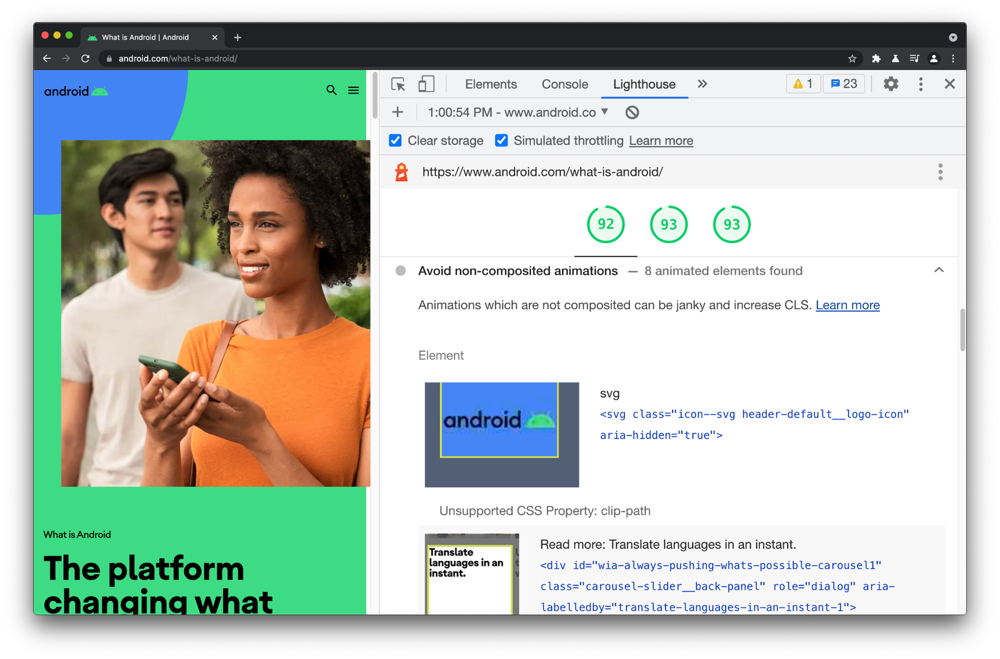
</picture>

### Отладка метрик FID, TBT, LT

Метрика First Input измеряет время от первой попытки взаимодействия со страницей (например, когда они кликают по ссылке, кнопке или использую JS-контрол), до момента, когда браузер действительно начинает обрабатывать события в ответ на это взаимодействие. Долгие JavaScript-таски могут повлиять на эту метрику и на её прокси-метрику Total Blocking Time.

<picture>
    <source srcset="images/15.webp" type="image/webp">
    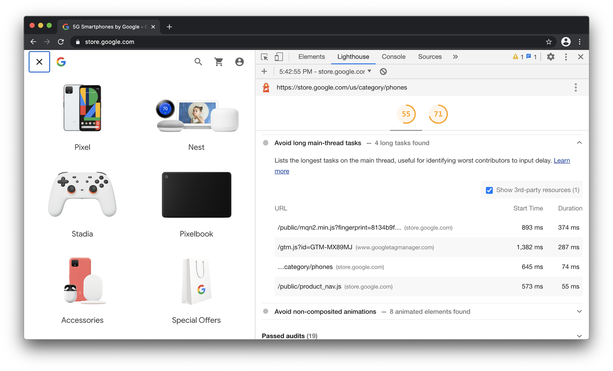
</picture>

Lighthouse включает отчёт «[Avoid long main-thread tasks](https://web.dev/long-tasks-devtools/)», которая перечисляет долгие таски в основном потоке. Это помогает отыскать самое большое влияние на задержку первого взаимодействия. В левой колонке вы можете увидеть адрес скрипта, ответственного за долгие таски в главном потоке.

Справа вы можете увидеть длительность выполнения этих тасок. Отмечу, что долгие таски — это те, что занимают более 50 миллисекунд. Такая длительность блокирует основной поток настолько, чтобы повлиять на частоту смены кадров или задержку первого взаимодействия.

Из сторонних сервисов для мониторинга работы основного потока мне понравился [Calibre](https://calibreapp.com/docs/features/main-thread-execution-timeline), который отображает на оси времени долгие таски, родительские и дочерние.

<picture>
    <source srcset="images/16.webp" type="image/webp">
    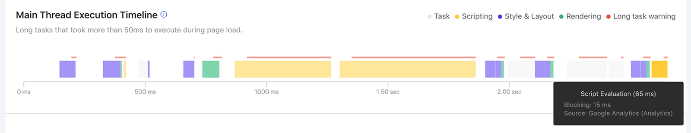
</picture>

### Блокировка сетевых запросов в Lighthouse

Инструменты разработчика Chrome поддерживают [блокировку сетевых запросов](https://developers.google.com/web/updates/2017/04/devtools-release-notes#block-requests), чтобы увидеть вклад каждого из загружаемых ресурсов, если они доступны или нет. Это может оказаться важным для понимания вклада каждого отдельного скрипта, который может повлиять на такие метрики, как Total Blocking Time (TBT) и Time to Interactive (TTI).

Блокировка сетевых запросов также работает в Lighthouse! Давайте взглянем на отчёт Lighthouse для сайта. Например, «Performance» выдаёт 63 из 100 очков с TBT, равным 400 мс. Покопавшись, мы найдём загрузку полифила Intersection Observer в Chrome, который для этого браузера не нужен. Заблокируем его!

<picture>
    <source srcset="images/17.webp" type="image/webp">
    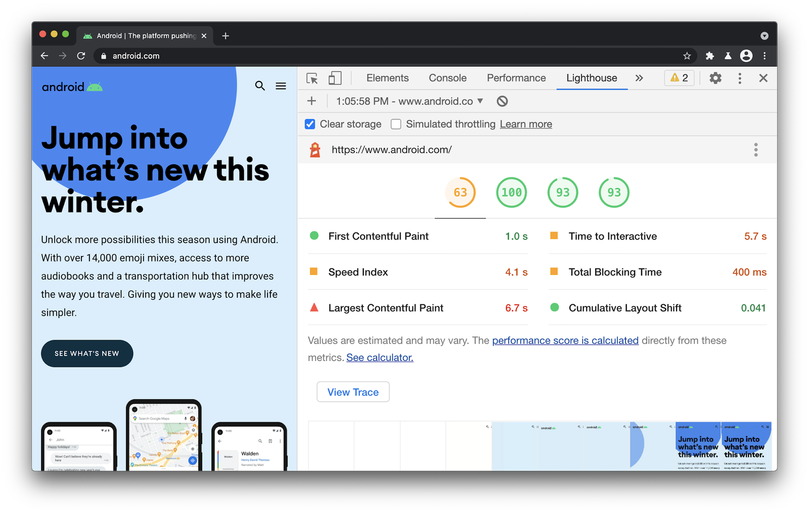
</picture>

Мы можем кликнуть правой кнопкой на скрипте в инструментах разработчика на панели «Network» и выбрать «Block request URL». Здесь мы сделали это для полифила Intersection Observer.

<picture>
    <source srcset="images/18.webp" type="image/webp">
    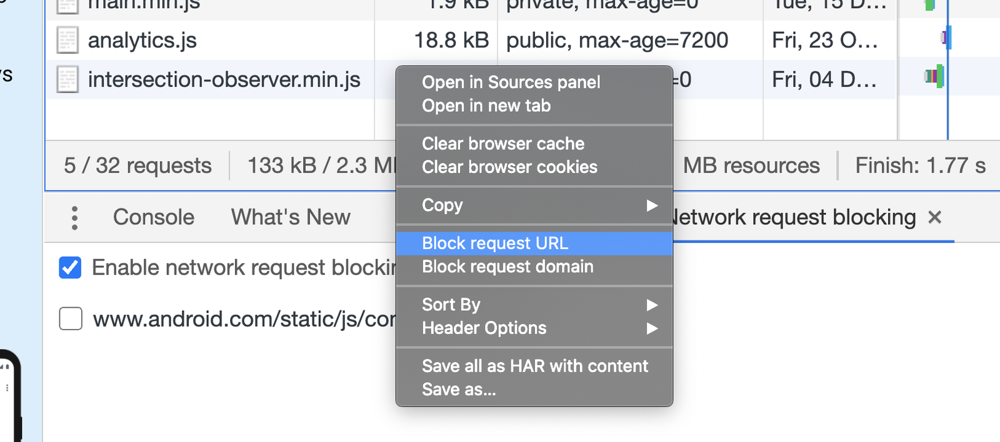
</picture>

Затем мы перезапускаем Lighthouse. На этот раз мы видим улучшение показателя Performance (70/100) и Total Blocking Time (с 400 мс до 300 мс).

<picture>
    <source srcset="images/19.webp" type="image/webp">
    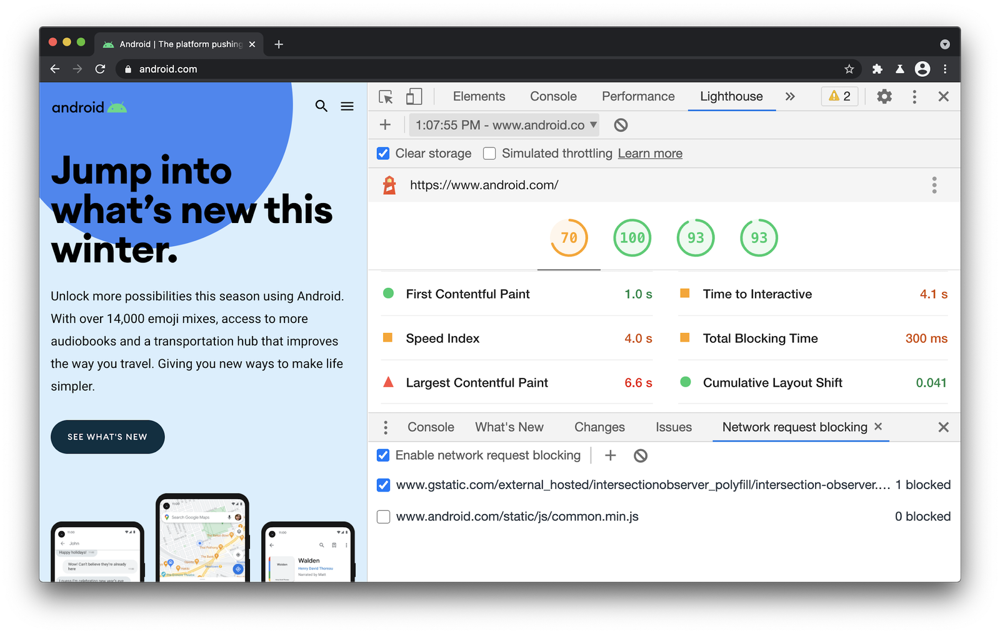
</picture>

### Замена дорогих сторонних виджетов на заглушки

Использование на странице сторонних ресурсов для видео, постов из социальных сетей или виджетов является обычной практикой. По умолчанию, большинство таких виджетов стараются загрузиться сразу же и могут существенно отразиться на пользовательском опыте. Это очень расточительно, особенно если такие виджеты некритичны — то есть пользователю ещё нужно прокрутить до них.

Один из способов улучшения скорости загрузки таких виджетов — [ленивая загрузка во время взаимодействия](https://addyosmani.com/blog/import-on-interaction/). Это может быть реализовано с помощью лёгкой заглушки виджета: полная версия загрузится только тогда, когда начнётся взаимодействие. В Lighthouse есть отчёт, который рекомендует сторонние решения для [ленивой загрузки с заглушкой](https://web.dev/third-party-facades/), например, для видео с YouTube.

<picture>
    <source srcset="images/20.webp" type="image/webp">
    
</picture>

Напомню, что Lighthouse будет [подсвечивать сторонний код](https://web.dev/third-party-summary/), который блокирует основной поток более, чем на 250 мс. Это поможет обнаружить все сторонние скрипты (включая собственные Google), которые стоит отложить или загрузить лениво, если результат их рендеринга прячется за прокруткой.

<picture>
    <source srcset="images/21.webp" type="image/webp">
    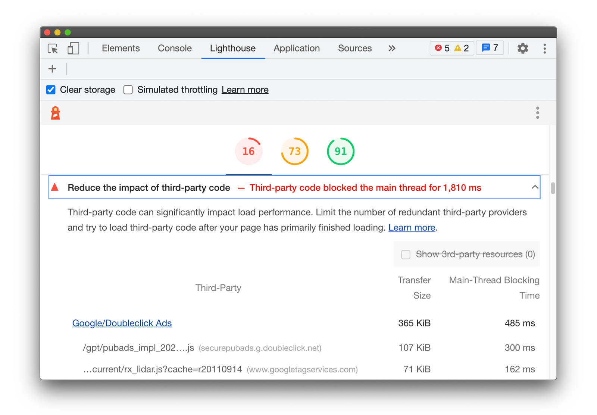
</picture>

### Не только Core Web Vitals

Помимо использования Core Web Vitals, последние версии Lighthouse и PageSpeed Insights также пытаются обеспечить разработчиков конкретными советами для ускорения тяжёлых JS-приложений, если у вас включены карты кода.

Также эти инструменты включают растущий список отчётов для уменьшения стоимости JavaScript на ваших страницах, включая зависимость от полифилов и дублирование кода, который не нужен пользователям.

За подробностями об инструментах Core Web Vitals следите [в Твиттере команды Lighthouse](https://twitter.com/____lighthouse), а также в разделе [What’s new in DevTools](https://developers.google.com/web/updates/2020/05/devtools).
