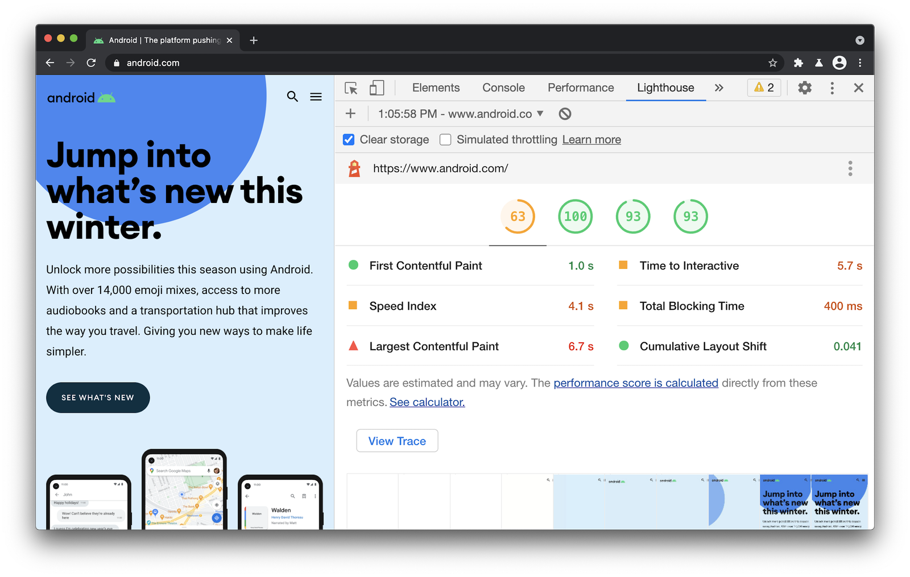

В этой статье мы охватим новые возможности инструментов Lighthouse, PageSpeed и DevTools, чтобы помочь разобраться с тем, как улучшить ваш сайт [по метрикам Web Vitals](https://web.dev/vitals).

[Lighthouse](https://github.com/GoogleChrome/lighthouse) — это автоматический, постоянно обновляемый инструмент с открытым кодом для улучшения качества страниц. Вы можете найти его в инструментах разработчика [Chrome DevTools](https://developers.google.com/web/tools/chrome-devtools) и запутить в нём любые страницы: публичные или скрытые за авторизацией. Вы также можете найти Lighthouse [в PageSpeed Insights](https://developers.google.com/speed/pagespeed/insights/?url=https%3A%2F%2Fstore.google.com), [CI](https://github.com/GoogleChrome/lighthouse-ci) и [WebPageTest](https://www.webpagetest.org/easy).

Lighthouse версии 7.x обладает новыми возможностями. Например, теперь можно сделать скриншоты элементов интерфейса для более простой визуальной проверки важных для пользователя частей. Или можно найти элемент, который вносит основной вклад в сдвиг раскладки при загрузке страницы.

<video src="video/1.mp4" width="1920" height="1080" autoplay loop muted></video>

Мы также добавили поддержку скриншотов элементов страницы в PageSpeed Insights, чтобы легче было найти проблемы, которые возникают при однократной загрузке страницы.


## Метрики Core Web Vitals

Lighthouse позволяет сформировать отчёт на основе [синтетических тестов](https://web.dev/vitals-measurement-getting-started/#measuring-web-vitals-using-lab-data). По результатам тестирования формируется список метрик [из набора Core Web Vitals](https://web.dev/vitals/), включая [Largest Contentful Paint (LCP)](https://web.dev/lcp/), [Cumulative Layout Shift (CLS)](https://web.dev/cls/) и [Total Blocking Time (TBT)](https://web.dev/tbt/). TBT — специальная метрика для измерения [First Input Delay (FID)](https://web.dev/fid/) на реальных устройствах. Эти метрики позволяют измерять процесс загрузки страницы, стабильность отображения пользовательского интерфейса в процессе загрузки и степень готовности страницы для взаимодействия с пользователем. Другие метрики, такие как [First Contentful Paint](https://web.dev/first-contentful-paint/), уже реализованы с запасом [на будущее Core Web Vitals (CWV)](https://developer.chrome.com/devsummit/sessions/future-of-core-web-vitals/).


Lighthouse позволяет измерить пользовательский опыт при первоначальной загрузке страницы в рамках искусственных (лабораторных) настроек окружения, которые эмулируют медленные смартфоны и десктопные компьютеры. Метрики не смогут оценить вашу страницу, если проблемы связаны со сдвигом раскладки или окончанием выполнения JavaScript после загрузки всей страницы, но вы можете сделать это на вкладке _Performance_ инструментов разработчика, с помощью [Search Console](https://search.google.com/search-console/about), [расширения Web Vitals](https://chrome.google.com/webstore/detail/web-vitals/ahfhijdlegdabablpippeagghigmibma?hl=en) или [RUM](https://web.dev/vitals-measurement-getting-started/#measuring-web-vitals-using-rum-data) для изучения поведения страницы после ее загрузки.

В секции _Metrics_ отчёта Lighthouse отображена версия настроек окружения, которая была применена для оценки этих метрик. Вы можете использовать это в качестве краткого обзора наиболее критичных аспектов пользовательского опыта.

<figure>
    
    <figcaption>
        На панели Web Vitals во вкладке Performance инструментов разработчика можно включить индикаторы, соответствующие метрикам. Например, индикаторы для метрики Layout Shift (LS) показаны на скриншоте выше.
    </figcaption>
</figure>

[Реальные метрики](https://web.dev/vitals-field-measurement-best-practices/), которые вы можете найти [в отчёте Chrome User Experience (CrUX)](https://developers.google.com/web/tools/chrome-user-experience-report) или [в RUM](https://developer.mozilla.org/en-US/docs/Web/Performance/Rum-vs-Synthetic), не имеют ограничений, связанных с искусственными настройками окружения, и являются дополнением к лабораторным. Данные о реальном использовании не могут предоставить диагностическую информацию, которую вы можете получить в лаборатории. Но лабораторные и реальные метрики вместе представляют полный набор индикаторов, с помощью которых можно комплексно оценить сайт.

## Где можно улучшить метрики Web Vitals

### Largest Contentful Paint (LCP)

Восприятие загрузки страницы пользователем является важной составляющей пользовательского опыта. Для пользователя плохим опытом является медленная загрузка тех или иных элементов. Оптимизация элемента, отрисовка которого занимает наибольшее время позволит улучшить пользовательский опыт. Во время загрузки страницы индикатор LCP определяет момент, в который основной контент страницы загружен и отображён браузером для пользователя.

Lighthouse позволяет выделить элемент (LCP-элемент), который имеет наибольшее время загрузки. Для удобства отладки этот элемент выделяется рамкой в основном окне браузера.


Если этим элементом является картинка, Lighthouse позволяет определить основные проблемы с загрузкой. Например, можно увеличить сжатие картинок, изменить их размеры или использовать более современный формат.


Вы можете воспользоваться инструментом [LCP Bookmarklet](https://gist.github.com/anniesullie/cf2982342337fd1b2be95c2d5fe5ea06) Энни Салливан, который может оказаться полезным для быстрого поиска LCP-элемента.


### Предзагрузка картинок для улучшения LCP

Чтобы улучшить метрику LCP, вы можете [презагрузить](https://web.dev/preload-responsive-images/) картинки, важные для пользователя с точки зрения контента. Такие картинки могут отображаться браузером с опозданием, например, если загрузка JavaScript предшествует загрузке картинок.


**Предзагрузкой нужно пользоваться аккуратно**. Пропускная способность соединения на первом этапе загрузки страницы невелика. Предзагрузка картинок может повлиять на загрузку других важных ресурсов. Используйте предзагрузку эффективно. Убедитесь, что ресурсы загружаются в правильном порядке, чтобы не привести к уменьшению ваших показателей по другим метрикам (например, критический CSS, JS, шрифты). [Читайте подробнее](https://docs.google.com/document/d/1ZEi-XXhpajrnq8oqs5SiW-CXR3jMc20jWIzN5QRy1QA/view) (Google Docs) о предзагрузке и особенности её использования.

Начиная с версии 6.5, Lighthouse предлагает инструменты, которые позволяют применить данную оптимизацию.

Ниже приведены наиболее распространённые вопросы о предварительной загрузке картинок и ответы на них.

Можно ли предварительно загрузить адаптивные картинки? [Да, можно](https://web.dev/preload-responsive-images/#imagesrcset-and-imagesizes). Скажем, у вас есть набор картинок для разных размеров экрана, которые описаны с помощью `srcset` и `sizes`, например:

```html

```

Благодаря атрибутам `imagesrcset` и `imagesizes`, добавленным в тег `link`, вы можете предварительно загрузить картинку, которая впоследствии будет использована, согласно условиям в `srcset` и `sizes`:

```html
<link rel="preload" as="image"
    href="lighthouse.jpg"
    imagesrcset="lighthouse_400px.jpg 400w,
        lighthouse_800px.jpg 800w,
        lighthouse_1600px.jpg 1600w"
    imagesizes="50vw">
```

Подсветит ли аудит возможности предзагрузки, если LCP-картинка задана с помощью CSS-фона? Да, конечно.

Любая картинка, помеченная как LCP (будь то `` или фоновая картинка в CSS), это кандидат для аудита, если она обнаружена в водопаде на глубине три уровня и больше.

### Поиск влияний на CLS

Кумулятивный сдвиг раскладки (Cumulative Layout Shift, CLS) — это оценка стабильности отображения контента. Она показывает, как контент страницы двигается в интерфейсе пользователя при загрузке того или иного HTML-элемента. Lighthouse содержит специальную метрику для этого — CLS.

Это оценка выделяет узлы DOM-дерева, которые вносят основной вклад в сдвиг контента страницы. В колонке Element отчёта Lighthouse вы увидите список таких узлов DOM-дерева, а справа — их вклад в CLS.


Благодаря новой возможности делать скриншот элемента, мы можем видеть общее превью ключевого элемента и увеличивать его для более детального просмотра:


Для CLS после загрузки страницы, бывает полезно обозначить элементы, которые внесли самый большой вклад в сдвиг раскладки. Эту возможно можно найти в сторонних инструмента, например, [панели Core Web Vitals](https://speedcurve.com/blog/web-vitals-user-experience/) от SpeedCurve или [Layout Shift GIF Generator](https://defaced.dev/tools/layout-shift-gif-generator/) от Defaced, который мне очень нравится:


Для анализа сдвигов раскладки для всего сайта мне помогает [отчёт Core Web Vitals](https://support.google.com/webmasters/answer/9205520), который создаёт Google Search Console. Этот отчёт позволяет видеть страницы сайта с высоким значением CLS, что помогает понять, на какие файлы шаблонов мне стоит обратить внимание прежде всего:


Чтобы улучшить показатель CLS для веб-шрифтов, обратите внимание на новый дескриптор [`size-adjust`](https://groups.google.com/a/chromium.org/g/blink-dev/c/1PVr94hZHjU/m/J0xT8-rlAQAJ) для `@font-face`. Он позволяет изменять размер базовых шрифтов для уменьшения значения CLS.

### Поиск картинок без размеров для улучшения CLS

Чтобы [уменьшьить](https://web.dev/optimize-cls/#images-without-dimensions) сдвиг раскладки, вызванный загрузкой ресурсов без заданных размеров, задайте картинкам и видео атрибуты `width` и `height`. Этот способ помогает браузеру выделить достаточное место на странице, пока картинки или видео грузятся.


Читайте статью «[Setting Height And Width On Images Is Important Again](https://www.smashingmagazine.com/2020/03/setting-height-width-images-important-again/)» для лучшего понимания важности указания размеров и соотношения сторон для картинок.

### Поиск влияния на CLS от рекламы

Отчёт о рекламных баннерах на странице [Publisher Ads для Lighthouse](https://developers.google.com/publisher-ads-audits) позволит вам улучшить опыт пользователя в части загрузки рекламы, включая вклад рекламных баннеров в сдвиг раскладки и оценку долгих операций, связанных с загрузкой рекламных объявлений. Это помогает понять, насколько быстро наступает момент, когда страница готова к взаимодействию с пользователем. В Lighthouse вы можете включить этот инструмент с помощью Community Plugins.


Помните, что рекламные баннеры — это элементы, которые по статистике [вносят наибольший вклад](https://web.dev/optimize-cls/#ads-embeds-and-iframes-without-dimensions) в сдвиг раскладки. Важно:

- будьте осторожны при размещении рекламы в верхней части вьюпорта;
- зарезервируйте больше места для рекламны, чтобы избежать сдвига.

### Избегайте отдельных анимаций

Анимации, не объединённые в общий композитный слой рендеринга, могут дёргаться на слабых устройствах, если исполнение сложных JavaScript-задач занимает главный поток. Такие анимации могут вызывать сдвиги раскладки.

Если Chrome обнаруживает, что анимация не может быть выделена в отдельный слой, он сообщает об этом в DevTools. Это позволяет составить список всех элементов, для которых анимация не была композитной и выяснить причину. Вы можете найти эту информацию в отчёте [Avoid non-composited animations](https://web.dev/non-composited-animations/).


### Отладка метрик FID, TBT, LT

Метрика First Input измеряет время от первой попытки взаимодействия со страницей (например, когда они кликают по ссылке, кнопке или использую JS-контрол), до момента, когда браузер действительно начинает обрабатывать события в ответ на это взаимодействие. Длинные JavaScript-задачи могут повлиять на эту метрику и на её прокси-метрику Total Blocking Time.


Lighthouse включает метрику [Avoid long main-thread tasks](https://web.dev/long-tasks-devtools/), которая перечисляет длинные задачи в основном потоке. Это помогает отыскать самый большой ущерб в задержку первого взаимодействия. В левой колонке вы можете увидеть адрес скрипта, ответственного за длинные задачи.

Справа вы можете увидеть длительность выполнения этих задач. Отмечу, что длинные задачи — это те, что занимают более 50 миллисекунд. Такая длительность блокирует основной поток настолько, чтобы повлиять на частоту смены кадров или задержку первого взаимодействия.

Из сторонних сервисов для мониторинга работы основного потока мне понравился [Calibre](https://calibreapp.com/docs/features/main-thread-execution-timeline), который отображает на оси времени длинные задачи, родительские и дочерние.


### Блокировка сетевых запросов в Lighthouse

Инструменты разработчика Chrome поддерживают возможность моделировать [блокировку сетевых запросов](https://developers.google.com/web/updates/2017/04/devtools-release-notes#block-requests), чтобы увидеть вклад каждого из загружаемых ресурсов, если они доступны или нет. Это может оказаться важным для понимания вклада каждого отдельного скрипта, который может повлиять на такие метрики, как Total Blocking Time (TBT) и Time to Interactive (TTI).

Блокировка сетевых запросов также работает в Lighthouse! Давайте взглянем на отчёт Lighthouse для сайта. Например, _Performance_ выдаёт 63 из 100 очков с TBT, равным 400 мс. Покопайвшись, мы найдём загрузку полифила Intersection Observer в Chrome, который для этого браузера не нужен. Заблокируем его!



Мы можем кликнуть правой кнопкой на скрипте в инструментах разработчика на панели _Network_ и выбрать _Block request URL._ Здесь мы сделали это для полифила Intersection Observer.


Затем мы перезапускаем Lighthouse. На этот раз мы видим улучшение показателя Performance (70/100) и Total Blocking Time (с 400 мс до 300 мс).


### Замена дорогих сторонних виджетов на фасад

Использование на странице сторонних ресурсов для видео, постов из социальных сетей или виджетов является обычной практикой. По умолчанию, большинство таких виджетов стараются загрузиться сразу же и могут существенно отразиться на пользовательском опыте. Это очень расточительно, если такие виджеты некритичны — то есть пользователю ещё нужно прокрутить до них страницу.

Один из способов улучшения скорости загрузки таких виджетов — [ленивая загрузка во время взаимодействия](https://addyosmani.com/blog/import-on-interaction/). Это может быть реализовано с помощью лёгкого «фасада» виджета: полная версия загрузится только тогда, когда начнётся взаимодействие. В Lighthouse есть отчёт, который рекомендует сторонние решения для [ленивой загрузки с фасадом](https://web.dev/third-party-facades/), например, для видео с YouTube.


Напомню, что Lighthouse будет [подсвечивать сторонний код](https://web.dev/third-party-summary/), который блокирует основной поток более, чем на 250 мс. Это поможет обнаружить все сторонние скрипты (включая собственные Google), которые стоит отложить или загрузить лениво, если результат их рендеринга прячется за прокруткой.


### Не только Core Web Vitals

Помимо использования Core Web Vitals, последние версии Lighthouse и PageSpeed Insights также пытаются обеспечить разработчиков конкретными советами для ускорения тяжёлых JS-приложений, если у вас включены карты кода.

Также эти инструменты включают растущий список отчётов для уменьшения стоимости JavaScript на ваших страницах, включая зависимость от полифилов и дублирование кода, который не нужен пользователям.

За подробностями об инструментах Core Web Vitals следите [в Твиттере команды Lighthouse](https://twitter.com/____lighthouse), а также в разделе [What’s new in DevTools](https://developers.google.com/web/updates/2020/05/devtools).
