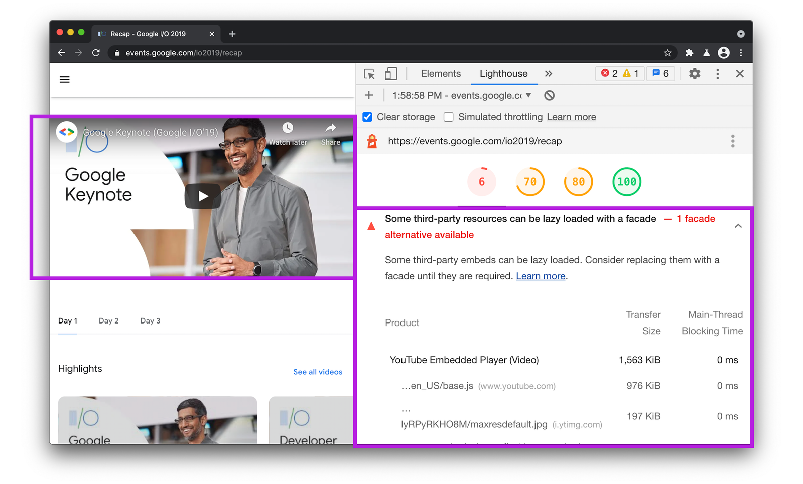

В этой статье мы охватим новые возможности инструментов Lighthouse, PageSpeed и DevTools, чтобы помочь разобраться с тем, как улучшить ваш сайт по показателям [Web Vitals](https://web.dev/vitals).

[Lighthouse](https://github.com/GoogleChrome/lighthouse) — это автоматический, постоянно обновляемый инструмент для улучшения качества веб-страниц с открытым исходным кодом. Вы можете найти его в наборе инструментов разработчика [Chrome DevTools](https://developers.google.com/web/tools/chrome-devtools) для отладки и запуска веб-страниц, которые являются общедоступными или скрыты за аутентификацией. Вы также можете найти Lighthouse в [PageSpeed Insights](https://developers.google.com/speed/pagespeed/insights/?url=https%3A%2F%2Fstore.google.com), [CI](https://github.com/GoogleChrome/lighthouse-ci) и [WebPageTest](https://www.webpagetest.org/easy).

Lighthouse версии 7.x обладает новыми возможностями. Например, теперь можно сделать скриншоты элементов интерфейса пользователя для более простой визуальной проверки с точки зрения пользовательского опыта. Или можно найти элемент, который вносит основной вклад в сдвиг раскладки при загрузке страницы.

<figure>
    <video src="https://storage.googleapis.com/web-dev-uploads/video/1L2RBhCLSnXjCnSlevaDjy3vba73/3G0x4Z1dmOcsusG7j1LE.mp4" autoplay="" loop="" muted=""></video>
</figure>

Мы также добавили поддержку скриншотов элементов интерфейса пользователя в PageSpeed Insights, теперь можно найти проблемы, которые возникают при однократной загрузке страницы.

<figure>
    
</figure>

## Метрики Core Web Vitals

Lighthouse позволяет сформировать отчёт на основе [синтетических тестов](https://web.dev/vitals-measurement-getting-started/#measuring-web-vitals-using-lab-data). По результатам тестирования формируется список метрик из [набора Core Web Vitals](https://web.dev/vitals/), включая [Largest Contentful Paint (LCP)](https://web.dev/lcp/), [Cumulative Layout Shift (CLS)](https://web.dev/cls/) и [Total Blocking Time (TBT)](https://web.dev/tbt/). TBT — специальная метрика для измерения [First Input Delay (FID)](https://web.dev/fid/) на реальных устройствах. Эти метрики позволяют измерять процесс загрузки страницы, стабильность отображения пользовательского интерфейса в процессе загрузки и степень готовности страницы для взаимодействия с пользователем. Другие метрики, такие как [First Contentful Paint](https://web.dev/first-contentful-paint/), уже реализованы с запасом на [будущее Core Web Vitals (CWV)](https://developer.chrome.com/devsummit/sessions/future-of-core-web-vitals/).

<figure>
    
</figure>

> Lighthouse позволяет измерить пользовательский опыт при первоначальной загрузке страницы в рамках искусственных (лабораторных) настроек окружения, которые эмулируют медленные смартфоны и настольные компьютеры. Метрики не смогут оценить вашу страницу, если проблемы связаны со сдвигом раскладки или окончанием выполнения JavaScript после загрузки всей страницы, но вы можете сделать это на вкладке "Производительность" (Performance) в инструментах разработчика, с помощью [Search Console](https://search.google.com/search-console/about), [расширения Web Vitals](https://chrome.google.com/webstore/detail/web-vitals/ahfhijdlegdabablpippeagghigmibma?hl=en), или [RUM](https://web.dev/vitals-measurement-getting-started/#measuring-web-vitals-using-rum-data) для изучения поведения страницы после ее загрузки.

В секции "Метрики" (Metrics) отчёта Lighthouse отображена версия настроек окружения, которая была применена для оценки этих метрик. Вы можете использовать это в качестве краткого обзора наиболее критичных аспектов пользовательского опыта.

<figure>
    
    <figcaption>
        На панели Web Vitals во вкладке "Производительность" (Performance) в инструментах разработчика можно включить индикаторы, соответствующие метрикам (например, индикаторы для метрики Layout Shift (LS) показаны на скриншоте выше).
    </figcaption>
</figure>

[Реальные метрики](https://web.dev/vitals-field-measurement-best-practices/), которые вы можете найти в [отчёте о пользовательском опыте в Chrome](https://developers.google.com/web/tools/chrome-user-experience-report) или в [RUM](https://developer.mozilla.org/en-US/docs/Web/Performance/Rum-vs-Synthetic), не имеют ограничений, связанных с искусственными настройками окружения, и являются дополнением к лабораторным. Данные о реальном использовании не могут предоставить диагностическую информацию, которую вы можете получить в лаборатории. Но лабораторные и реальные метрики вместе представляют полный набор индикаторов,с помощью которых можно комплексно оценить веб-сайт.

## Способы улучшения метрик Web Vitals

### Метрика Largest Contentful Paint (LCP)

Восприятие загрузки страницы пользователем является важной составляющей пользовательского опыта. Для пользователя плохим опытом является медленная загрузка тех или иных элементов. Оптимизация элемента, отрисовка которого занимает наибольшее время позволит улучшить пользовательский опыт. Во время загрузки страницы индикатор LCP определяет момент, в который основной контент страницы загружен и отображён браузером для пользователя.

Lighthouse позволяет выделить элемент (LCP-элемент), который имеет наибольшее время загрузки. Для удобства отладки этот элемент выделяется рамкой в основном окне браузера.

<figure>
    
</figure>

Если этим элементом является картинка, Lighthouse позволяет определить основные проблемы с загрузкой. Например, можно увеличить компрессию картинок, изменить их размеры или использовать более современный формат.

<figure>
    
</figure>

Вы можете воспользоваться инструментом [LCP Bookmarklet](https://gist.github.com/anniesullie/cf2982342337fd1b2be95c2d5fe5ea06) от Энни Салливан (Annie Sullivan), который может оказаться полезным для быстрого поиска LCP-элемента.

<figure>
    
</figure>

### Предварительная загрузка картинок может улучшить метрику LCP

Чтобы улучшить метрику LCP, вы можете [предварительно загрузить](https://web.dev/preload-responsive-images/) картинки, важные для пользователя с точки зрения контента. Такие картинки могут отображаться браузером с опозданием, например, если загрузка JavaScript предшествует загрузке картинок.

<figure>
    
</figure>

> **Предварительной загрузкой нужно пользоваться аккуратно**. Пропускная способность соединения на первом этапе загрузки страницы невелика. Предварительная загрузка картинок может повлиять на загрузку других важных ресурсов. Используйте предварительную загрузку эффективно. Убедитесь, что ресурсы загружаются в правильном порядке, чтобы не привести к уменьшению ваших показателей по другим метрикам (например, критический CSS, JS, шрифты). Предварительная загрузка и особенности её использования детально описаны [здесь](https://docs.google.com/document/d/1ZEi-XXhpajrnq8oqs5SiW-CXR3jMc20jWIzN5QRy1QA/edit).

Начиная с версии 6.5, Lighthouse предлагает инструменты, которые позволяют применить данную оптимизацию.

Ниже приведены наиболее распространённые вопросы о предварительной загрузке картинок и ответы на них.

Можно ли предварительно загрузить отзывчивые картинки? [Да](https://web.dev/preload-responsive-images/#imagesrcset-and-imagesizes). Скажем, у вас есть набор картинок для разных размеров экрана, которые описаны с помощью `srcset` и `sizes`, например:

```html

```

Благодаря атрибутам `imagesrcset` и `imagesizes`, добавленным в тег `link`, вы можете предварительно загрузить картинку, которая впоследствии будет использована, согласно условиям в `srcset` и `sizes`:

```html
<link rel="preload" as="image"
    href="lighthouse.jpg"
    imagesrcset="lighthouse_400px.jpg 400w,
                lighthouse_800px.jpg 800w,
                lighthouse_1600px.jpg 1600w"
    imagesizes="50vw">
```

Можно ли предварительно загрузить картинку, используемую в качестве фоновой с помощью CSS и выделенную на этапе анализа в качестве LCP-картинки? Да.

Для любой картинки, которая обозначена как LCP-картинка, можно воспользоваться предварительной загрузкой. При этом не важно, будет ли эта картинка использоваться в теге `` или в качестве фоновой с помощью CSS, если глубина каскада три и больше.

### Поиск элементов, которые уменьшают значение CLS

Кумулятивный сдвиг (Cumulative Layout Shift, CLS) — это оценка стабильности отображения контента. Она показывает, как контент страницы двигается в интерфейсе пользователя при загрузке того или иного HTML-элемента. Lighthouse содержит специальную метрику для этого — CLS.

Это оценка выделяет узлы DOM-дерева, которые вносят основной вклад в сдвиг контента страницы. В колонке "Элемент" (Element) слева вы увидите список таких узлов DOM-дерева, а справа — их вклад в CLS.

<figure>
    
</figure>

Благодаря новой возможности делать скриншот элемента, мы можем видеть общее превью ключевого элемента и увеличивать его для более детального просмотра:

<figure>
    
</figure>

Можно оценить CLS и после загрузки страницы, что поможет понять, как воспринимается процесс загрузки элемента пользователем в этом случае. Такую оценку можно провести с помощью стороннего инструмента, например, [панели Core Web Vitals](https://speedcurve.com/blog/web-vitals-user-experience/) от SpeedCurve или [Layout Shift GIF Generator](https://defaced.dev/tools/layout-shift-gif-generator/) от Defaced, который мне нравится использовать больше:

<figure>
    
</figure>

Для просмотра всего сайта сразу с точки зрения проблем с кумулятивным сдвигом мне нравится использовать [отчёт Core Web Vitals](https://support.google.com/webmasters/answer/9205520?hl=en), который создаёт Google Search Console. Этот отчёт позволяет видеть набор страниц на сайте с высоким значением CLS (такой отчёт позволяет обратить внимание в первую очередь на проблемы с шаблоном для набора страниц или на отдельные страницы):

<figure>
    
</figure>

> Чтобы улучшить показатель CLS для веб-шрифтов, обратите внимание на новый дескриптор [`size-adjust`](https://groups.google.com/a/chromium.org/g/blink-dev/c/1PVr94hZHjU/m/J0xT8-rlAQAJ) для `@font-face`. `size-adjust` позволяет регулировать размер резервных шрифтов для уменьшения значения CLS.

### Поиск картинок без заданных размеров (уменьшает значение CLS)

Существует [способ](https://web.dev/optimize-cls/#images-without-dimensions) уменьшить кумулятивный сдвиг, вызванный картинками и видео без заданных ширины и высоты. Явным образом указанные размеры позволяют браузеру выделить достаточное место на странице во время рендеринга для отображения картинки или видео, пока они ещё грузятся.

<figure>
    
</figure>

Смотрите материал [Setting Height And Width On Images Is Important Again](https://www.smashingmagazine.com/2020/03/setting-height-width-images-important-again/) для лучшего понимания важности указания размеров и соотношения сторон для картинок.

### Оценка рекламных баннеров на странице (уменьшает значение CLS)

Отчёт о рекламных баннерах на странице [Publisher Ads для Lighthouse](https://developers.google.com/publisher-ads-audits) позволит вам улучшить опыт пользователя в части загрузки рекламы, включая вклад рекламных баннеров в кумулятивный сдвиг и оценку долгих операций, связанных с загрузкой рекламных объявлений. Это помогает понять, насколько быстро наступает момент, когда страница готова к взаимодействию с пользователем. В Lighthouse вы можете включить этот инструмент с помощью Community Plugins.

<figure>
    
</figure>

Помните, что рекламные баннеры — это элементы, которые по статистике [вносят наибольший вклад](https://web.dev/optimize-cls/#ads-embeds-and-iframes-without-dimensions) в кумулятивный сдвиг. Важно:

- будьте осторожны при размещении рекламных объявлений в верхней части окна просмотра, которые не "прилипают" к ней;
- устраните смещения, зарезервировав максимально возможный размер для рекламного баннера.

### Избегайте набора простых анимаций, объединяйте их в одну составную анимацию

Простые анимации в составе одной сложной позволят улучшить пользовательский опыт на слабых устройствах, поскольку JavaScript не будет удерживать основной поток. Последовательно выполняющиеся простые анимации могут вносить сдвиг раскладки страницы, заметный пользователю.

Если Chrome обнаруживает, что анимация не может быть представлена одной составной, он сообщает об этом трассировщику DevTools. Это позволяет составить список всех элементов, для которых сложная анимация не была представлена в виде составной с указанием возможной причины. Вы можете найти эту информацию в отчёте [Avoid non-composited animations](https://web.dev/non-composited-animations/).

<figure>
    
</figure>

### Отладка метрик First Input Delay / Total Blocking Time / Long Tasks

Метрика First Input позволяет измерять время при загрузке страницы от момента, после которого пользователь может взаимодействовать с ней (например, когда пользователь может кликнуть по ссылке или кнопке или использовать другой элемент, поведение которого задаётся с помощью JavaScript), до момента, когда браузер действительно начинает обрабатывать события взаимодействия пользователя и интерфейса. "Тяжёлые" задачи JavaScript могут повлиять на эту метрику и на метрику Total Blocking Time, которая позволяет оценить реальное поведение пользователя.

<figure>
    
</figure>

Lighthouse включает такую метрику, как [Avoid long main-thread tasks](https://web.dev/long-tasks-devtools/), которая формирует список "тяжёлых" задач в основном потоке выполнения. Эта метрика поможет отыскать код, который вносит наибольший вклад в задержку первого взаимодействия со страницей для пользователя. В левой колонке вы можете увидеть адрес скрипта, выполнение которого в основном потоке может затянуться.

Справа вы можете увидеть длительность выполнения этих скриптов. Отмечу, что "тяжёлые" задачи — это задачи, выполнение которых длится более 50 миллисекунд, что может блокировать основной поток и повлиять на частоту смены кадров или задержку первого взаимодействия со страницей для пользователя.

Из сторонних сервисов для мониторинга работы основного потока мне понравился [Calibre](https://calibreapp.com/docs/features/main-thread-execution-timeline), который отображает на оси времени "тяжёлые" задачи, родительские и дочерние.

<figure>
    
</figure>

### Блокировка сетевых запросов в Lighthouse

Инструменты разработчика в Chrome поддерживают возможность моделировать [блокировку сетевых запросов](https://developers.google.com/web/updates/2017/04/devtools-release-notes#block-requests), для того чтобы увидеть вклад каждого из загружаемых ресурсов, которые могут быть доступны или не доступны. Это может оказаться важным для понимания вклада каждого отдельного скрипта, который может повлиять на такие метрики, как Total Blocking Time (TBT) и Time to Interactive.

Блокировка сетевых запросов также работает в Lighthouse! Давайте быстро взглянем на отчёт Lighthouse для сайта. Например, "Производительность" (Performance) выдаёт 63 из 100 очков с TBT, равным 400 мс. Посмотрев на код, мы найдём загрузку полифила Intersection Observer в Chrome, который для этого браузера не нужен. Заблокируем его!

<figure>
    
</figure>

Мы можем кликнуть правой кнопкой мыши на скрипте в инструментах разработчика на панели "Сеть" (Network) и выбрать пункт из контекстного меню `Заблокировать запрашиваемый URL`. Здесь мы сделали это для полифила Intersection Observer.

<figure>
    
</figure>

Затем мы можем перезапустить Lighthouse. На этот раз мы можем увидеть улучшение показателя производительности (70/100) и Total Blocking Time (400ms => 300ms).

<figure>
    
</figure>

### Замена "дорогих" сторонних виджетов на фасад

Использование сторонних скриптов для видео, постов из социальных сетей или виджетов на странице является обычной практикой. По умолчанию, большинство таких встраиваемых скриптов несут достаточно много контента, загрузка которого может существенно отразиться на пользовательском опыте. Если такие скрипты не являются критически важными, лучше не грузить их сразу же при загрузке страницы (например, если пользователю понадобится сначала прокрутить до встроенного элемента, чтобы увидеть его).

Один из паттернов, которые применяются для улучшения скорости загрузки таких виджетов, — использование [ленивой загрузки во время взаимодействия пользователя с виджетом](https://addyosmani.com/blog/import-on-interaction/). Это может быть реализовано с помощью легковесного предварительного просмотра виджета (фасада). Полная версия виджета грузиться только тогда, когда пользователь начинает взаимодействовать с ним. В отчёте Lighthouse есть метрика, которая определяет те сторонние виджеты, для которых может быть применена [ленивая загрузка с фасадом](https://web.dev/third-party-facades/), например, видео с YouTube.

<figure>
    
</figure>

Напомню, что Lighthouse будет [выделять сторонний код](https://web.dev/third-party-summary/), который блокирует основной поток более, чем на 250 мс. Правильным подходом будет загрузка всех виджетов, включая виджеты от Google, с помощью ленивой загрузки в том случае, если пользователю нужно прокручивать страницу, чтобы увидеть эти виджеты на ней.

<figure>
    
</figure>

### Помимо Core Web Vitals

Помимо использования Core Web Vitals, последние версии Lighthouse и PageSpeed Insights также пытаются обеспечить разработчиков конкретными руководствами о том, насколько быстро могут грузится "тяжёлые" веб-приложения при включённом source maps, основу которых составляет большое количество кода на JavaScript.

Инструменты включают в себя метрики для повышения скорости загрузки JavaScript, например, уменьшение количества зависимостей для обеспечения работы полифилов и уменьшение количества дублируемого кода, которые могут быть и не нужны для пользователя.

Для более подробной информации об инструментах Core Web Vitals следите за Твиттером [команды Lighthouse](https://twitter.com/____lighthouse) и новостями в разделе ["Новинки в инструментах разработчика"](https://developers.google.com/web/updates/2020/05/devtools).
