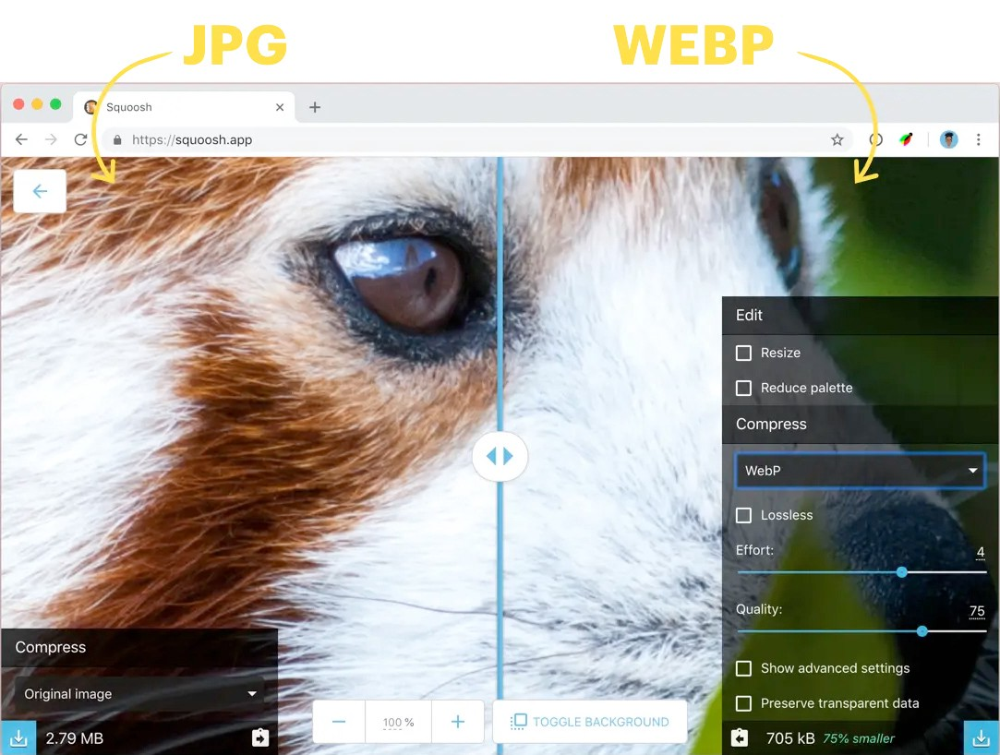
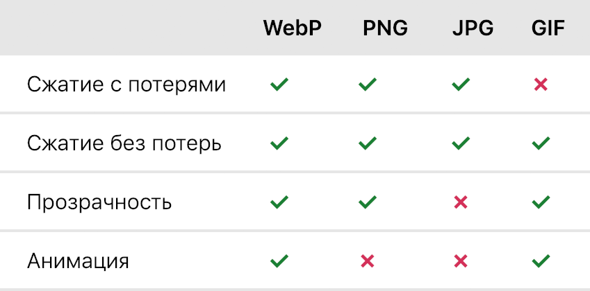
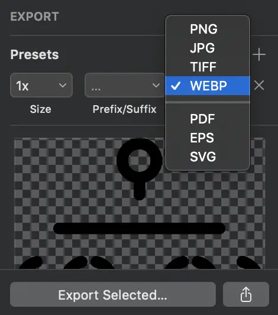
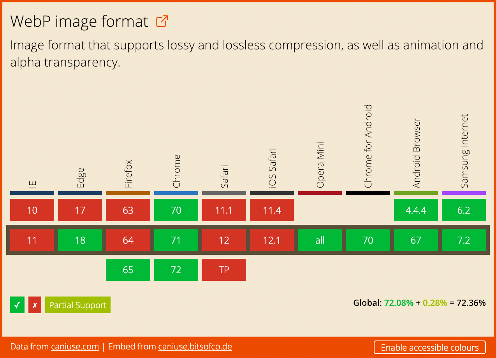

[WebP](https://developers.google.com/speed/webp/) — формат графики, разработанный Google в 2010. Он был создан, как альтернатива PNG и JPG, и отличается от них гораздо меньшим размером при том же качестве изображения.

_Интерфейс оптимизатора [Squoosh](https://squoosh.app/)._

## Почему WebP?

WebP — крайне полезный формат, ведь он даёт и производительность и возможности. В отличие от других форматов, WebP поддерживает сжатие как с потерями так и без, а также полупрозрачность и анимацию.

_Сравнение возможностей форматов WebP, PNG, JPG, GIF._

И даже со всеми этими возможностями, WebP обеспечивает меньший размер чем его конкуренты. В [сравнительном исследовании формата](https://developers.google.com/speed/webp/docs/c_study#results) было установлено, что изображения в формате WebP, сжатые с потерями, в среднем на 30% меньше, чем в формате JPG, а сжатые без потерь — в среднем на 25% меньше чем в формате PNG.

## Как сконвертировать картинки в WebP?

Есть несколько инструментов, которыми можно конвертировать JPG, PNG и другие форматы в WebP.

### Онлайн-инструменты

- [Squoosh](https://squoosh.app/) — конвертация и сжатие онлайн
- [Online-Convert.com](http://online-convert.com/) — конвертация онлайн

### Инструменты командной строки

[Cwebp](https://www.npmjs.com/package/cwebp) — самая популярная утилита для командной строки, для преобразовать изображения в формат WebP. После установки, мы можем конвертировать изображения указав качество, входной и выходной файлы.

    # cwebp -q [quality] [input_file] -o [output_file]

    cwebp -q 75 image.png -o image.webp

### Инструменты для Node.js

[Imagemin](https://github.com/imagemin/imagemin), вместе с плагином [imagemin-webp](https://github.com/imagemin/imagemin-webp) — самая популярная библиотека для конвертации изображений в формат WebP. Вот пример скрипта, который преобразует в WebP все PNG- и JPG-файлы в папке.

    /* convert-to-webp.js */

    const imagemin = require("imagemin");
    const webp = require("imagemin-webp");

    imagemin(["*.png", "*.jpg"], "images", {
      use: [
        webp({ quality: 75})
      ]
    });

Теперь, мы можем использовать этот скрипт из командной строки или с помощью сборщика:

    node convert-to-webp.js

### Sketch

В Sketch мы можем экспортировать любой слой в формате WebP.

_Интерфейс экспорта графики в [Sketch](https://www.sketchapp.com)._

## Что с поддержкой?

На момент написания статьи _(21 ноября 2018, прим. редактора)_, WebP поддерживается в 72% браузеров.

_[Поддержка WebP на Can I use.](https://caniuse.com/#feat=webp)_

Хотя всего этого вполне достаточно чтобы убедиться в преимуществах WebP, всё же не стоит просто полагаться на формат без фолбэка. В браузерах, которые не поддерживают WebP, картинки будут поломаны.

Мы можем сделать фолбэк для WebP используя элемент `<picture>`. Этот HTML5-элемент позволяет нам добавлять несколько форматов для одной картинки.

    <picture>
        <source type="image/webp" srcset="image.webp">
        <source type="image/jpeg" srcset="image.jpg">
        
    </picture>

Для добавления альтернативных форматов, мы используем элемент `<source>` вместе с `<picture>`. У элемента `<source>` есть несколько атрибутов, которые мы можем использовать, чтобы определить изображение и когда оно будет использовано.

- `type` для [MIME-типа](https://developer.mozilla.org/en-US/docs/Web/HTTP/Basics_of_HTTP/MIME_types/Complete_list_of_MIME_types) формата
- `srcset` для пути к файлу изображения. Несколько файлов могут быть использованы для изображений разных размеров и плотности пикселей.
- `sizes` для перечня размеров каждого файла.
- `media` для медиавыражения, которое определяет, какое изображение будет использовано.

_Подробнее об этих атрибутах и адаптивных картинках читайте в статье Ире «[Responsive Images — The srcset and sizes Attributes](https://bitsofco.de/the-srcset-and-sizes-attributes/)» — прим. редактора._

В дополнение к различным `<source>`, также нужно добавить обычный элемент ``, как фолбэк для браузеров, которые не поддерживают множественные форматы и `<picture>`.
