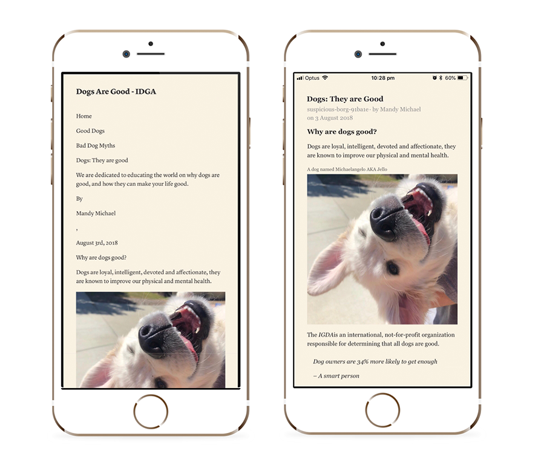
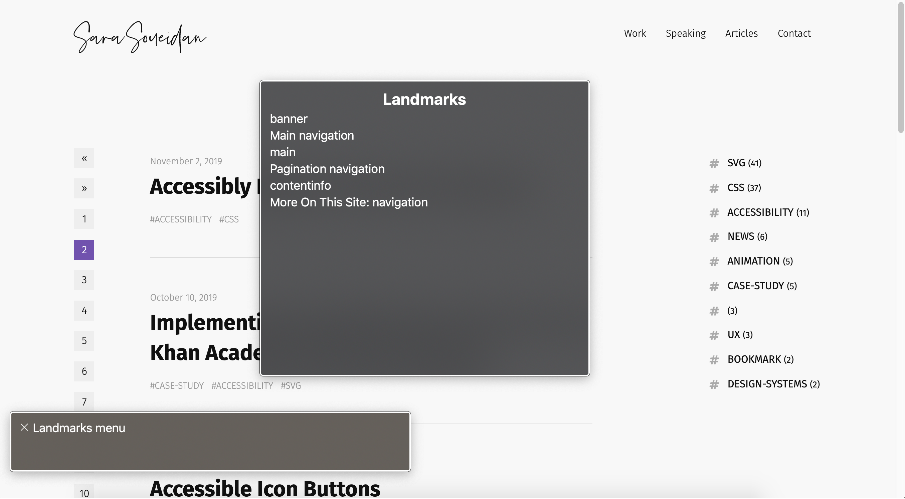
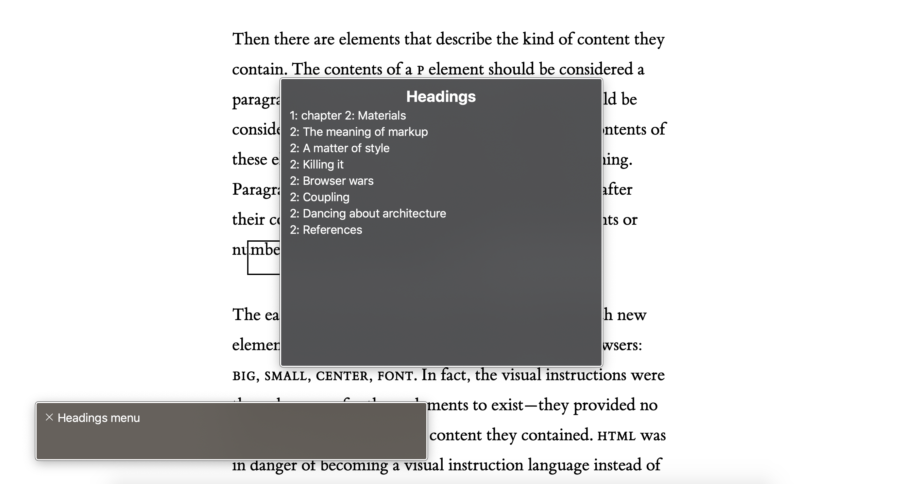
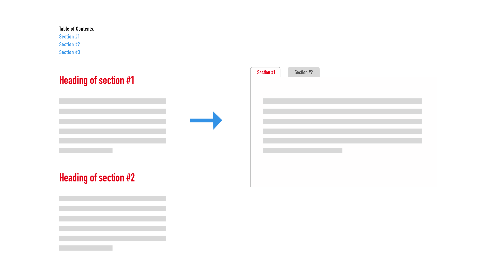
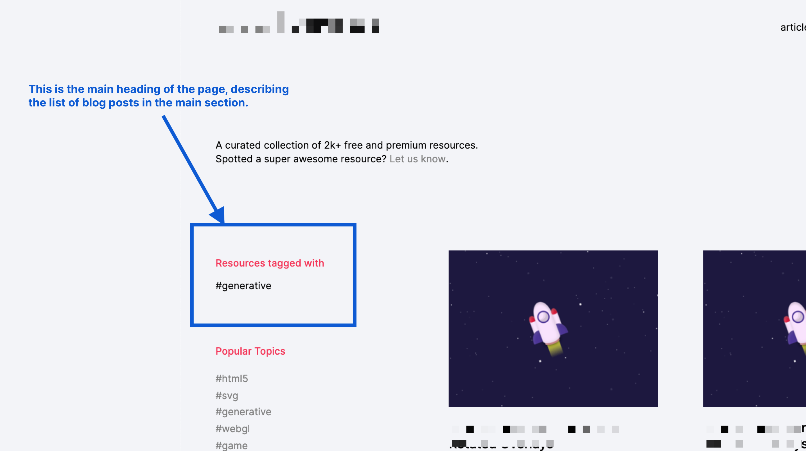
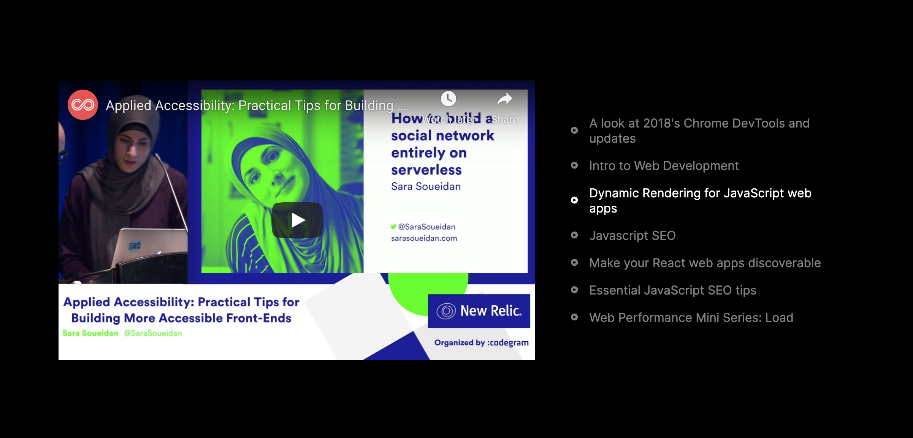

Ещё несколько лет назад я не знала значения термина «доступность». Я создавала сайты, которые были доступны лишь частично, **так как понятия не имела как сделать лучше**. На сегодняшний день мне известно достаточно, чтобы писать, говорить о доступности и проводить мастер-классы, помогая другим создавать более доступный и инклюзивный веб. Как и многие в нашей сфере, я всё ещё нахожусь в процессе обучения. Но с тех пор, когда я только начинала, я усвоила множество ценных уроков и ключевых ценностей, которым следую в своей работе по сей день. Вот некоторые из них.

## Семантический HTML — основа по-настоящему доступного веба

Семантический HTML — это универсальный язык, который понимают все устройства, имеющие доступ к интернету, язык, который вы используете для передачи вашего контента этим устройствам.

HTML семантичен или, другими словами, описателен и отвечает за передачу смысла, каждый HTML-элемент описывает тип контента, который он представляет. Таким образом, если перед вами заголовок — вы используете элемент, соответствующий заголовку. Если абзац — тег `
`. Иными словами, подразумевается использование корректных HTML-элементов по их назначению.

Использование корректных элементов гарантирует вашему контенту передаваемую структуру и смысл.

Важность структуры заключается в том, что она способствует совместимости. Совместимость — это способность разных систем, устройств, приложений или продуктов взаимодействовать согласованно, без приложения усилий пользователем. Иначе говоря, это позволяет большему количеству устройств интерпретировать и получать доступ к вашему контенту, включая те, что появятся в будущем.

Структура помогает приложениям для чтения и режимам чтения (подобным тому, который есть в Safari), а также таким средам, как режим высокой контрастности в Windows, интерпретировать ваш контент и стилизовать его тем способом, который приведёт к улучшению интерфейса. Это возможно только тогда, когда использованы соответствующие семантические HTML-элементы, такие как `<article>`, `<h1>`, `<ul>`, `<aside>`, `<nav>` и многие другие имеющиеся в HTML. Данные элементы описывают тип своего содержимого. Без них приложения будут неспособны рассказать, что оно из себя представляет и, следовательно, не смогут стилизовать его надлежащим образом. Это повысит риск того, что контент станет менее доступным, если не утратит это свойство вообще.

<figure>
    
    <figcaption>
        Cтраница Мэнди Майкл <a href="https://medium.com/@mandy.michael/building-websites-for-safari-reader-mode-and-other-reading-apps-1562913c86c9">демонстрирует</a>, как статья, размеченная несемантично (дивами, слева) и семантично (подходящими элементами, справа) выглядит в Instapaper.
    </figcaption>
</figure>

Структура также важна, поскольку позволяет пользователям более эффективно перемещаться по контенту. Пользователи скринридеров полагаются на соответствующую структуру документа, чтобы быстрее попадать на необходимые области страницы, используя различные комбинации клавиш, специальные для скринридеров. Если вы не используете соответствующие ориентиры (или «landmarks», определяемые скринридерами через семантику таких HTML-элементов, как `<nav>`, `<main>` или `<header>`), пользователи скринридеров могут лишиться возможности эффективно перемещаться по странице, а достижение нужных частей сайта станет более утомительным.

<figure>
    
    <figcaption>
        Меню VoiceOver показывает все ориентиры, доступные на странице, позволяя пользователю перемещаться в нужные части страницы.
    </figcaption>
</figure>

Заголовки также предоставляют схему или некий каркас страницы, по которым пользователи могут перемещаться при помощи комбинаций клавиш и которые соответствуют визуальной структуре вашего контента, доступной зрячим пользователям. Вот почему нужно использовать правильные уровни заголовков, вне зависимости от того, как они выглядят на самом деле. Заметьте, что, хотя мы и можем стилизовать заголовки по-разному, там, где это необходимо, визуальная согласованность по-прежнему очень важна.

<figure>
    
    <figcaption>
        Меню VoiceOver показывает все заголовки, доступные на странице, позволяя пользователю ориентироваться на странице более эффективно.
    </figcaption>
</figure>

Семантика также выражает назначение. HTML-элементы, как отмечает Джереми Кит в своей книге «[Resilient Web Design](https://resilientwebdesign.com/)», — это словарь значений. Использование соответствующих HTML-элементов позволяет различным приложениям и устройствам передавать значение вашего содержимого пользователям таким образом, чтобы им было понятно, что от него ожидать и как с ним взаимодействовать.

Например, когда вы используете `<button>` для создания кнопки, скринридер отображает кнопку, как она есть, и пользователи знают, что они могут совершить с ней определённое действие (обычно обусловленное наличием у последней доступной подписи), нажав на клавиши Space или Enter. Так, они получат функциональность и доступность элемента `<button>`, встроенные в него по умолчанию.

Если же вы не используете `<button>` для создания кнопки, а выбираете вместо этого, скажем, `
`, вы теряете всю встроенную семантику, а также возможность доступа с клавиатуры, делая кнопку полностью недоступной для скринридеров.

> # Но ведь можно использовать ARIA атрибуты, чтобы превратить `
` в `<button>`! Так?

Ну, и да, и нет…

## ARIA — это полифилл для HTML-семантики

ARIA-атрибуты — вероятно, наиболее мощный инструмент в нашем арсенале доступности. Многие ARIA-атрибуты имитируют нативную семантику HTML, в то время как некоторые предоставляют ту, что ещё не представлена в HTML. Однако, они не меняют поведение, не добавляют функциональности, состояния фокуса или возможности управления с клавиатуры. Так что, если вы решили пойти по пути создания кнопки с помощью `
`, вам придётся добавить эту функциональность при помощи JavaScript. Но зачем создавать столь хрупкую реализацию того, что уже предоставляется вам браузерами?

[Первое правило ARIA гласит](https://www.w3.org/TR/using-aria/#rule1):

> Если для того, чтобы сделать элемент доступным, вместо переназначения роли элемента с помощью ARIA вы можете использовать нативный HTML-элемент или семантический атрибут с **уже встроенным**, необходимым поведением, **то так и делайте**.

Так что пока нам следует полагаться на использование нативных HTML-элементов везде, где это возможно, однако есть некоторые виджеты, которые мы можем создать только при помощи ARIA. Например, не существует нативного эквивалента для табов (например, таких элементов, которые имели бы роли `tab`, `tablist` или `tabpanel`) со всей встроенной в них по умолчанию интерактивностью, поэтому мы можем создавать табы, меняя роли другим элементам с помощью ARIA, предоставляя тем самым комбинированный UI для пользователей скринридеров.

Так как ARIA кардинально меняет и доступное отображение элементов, при некорректном использовании это может оказать негативное влияние на то, каким образом ваш контент будет показан людям, использующим вспомогательные технологии. [Скотт Охара](https://scottohara.me/), ссылается на практические рекомендации ARIA:

> Первый принцип применения ARIA гласит, что «роль — это обещание». Используя ARIA или, раз уж на то пошло, HTML, задумайтесь, что именно вы обещаете людям, которые пользуются вашими интерфейсами или потребляют ваш контент. Сдерживаете ли вы обещания, которые им даёте?
> [Скотт Охара](https://scottohara.me/)

Прежде чем использовать ARIA-атрибуты, подумайте о том, что именно вы обещаете вашим пользователям. ARIA-атрибуты прямо влияют на то, как элементы будут размещены в дереве доступности и, следовательно, каким образом с ними будут взаимодействовать пользователи. Если вы нуждаетесь в указаниях, как следует и как не следует их использовать, Документация по использованию ARIA — лучший для этого источник.

> Главный совет от [@LeonieWatson](https://twitter.com/LeonieWatson) заключается в том, что существует 147 HTML-элементов и только два из них не имеют встроенных возможностей доступности — `
` и ``. Используйте семантически правильные элементы по максимуму!
> [Бет Фрейзер](https://twitter.com/edinbeth/status/1176161245352927237)

> Простейший #a11y совет, который я когда-либо получала: `
` — последнее к чему вам следует обращаться. Имеете дело с основным контентом? Для этого есть свой тег. С заголовком? И для него тоже. `
` — это не плохо; просто он ничего не значит. И это совершенно точно означает, что не стоит использовать его для чего-то, на что можно кликнуть.
> Смотрите на ваш контент, как на что-то, имеющее предназначение, и пытайтесь подобрать под это подходящий тег. В ином случае `
` (или ``) подойдёт. Для `
` есть своё место, однако большинство учебников преувеличивают его значение.
> [И. Дж. Мейсон](https://twitter.com/codeability/status/1162861059822112770)

## JavaScript необходим для по-настоящему доступных кастомных интерактивных компонентов

И хотя вы можете обойтись без него, создавая функциональные интерактивные компоненты, такие, как модальные окна на чистом CSS или раскрывающиеся виджеты с помощью печально известного чекбокс-хака, это почти всегда гарантирует, что такие компоненты не будут по-настоящему доступными.

Когда вы создаёте интерактивный виджет, с большей долей вероятности он будет иметь состояние. Раскрывающийся виджет имеет либо открытое состояние, либо закрытое (или развёрнутое и свёрнутое). Это состояние видно пользователям скринридеров посредством ARIA-атрибутов (например, `aria-expanded="true"` или `false`) и когда пользователи взаимодействуют с виджетом, состояние меняется и эти изменения передаются пользователю. JavaScript для этого необходим. Я смирилась с этим фактом два года назад, когда мне нужно было создать доступный тултип для одного из моих клиентов.

JavaScript также необходим для того, чтобы добавлять кастомным компонентам возможность взаимодействовать с клавиатурой (например, табы должны переключаться с помощью клавиш со стрелками, а раскрывающийся виджет быть управляемым клавишами Space и Enter).

**Примечание:** даже если JavaScript необходим для создания интерактивных кастомных компонентов, для того чтобы быть уверенным, что ваш контент инклюзивен для всех пользователей вне зависимости от их особенностей, вы можете и, вероятно, должны — везде, где это возможно — убедиться, что они могут воспринимать ваш контент, когда JavaScript недоступен. Фактически, никогда не следует рассчитывать на то, что у ваших пользователей он есть, так как существует [множество](https://kryogenix.org/code/browser/everyonehasjs.html) причин, почему его может не быть. Вот почему прогрессивное улучшение является наиболее доступной стратегией для создания веба. Я бы даже пошла ещё дальше и сказала, что в некоторых случаях оно абсолютно необходимо для создания инклюзивных документов и компонентов.

## Прогрессивное улучшение — это инклюзивная стратегия для создания веба

Кажется, что среди многих разработчиков сложилось неправильное представление о том, что раз JavaScript необходим для обеспечения доступности интерактивного компонента, вы не сможете создать его, используя подход прогрессивного улучшения. Причина в том, что разработчики рассматривают прогрессивное улучшение как некий анти-JavaScript-паттерн. Это заблуждение.

Прогрессивное улучшение можно рассматривать, как своего рода наслоение — всё начинается с гибкой основы — семантического HTML — и лишь затем сверху, при необходимости, наслаиваются стили и функциональность (JavaScript).

С первого дня, как я узнала о прогрессивном улучшении, оно стало для меня основной движущей силой в создании интерфейсов. Сейчас я не могу себе представить другого подхода к веб-разработке. И с тех пор, как я начала создавать интерфейсы, держа в уме доступность, я пришла к убеждению, что этот подход наиболее разумный.

Давайте в качестве примера снова возьмём компонент табов. В таком компоненте у вас есть серия вкладок, которые управляют блоками с содержимым. Пользователь может переключаться между блоками, активируя ту или иную вкладку. Для того чтобы работать и быть доступными, табам необходим JavaScript. Но что, если JavaScript не работает? Если бы табы были созданы без использования прогрессивного улучшения — то есть в полной уверенности разработчика, что JavaScript у пользователя всегда будет включен, они были бы не в состоянии работать и содержимое скрытых блоков осталось бы полностью недоступным.

Но если бы вы подошли к табам с точки зрения прогрессивного улучшения, вы бы рассмотрели вариант создания компонента с помощью одного только HTML — без использования CSS, добавляющего интерфейсу возможность взаимодействия и без JavaScript, запускающего его функциональность.

В ситуации, когда JavaScript недоступен, можно предусмотреть отображение вкладок, как последовательность секций с заголовком и содержимым, которую может сопровождать оглавление в начале страницы. В таком виде пользователи будут видеть компонент по умолчанию при выключенном JavaScript.

<figure>
    
    <figcaption>
        Табы могут быть прогрессивно улучшены как последовательность секций с заголовком и соответствующим ей содержимым.
    </figcaption>
</figure>

<figure>
    
    <figcaption>
        Табы могут быть прогрессивно улучшены как последовательность секций с заголовком и соответствующим ей содержимым, а также с оглавлением, предваряющим эти секции.
    </figcaption>
</figure>

Когда JavaScript заработает, вы сможете улучшить эти секции, изменив их раскладку и отображение, а также добавив необходимую интерактивность. Я бы реализовала это, добавив в разметку флаг, по которому определяла бы наличие JavaScript и, в зависимости от этого, необходимость изменения сетки секций и активации функционала табов.

Когда вы применяете к доступности [подход «shift left»](https://www.deque.com/shift-left/) _(привлекаете тестировщиков на ранних этапах разработки, прим. переводчика)_, использование стратегии прогрессивного улучшения приобретает ещё больший смысл. Почти каждый кастомный интерактивный компонент, созданный мной за последний годы, представлял собой улучшение базового не интерактивного компонента. В первую очередь, начинайте с HTML. Задействуйте всё, что он может вам предложить для обеспечения базовой доступности интерфейса.

> Прогрессивное улучшение. Потому что однажды ваш JavaScript не сработает. Будьте к этому готовы.
> [Стюарт Лэнгридж](https://www.kryogenix.org/)

## Дизайн не всегда диктует реализацию

Одним из самых распространённых способов, который, на мой взгляд, способен разрушить семантику является извлечение её из визуального дизайна. Потому что визуальный дизайн не всегда описывает тип контента, который он представляет.

Это прекрасно иллюстрирует пример с заголовками. В недавнем докладе я показывала пример из одного моего последнего проекта, где страница была спроектирована таким образом, что главного заголовка, казалось, не существует, хотя это было не так. Он просто-напросто не был стилизован как заголовок первого уровня.

<figure>
    
    <figcaption>
        Главный заголовок страницы, который описывает содержимое главного раздела страницы, расположен и стилизован таким образом, что (ненамеренно) маскирует факт того, что он им является.
    </figcaption>
</figure>

Размышляя над структурой документа и ожиданиями пользователей скринридеров, я узнала, что главный заголовок странице необходим. До недавних пор я должна была предусматривать заголовок для пользователей скринридеров только на тех страницах, где он визуально отсутствовал. В этом же конкретном случае заголовок уже был там, просто стилизованный таким образом, что выглядел совсем иначе.

Глядя на страницу через призму доступности и держа в уме HTML — семантику и структуру — поменялось моё видение страницы, а также кардинально изменился подход к работе над ней.

Так что если компонент или элемент выглядят как нечто определённое, это не означает, что они непременно этим являются. И наоборот, если они не выглядят как нечто определённое, это не означает, что они этим не являются.

То же самое справедливо и для интерактивных UI-паттернов. Один и тот же паттерн может работать по-разному, в зависимости от того в каком контексте находится. И часто именно контекст определяет поведение паттерна и то, каким должен быть пользовательский опыт, а это, в свою очередь, должно составлять основу семантики, от которой зависит сама реализация.

В том же самом проекте, который я упоминала, был простой на вид UI-паттерн, который оказался достаточно интересным испытанием UX и доступности. На следующем изображении скриншот этого компонента:

<figure>
    
    <figcaption>
        Компонент из моего недавнего коммерческого проекта состоит из видео слева и плейлиста справа. При клике на любое из названий справа загружается видео слева; однако, это не инициирует его запуск. (Заметьте, что содержимое на скриншоте — просто пример).
    </figcaption>
</figure>

Для реализации этого видеоплееера, мне нужно было разобраться, как он работает — чтобы я могла сверстать его таким образом, чтобы передать его семантику и функциональность скринридерам должным образом.

И хотя плейлист справа выглядит как список ссылок, _в действительности_ — это не так, потому что предполагается, что ссылка должна вас куда-то вести, чего в этом случае не происходит. При клике на название видео оно загрузится в плеере слева. Значит, это интерактивный элемент, который совершает некое действие и, следовательно, не является ссылкой. И хотя их внешний вид не демонстрирует этого, эти названия на самом деле являются _кнопками_.

Затем возник вопрос, что случится, если кликнуть на само название? Сработает ли автозапуск? Если да, то кнопка должна отвечать также и за постановку на паузу, играя тем самым роль кнопки-переключателя. Но если клик на название запускает и ставит видео на паузу вы также захотите ассоциировать эту кнопку и с кнопками запуска и паузы внутри самого видео, что может стать проблемой, учитывая, что видео может быть с YouTube, Vimeo или со своё. И если вы не запускаете видео автоматически, должны ли вы устанавливать фокус на `<iframe>` после того, как нажали на кнопку?

После изучения предполагаемого UX и тестирования скринридерами, я, в конечном счёте, реализовала плеер с помощью табов, где каждая вкладка управляет блоком содержимого.

Я никогда прежде не думала об интерфейсе табов, в котором несколько вкладок управляют одним блоком. Но контекст этого компонента и его UX определили ход моих мыслей и соображения, которые привели меня к конечной реализации.

Первое, что я усвоила из этого компонента — UX определяет реализацию. ARIA поставляет множество атрибутов, которые позволяют нам создавать разные UI-паттерны в разных контекстах, но иногда нам всем нужна возможность немного модифицировать паттерн для конкретного контекста.

> Странно, что мы до сих пор извлекаем семантику из визуального дизайна, а не наоборот. Визуальный дизайн может отличаться в зависимости от контекста, в то время, как основная семантика — нет.
> [Рик Шеннинк](https://twitter.com/rikschennink/status/1166771758684356608)

## Если что-то технически доступно, не значит, что оно инклюзивно

Вы можете создать что-то, что будет технически доступным, но при этом не будет инклюзивным. Такой элемент или компонент может иметь все необходимые кнопки, доступные с клавиатуры, а также видимые скринридерами, но действительно ли вы приняли во внимание потребности и ожидания ваших пользователей, когда принимали решения насчёт отображения того или иного элемента и взаимодействия с ним?

В докладе [«Inclusive by Design»](http://feather.ca/inclusion/aea2019) Дерек Фэверстон, пропагандист доступности и дизайнер, рассказывает о том, как он и его команда создавали доступный видеоплеер для одной организации.

Когда пришло время и компонент понадобился для использования пользователями с разными особенностями здоровья, команда осознала, что, хотя они создали прекрасный и доступный видеоплеер, его нельзя было назвать по-настоящему инклюзивным — в нём была упущена разного рода функциональность, которая упрощала бы его использование для некоторых групп пользователей, такая как, например, перемотка вперёд или назад. Дерек и его команда также пытались предположить, как плеер мог бы использоваться всеми пользователями, и поняли, что не учли публику со старыми версиями скринридеров. Они рисковали пропустить важные объявления — те самые, что должны были помочь в управлении. Так, после нескольких итераций и тестов с разными пользователями, они в конечном счёте добавили в плеер необходимые возможности, приняв в расчёт все его недостатки и ожидания пользователей, что сделало плеер гораздо более инклюзивным и чрезвычайно улучшило его UX.

Доклад Дерека полон множества хороших примеров, которые подчёркивают важность **своевременного вовлечения пользователей ещё на этапе проектирования**, а также убеждают вас учитывать возможные различия по умолчанию.

> Ничего о нас без нас.
> Майкл Масута

## В конце концов, всё это только ради пользователя

Если в процессе разработки вы будете держать в уме реальные потребности пользователей и инклюзивность, то в скором времени осознаете, что реализация спроектированного паттерна может быть достигнута разными способами. А в проектировании доступности предостаточно категоричных моментов.

Прекрасный пример — модальные окна. Несмотря на то, что этот UI-паттерн всех раздражает, существует множество дискуссий вокруг того, каким образом он должен быть реализован и как должен себя вести, когда модальное окно открыто: следует ли устанавливать фокус на первом доступном для этого элементе внутри модального окна. Что если таких элементов нет? Что если первый элемент, доступный для фокуса — это кнопка закрытия окна? Хотели бы вы, чтобы модальное окно побуждало вас к его скорейшему закрытию? (Очевидно, нет). Что если первый элемент, доступный для фокуса — это поле, требующее от пользователя адрес его электронной почты? Допустимо ли без какого-либо контекста требовать от пользователя личную информацию? (Очевидно, что так же нет).

В конце концов, не важно какое решение вы примете, оно всегда должно быть принято для пользователя. Поэтому вовлечение пользователя или более разнообразной команды в проектирование и процесс разработки — это ключевой момент в построении по-настоящему инклюзивных веб-интерфейсов.

Но что если у вас нет такой возможности? Что если у вас нет доступа к такому окружению или команде? Что если вы, как и я — независимый разработчик, который часто работает с командами, не имеющими доступа к пользователям или людям с особенностями здоровья.

## Обратитесь за советом, если сомневаетесь

Если вы не в силах сделать это сами, вы можете воспользоваться опытом или советами тех, кто через это прошёл. И, что очень важно, быть готовыми и открытыми для конструктивного фидбека.

В нашей сфере есть уйма чудесных (иногда по понятным причинам довольно раздражительных) экспертов по доступности, которые _мечтают,_ чтобы веб был более доступным. Большинство из них бесплатно дают ценные советы и делятся своими ценными знаниями в разной форме — пишут статьи и книги, создают видеокурсы, читают доклады и устраивают воркшопы и так далее. Мы многому могли бы научиться у них. И большинство из них открыты к вопросам любой степени сложности (и платно, и бесплатно).

Некоторые из моих авторитетных экспертов (порядок не имеет значения):

- [Leonie Watson](https://tink.uk/)
- [Derek Featherstone](http://feather.ca/)
- [Scott O’Hara](http://scottohara.me/)
- [Marcy Sutton](https://marcysutton.com/)
- [Rob Dodson](https://www.youtube.com/channel/UCJAtIv92EJqzG2EOzo92sdQ)
- [Alice Boxhall](https://twitter.com/sundress)
- [Marco Zehe](https://marcozehe.de/)
- [Eric Bailey](https://ericwbailey.design/)
- [Steve Faulkner](https://twitter.com/stevefaulkner)
- [The Paciello Group](https://www.paciellogroup.com/)

Перед тем как обратиться за помощью, вы поступите правильно, уделив время чтению спецификаций и рекомендаций по ARIA, чтобы попытаться самим узнать о доступности как можно больше. В конце концов, эти добрые люди способны помочь, но они не обязаны делать нашу работу за нас — по крайней мере, не бесплатно.

## Заключение

Доступность — это непросто. Чаще всего это откровенно тяжело. Но это издержки профессии. Проектирование для человека — вот что, на самом деле, тяжело. А доступность, в конечном счёте, целиком _про_ человека и _для_ человека.

Мы можем делать это не до конца правильно, всегда есть место улучшениям — тем более, что всё большее количество пользователей используют наши продукты и потребляют наш контент, но одна вещь, которую я знаю точно, это то, что мы никогда не должны отбивать у них желание к этому. Так или иначе, почти всё можно улучшить. Самое главное — быть открытыми для обратной связи, быть достаточно чуткими, чтобы беспокоиться о своих пользователях и стараться изо всех сил, чтобы сделать их жизнь проще с теми (мощными) инструментами, которые есть в нашем распоряжении.

Используйте HTML. Совершенствуйте сделанное при помощи CSS. Добавляйте мощи JavaScript. Вовлекайте ваших пользователей в дизайн-процессы как можно раньше и всегда смотрите на вашу работу сквозь призму инклюзивности. Так, вы достигнете большего. Продолжайте учиться, повторяйте выученное и становитесь лучше. Ну, и не забывайте, что возможности нашего здоровья не всегда будут неограниченными.
